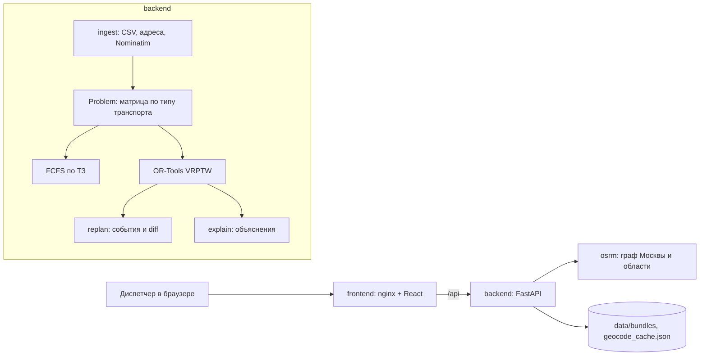

# Планировщик маршрутов выездных инженеров

Прототип помощника диспетчера для кейса «Билайн Бизнес» (Лидеры цифровой трансформации). Сервис загружает заявки дня, распределяет их между инженерами с учётом навыков, временных окон, смен и типа транспорта, строит маршруты по дорогам Москвы и области, перестраивает план после событий и объясняет каждое решение простыми словами.

## Что умеет

- Загрузка сырого CSV Билайна или готового JSON-бандла, фоновый предподсчёт с прогрессом.
- Два плана на один день: базовый FCFS строго по ТЗ и оптимизированный OR-Tools, плюс реальное распределение диспетчеров для сравнения.
- Нагрузка инженеров из трёх шагов: 😌 «Спокойный день», 😐 «Обычный день» и 🥵 «На пределе». Чем выше нагрузка, тем дороже оптимизатору каждый новый инженер; базовый FCFS от неё не зависит. Выбирается ползунком перед планированием и меняется прямо в шапке рядом с метриками вместе с обедом: оба выбора применяются одной кнопкой «Применить», день пересчитывается заново, события дня сбрасываются, часы встают на начало дня.
- Обязательные метрики ТЗ: число задействованных инженеров, пробег по каждому и суммарно.
- События дня: срочная заявка с окном или «как можно скорее», отмена, возврат и изменение заявки (адрес, окно, длительность, навык, приоритет, требование к транспорту), недоступность инженера, смена транспорта инженера (например, сломалась машина или выдали автомобиль), задержка инженера с прогнозом опозданий, переназначение заявки на выбранную бригаду из карточки заявки. Переназначенная заявка закреплена за бригадой и в следующих событиях, пока бригада может её взять. Начатые визиты закрепляются, визит, к которому инженер уже выехал, не переназначается, изменения показываются баннером с переключателем «до / после».
- Варианты исправления: на недоступность, смену транспорта, задержку инженера, срочную заявку и переназначение заявки сервис считает три варианта — «Оптимально по дню», «Минимум перестановок» и «Ничего не менять» (у переназначения — «Вставить в маршрут»: бригада пропускает свои заявки, к которым уже не успевает, остальные маршруты как есть), — сравнивает их по клиентам без инженера и опозданиям, бригадам, переносам заявок и километрам и рекомендует лучший. Часы останавливаются на таком событии, пока диспетчер не выберет; выбор можно поменять с метки события на шкале. У срочной заявки есть четвёртый вариант — отдать её конкретной бригаде: план считается по запросу, когда бригада названа, и карточка показывает цену такого решения по сравнению с «Оптимально по дню».
- Часы дня: ползунок текущего времени от 09:00 до конца смен с запуском в темпе 1 час за 6 секунд. События живут на шкале со своим временем: план в любой момент равен исходному плану плюс все события до ползунка. Отвели ползунок до события — план вернулся без него, вернули после — событие снова в плане. Пересчёт идёт при отпускании ползунка и при пересечении события.
- Где бригады сейчас: на карте маркер каждой бригады едет по линии маршрута, в списке заявок статусы «Выполнена», «В работе» и «В пути», на таймлайнах линия текущего времени.
- Карта маршрутов на Яндекс Картах; без ключа или при ошибке загрузки та же карта рисуется на подложке OpenStreetMap.
- Объяснение по любой заявке: какие ограничения проверены, кто ещё мог взять заявку и во сколько километров это обошлось бы.
- Объяснение маршрута инженера: порядок визитов, запас до конца окон, пробег и окончание работы относительно смены.
- Обед по плану включён по умолчанию и переключается там же, галочкой перед планированием и кнопкой в шапке: 45 минут с началом через 3–6 часов после начала смены, в оптимизированном плане и в FCFS. Обед виден полосой на таймлайне и строкой в маршруте бригады.
- Страница бригады: личный таймлайн, маршрут, история событий и кнопки «Смена транспорта», «Задержка», «Недоступен». Имена бригад кликабельны в списке заявок, в карточке заявки и на таймлайне, из заявки можно вернуться к бригаде.
- Отмена и возврат заявки из её карточки. Клик по пустому месту карты предлагает «Добавить заявку здесь»: открывается срочная заявка с этой точкой, адрес подставляется по координатам.
- Оборудование как ограничение: бригада получает железки (роутеры, приставки, колонки) в офисе утром сразу на весь день, по умолчанию 6 единиц, и заявка с оборудованием тратит одну. Больше, чем бригада увезла, ей не назначат ни оптимизатор, ни базовый FCFS; при перепланировании выданное не возвращается. У заявки метка «Оборудование», на странице бригады видно, сколько единиц она взяла утром и сколько осталось к текущему времени, а заявка, которую некому взять из-за оборудования, получает об этом отдельную причину.
- Три уровня приоритета распределения: авария → подключение → ремонт и дозаказ. Когда дня не хватает на всех, планировщик снимает сначала ремонт и дозаказ, потом подключение и только в последнюю очередь аварию. Уровень идёт от типа работ, а не от навыка: дозаказ делит навык с подключением, но остаётся на нижнем уровне. В списке заявок, в карточке и в неназначенных подключение помечено меткой уровня; аварию и так видно по «Срочная» и приставке URG-.
- Заявка со статусом «Отменена» в выгрузке — обычная заявка дня: клиент отказывался уже после приезда инженера, время и дорога потрачены. Шкала времени в начале дня пустая, отмену диспетчер ставит сам.
- Причина для каждой неназначенной заявки: нет навыка, нет транспорта, не помещается в окно или смену, нет свободных исполнителей, адрес не найден.
- Адреса понимаются и в формате выгрузки, и в ручной записи диспетчера: «Москва, Перовская улица 42к1», «ул. Перовская, дом 42, корпус 1».
- Срочная заявка всюду подписана «URG-<номер>»: и пришедшая с данными дня со своим билайновским номером (URG-57866), и добавленная диспетчером. Так же её называют сообщения сервера («Заявка URG-57866 уже в работе с 13:20, отменить её нельзя.») и помощник диспетчера. Номер заявки от подписи не меняется: в событиях, API и бандле он остаётся сырым.

## Быстрый старт в Docker

Нужно: Docker Desktop с Compose 2.24 или новее, 4 ГБ памяти для Docker, 5 ГБ на диске, интернет при первой сборке.

```bash
cp .env.example .env                                   # ключи Яндекс Карт и LLM необязательны
docker compose --profile prepare run --rm --build osrm-prepare   # граф дорог, один раз, ~3.5 мин
docker compose up -d --build
```

Откройте http://localhost:8000. Документация API: http://localhost:8000/api/docs.

Открывайте именно `localhost`, а не `127.0.0.1`: ключ Яндекс Карт ограничен по HTTP Referer значением `localhost`, на другом адресе карта не загрузится. У бесплатного ключа суточный лимит запросов, лишний раз страницу не перезагружайте: перезагрузка в той же вкладке восстанавливает план, но заново загружает карту. Без ключа или если Яндекс Карты не загрузились, план показывается на подложке OpenStreetMap.

Подложка Яндекс Карт при первом показе дорисовывается за несколько секунд: сначала видна только часть тайлов. Кнопка «Весь план» перерисовывает карту сразу.

Шаг `osrm-prepare` скачивает выгрузку OpenStreetMap по Центральному федеральному округу (876 МБ), вырезает Москву и область (218 МБ) и собирает граф OSRM в volume `osrm-data`. Повторный запуск ничего не делает. Без графа сервис работает на расстояниях по прямой, а отчёт предподсчёта показывает `matrix_source: haversine`.

Проверка backend без интерфейса:

```bash
docker compose up -d --build --wait backend osrm
docker compose exec backend python scripts/smoke_api.py
```

Скрипт загружает бандл Востока, строит план, применяет три демо-события, запрашивает объяснение и линии маршрутов и печатает метрики.

## Разработка без Docker

Backend (Python 3.12 и [uv](https://docs.astral.sh/uv/)):

```bash
docker compose up -d osrm                        # по желанию: OSRM на http://localhost:5050
cd backend
uv sync
OSRM_URL=http://localhost:5050 GEOCODER=cache-only uv run uvicorn app.api.main:app --reload --port 8001
```

Frontend: `cd frontend && npm ci && npm run dev`, dev-сервер Vite проксирует `/api` на `http://localhost:8001`.

Тесты и линтер:

```bash
cd backend
uv run pytest
uv run ruff format --check app tests scripts && uv run ruff check app tests scripts
```

Переменные окружения backend:

| Переменная | По умолчанию | Назначение |
|---|---|---|
| `DATA_DIR` | `data` в корне репозитория | бандлы и кэш геокодера |
| `CACHE_PATH` | `$DATA_DIR/cache.sqlite` | кэш матриц и линий OSRM |
| `OSRM_URL` | не задан | адрес OSRM; без него расстояния по прямой |
| `GEOCODER` | `nominatim` | `cache-only` не ходит в сеть за новыми адресами |
| `TRANSIT_MATRIX_DIR` | `$DATA_DIR/transit` | локальные матрицы 2ГИС для общественного транспорта, читаются при старте |
| `SOLVER_TIME_LIMIT_S` | `5` | лимит поиска OR-Tools для плана дня без обеда и для пересчёта по событиям, секунды |
| `SOLVER_TIME_LIMIT_LUNCH_S` | `30` | лимит поиска OR-Tools для плана дня с обедом, секунды |
| `SOLVER_WORKERS` | число ядер, не больше 4 | процессов для одновременного поиска OR-Tools разными стратегиями; `1` ищет одной стратегией в процессе backend |
| `YANDEX_MAPS_API_KEY` | не задан | ключ JavaScript API Яндекс Карт, отдаётся фронту через `/api/config`; без него карта на OpenStreetMap |
| `LLM_BASE_URL`, `LLM_API_KEY`, `LLM_MODEL` | не заданы | OpenAI-совместимый API помощника; ключ необязателен для локальных моделей |
| `LLM_TOOL_MODE` | `auto` | `tools` только вызов инструментов, `json` только JSON в ответе, `auto` инструменты с переходом на JSON |

## Помощник диспетчера

Вкладка «Рекомендуемые изменения» принимает сообщение обычным языком, например «Арташкин заболел после обеда, а клиент на Дубининской отказался». Backend отправляет модели правила и состояние дня, модель отвечает вызовами инструментов: срочная заявка, отмена, возврат, недоступность инженера или уточняющий вопрос. Модель ничего не меняет сама. Каждый ответ проверяется без участия модели: инженер и заявка должны однозначно найтись, время не раньше текущего, адрес срочной заявки находится геокодером, событие не противоречит плану. Заявку можно назвать номером, улицей или подписью из интерфейса «URG-<номер>»: префикс срочной заявки помощник отбрасывает и ищет заявку по её номеру. Прошедшие проверку предложения ждут решения диспетчера, остальные показываются с причиной. Кнопки «Применить» и «Применить все» отправляют событие в тот же пересчёт, что и ручные кнопки, поэтому карта, списки и баннер изменений обновляются одинаково.

Подойдёт любой OpenAI-совместимый провайдер. Для экономии выбирайте недорогую модель с поддержкой вызова инструментов; если провайдер инструменты не поддерживает, `LLM_TOOL_MODE=auto` сам перейдёт на JSON-ответ. Промпт растёт с числом заявок: для 66 заявок Востока это около 20 тысяч символов на сообщение.

Проверка без интерфейса:

```bash
docker compose exec backend python scripts/smoke_proposals.py "Арташкин заболел после обеда" --approve
```

## Подготовка данных

Бандлы регионов `data/bundles/<регион>/bundle.json` собираются из `data/raw` скриптом и лежат в git вместе с отчётами `report.md`:

```bash
cd backend
uv run python -m app.synth.prepare --region all --osrm-url http://localhost:5050 --geocoder cache-only
```

Без `--geocoder cache-only` новые адреса геокодируются через публичный Nominatim не чаще раза в секунду. Скрипт завершается с ошибкой, если базовый вариант не уступает оптимизированному: так проверяется требование ТЗ о конфликте в данных. Все досинтезированные поля и коэффициенты описаны в [docs/assumptions.md](docs/assumptions.md).

Время работ на адресе берётся из официальных нормативов организаторов («Нормативы.xlsx»): подключение 70 минут, авария 80, дозаказ 20, локальная заявка 30. В ответах организаторов на вопросы команд для аварии назван норматив 100 минут — это те же 20 минут дороги плюс 80 минут работ из их таблицы. Дорогу сервис считает сам, по матрице OSRM от предыдущего адреса бригады с коэффициентом пробок, поэтому на объекте планируются 80 минут, а дорога добавляется отдельно: взять 100 значило бы посчитать дорогу дважды и раздуть день бригады. То же правило применено ко всем четырём типам работ.

Регион «Северо-Запад» сгенерирован: реальной выгрузки по нему нет. Пара CSV в формате выгрузки Билайна собирается из реальных адресов OpenStreetMap и описания региона с выдуманными бригадами, дальше работает тот же `prepare`. В регионе сложнее ездить: петли Москвы-реки с редкими мостами (Строгино, Мнёвники, Терехово, Крылатское), Химкинское водохранилище и канал имени Москвы, Сходня и железные дороги.

```bash
cd backend
uv run python -m app.synth.generate_region --spec config/regions/north_west.yaml --fetch   # обновить адреса из Overpass API
uv run python -m app.synth.generate_region --spec config/regions/north_west.yaml           # CSV из сохранённых адресов
uv run python -m app.synth.prepare --region north_west --osrm-url http://localhost:5050
```

Пешком и общественный транспорт — один вид транспорта «Общественный транспорт и пешком». Если обе точки пары нашлись в одной локальной матрице 2ГИС `data/transit/<регион>.json`, время берётся из неё. Точка дня привязывается к ближайшей точке матрицы не дальше 150 м, так что метры расхождения геокодера и порядок точек не важны; если у региона дня есть матрица, а часть точек к ней не привязалась, сервис пишет об этом в лог при старте дня. `python -m scripts.transit_error` показывает, сколько точек бандлов привязалось. Остальные пары считаются формулой: быстрее из «пешком» (d × 1.3 при 5 км/ч) и поездки 22.5 + 2.8·d минут, где d — км по прямой. Так считаются пары с новой точкой (срочная заявка, изменённый адрес), пары дальше 50 км, которые демо-ключ 2ГИС не строит, и пары без маршрута. Формула подобрана по 23 тыс. пар матриц 2ГИС: средняя ошибка 19% против 28% у прежней модели, в пределах ±25% попадают 73% пар против 62%. Условия 2ГИС запрещают хранить результаты, поэтому матрицы считаются демо-ключом на машине диспетчера и в git не попадают, а бандлы и таблица результатов посчитаны без них.

У бригад без автомобиля ограничено одно плечо маршрута: велосипед не дальше 15 км, общественный транспорт не дальше 25 км, у автомобиля предела нет. Без предела бригады без автомобиля уезжали дальше, чем на них ездят: в базовом плане Юго-востока велобригада получала плечи 21 и 20 км, бригады на общественном транспорте — 28 и 31 км, а оптимизатор в разных прогонах отправлял в Каширу то велобригаду с маршрутом в 105 км, то бригаду на общественном транспорте с маршрутом в 136 км. По смене такой маршрут проходит, потому что снять заявку дороже любого пробега, по здравому смыслу — нет. Предел в километрах, а не в минутах: так он не зависит от коэффициента пробок и запаса на дорогу и совпадает с числом, которое диспетчер видит в маршруте.

```bash
cd backend
uv run python -m scripts.transit_matrix --region all --dry-run            # план расхода запросов демо-ключа
TWOGIS_API_KEY=... uv run python -m scripts.transit_matrix --region all   # матрицы в data/transit, backend читает их при старте
uv run python -m scripts.transit_error                                    # ошибка формулы против матриц по регионам и расстояниям
```

## Сценарий демонстрации

1. Загрузить `data/raw/east_synthetic.csv`. Сервис узнаёт регион по адресу офиса, показывает прогресс и отчёт предподсчёта.
2. Нажать «Спланировать».
3. Показать заявки и маршруты на карте, полоску метрик с тремя колонками: FCFS, оптимизированный план, диспетчеры.
4. Открыть заявку и показать объяснение: в карточке короткий вывод, кнопка «Почему?» открывает слева от карты панель с проверенными ограничениями, альтернативными инженерами и факторами выбора. Та же кнопка на странице бригады разбирает маршрут.
   Клик по имени бригады или строка во вкладке «Бригады» открывает страницу бригады с маршрутом, личным таймлайном и историей событий. На карте кликаются только заявки: маркеры бригад клик пропускают к заявке под ними.
5. Добавить срочную заявку, отменить заявку или сделать инженера недоступным. Срочная заявка открывается кнопкой сверху или кликом по карте «Добавить заявку здесь», события бригады открываются с её страницы.
   Время события по умолчанию 13:00; окно срочной заявки по умолчанию попадает в смены и следует за временем события, в диалогах событий бригады заранее выбрана эта бригада.
   Альтернатива: написать то же событие во вкладке «Рекомендуемые изменения» и нажать «Применить».
   «Смена транспорта» показывает оба направления: пересадка с автомобиля на велосипед отдаёт другим заявки, которым нужен автомобиль, а выданный автомобиль позволяет инженеру брать такие заявки и ездить быстрее.
   Кнопка «Изменить» в строке заявки или в её карточке открывает форму правки: например, клиент попросил перенести визит на после 16:00. Сохранение перестраивает план так же, как остальные события, а баннер показывает, что поменялось.
   В карточке заявки список бригад позволяет переназначить её вручную (бригада текущего плана выделена): часы останавливаются на этом событии, и окно предлагает «Оптимально по дню», «Минимум перестановок» или «Вставить в маршрут».
   «Задержка» на странице бригады показывает прогноз опозданий: баннер сравнивает, к скольким клиентам инженер опоздал бы без перепланирования, с планом после пересчёта.
   Полоса «Время дня» под метриками двигает текущее время: «Запустить» проигрывает день в темпе 1 час за 6 секунд, метки на шкале показывают события, «Добавить событие» заводит болезнь инженера, поломку транспорта, задержку или срочную заявку на выбранное время. Метку можно удалить, а ползунком вернуться к состоянию до события; «Сброс событий» рядом со срочной заявкой убирает все события разом и возвращает утренний план. Когда часы доходят до недоступности или поломки транспорта, открывается окно с тремя вариантами исправления: выберите, и часы пойдут дальше. У срочной заявки в окне можно назвать бригаду («я не согласен с оптимизатором») и увидеть, чего это стоит.
6. Показать, что изменилось: перенесённые и снятые заявки, сдвиги времени, закреплённые начатые визиты.
7. Сравнить с базовым вариантом по числу инженеров и пробегу.

## Схема решения



- `backend/app/domain` — модели заявки, инженера, события, плана; они же JSON-схема.
- `backend/app/ingest`, `backend/app/synth` — чтение выгрузки, геокодинг, досинтез, сборка бандлов.
- `backend/app/geo`, `backend/app/solvers` — матрицы, симуляция маршрута, FCFS, OR-Tools.
- `backend/app/planning` — сессия дня, события, diff, объяснения.
- `backend/app/api` — FastAPI, загрузка с фоновым предподсчётом, реестр датасетов в памяти.
- `frontend` — интерфейс диспетчера.
- Контракт API: [docs/superpowers/specs/2026-09-15-api-contract.md](docs/superpowers/specs/2026-09-15-api-contract.md).

## Логика оптимизации

Все ограничения проверяет одна функция симуляции маршрута: навык заявки есть у инженера, требуемый транспорт совпадает, одно плечо не длиннее предела для транспорта бригады (велосипед 15 км, общественный транспорт 25 км), работа начинается внутри временного окна, заканчивается до конца смены, у бригады осталась единица оборудования, если заявке оно нужно, заявка не отменена. Маршрут начинается в стартовой точке инженера, возврат не нужен.

**Базовый вариант (FCFS)** повторяет ТЗ: заявки в порядке файла назначаются первому по порядку инженеру, которому заявка подходит и помещается в конец маршрута. Порядок визитов равен порядку назначения.

**Оптимизированный план** решает задачу маршрутизации с временными окнами в OR-Tools. Навык и транспорт ограничивают допустимых инженеров заявки, окна и смены задаются измерением времени, возможность не назначить заявку стоит штраф. Плечо длиннее предела транспорта запрещено в самой модели: такая дуга не дорогая, а недопустимая, поэтому дальнюю заявку возьмёт бригада на машине или не возьмёт никто. Дневной запас оборудования бригады — отдельное измерение вместимости: заявка с оборудованием тратит одну единицу, и больше, чем бригада увезла утром, ей не назначить. Веса целевой функции задают порядок: сначала назначить все заявки (закреплённые диспетчером важнее всех, дальше по приоритету распределения — авария, подключение, ремонт и дозаказ), затем задействовать меньше инженеров, затем проехать меньше километров. Стоимость нового инженера выбирает диспетчер ползунком нагрузки; значение по умолчанию совпадает с таблицей результатов ниже. Поиск: `PATH_CHEAPEST_ARC` и `GUIDED_LOCAL_SEARCH` с лимитом 30 секунд для плана дня с обедом (`SOLVER_TIME_LIMIT_LUNCH_S`) и 5 секунд для плана без обеда и для пересчёта по событиям (`SOLVER_TIME_LIMIT_S`). OR-Tools ищет в одном потоке, поэтому при `SOLVER_WORKERS` больше 1 за тот же лимит в отдельных процессах идут до четырёх стратегий (`PATH_CHEAPEST_ARC` и `PARALLEL_CHEAPEST_INSERTION` с `GUIDED_LOCAL_SEARCH`, `PATH_CHEAPEST_ARC` с `SIMULATED_ANNEALING`, `SAVINGS` с `TABU_SEARCH`), и берётся план с наименьшей стоимостью по тем же весам. Варианты «Оптимально по дню» и «Минимум перестановок» при событии считаются одновременно и делят процессы поровну, поэтому выбор появляется через 5 секунд, а не через 10.

**Перепланирование** закрепляет визиты, начатые до времени события, и визит, к которому инженер уже выехал, переносит старт инженера в адрес последнего такого визита и решает оставшуюся часть дня заново, подсказывая солверу прошлый план и штрафуя перенос заявок к другим инженерам. Инженер, который уже работал сегодня, не штрафуется как «новый» задействованный.

**Объяснения** строятся без LLM: проверки ограничений берутся из симуляции, альтернативы считаются самой дешёвой допустимой вставкой заявки в маршрут каждого другого инженера.

## Результаты на данных Билайна

Четыре региона, 17.08.2026, матрица OSRM, общественный транспорт по формуле без матриц 2ГИС, лимит поиска 30 секунд, нагрузка «Обычный день» (запас на дорогу ×1,10, не меньше +5 минут), обед 45 минут и дневной запас оборудования 6 единиц на бригаду в оптимизированном плане и в FCFS. «Нарушений» — число записей о нарушении окна, смены или предела плеча в нашей модели: у одной заявки их может быть две (и начало позже окна, и окончание позже смены). В таблице 42 записи приходятся на 39 заявок; два из них — плечи велобригады Востока длиннее предела в 15 км.

| Регион | План | Инженеров | Км | Назначено | Не назначено | Нарушений |
|---|---|---|---|---|---|---|
| Восток | Базовый (FCFS по ТЗ) | 12 | 337.68 | 46 | 20 | 0 |
| Восток | Оптимизированный (OR-Tools) | 8 | 220.95 | 66 | 0 | 0 |
| Восток | Диспетчеры (контрольное распределение) | 12 | 235.29 | 64 | 2 | 7 |
| Юго-восток | Базовый (FCFS по ТЗ) | 12 | 1021.55 | 50 | 33 | 0 |
| Юго-восток | Оптимизированный (OR-Tools) | 11 | 312.83 | 83 | 0 | 0 |
| Юго-восток | Диспетчеры (контрольное распределение) | 12 | 290.4 | 83 | 0 | 22 |
| Югоцентр | Базовый (FCFS по ТЗ) | 11 | 316.65 | 46 | 10 | 0 |
| Югоцентр | Оптимизированный (OR-Tools) | 6 | 159.69 | 56 | 0 | 0 |
| Югоцентр | Диспетчеры (контрольное распределение) | 11 | 184.49 | 56 | 0 | 4 |
| Северо-Запад* | Базовый (FCFS по ТЗ) | 12 | 522.09 | 54 | 18 | 0 |
| Северо-Запад* | Оптимизированный (OR-Tools) | 9 | 261.27 | 72 | 0 | 0 |
| Северо-Запад* | Диспетчеры (контрольное распределение) | 12 | 338.5 | 71 | 1 | 9 |

Очередь уровней «авария → подключение → ремонт и дозаказ» в самой таблице не видна и не может быть видна: во всех четырёх регионах бригад хватает на все заявки, и жертвовать нечем. Уровни решают там, где ресурса не хватает, и этот выбор закреплён тестами солвера, а не таблицей. Таблица посчитана тем же портфелем стратегий, что работает в сервисе при `SOLVER_WORKERS` больше 1, поэтому она показывает то же, что диспетчер увидит на экране; с одной стратегией поиск за те же 30 секунд иногда приходит в заметно худший локальный оптимум. Порядок визитов в плане диспетчеров выбираем мы сами (в выгрузке его нет): сначала та заявка, чьё окно закрывается раньше. На расстояниях по прямой (без OSRM) оптимизированный план задействует 9, 11, 6 и 9 инженеров против 12, 12, 11 и 12 у FCFS. \* «Северо-Запад» сгенерирован, его «диспетчеры» — простая эвристика, а не решения людей. Отчёты последней сборки бандлов с полными таблицами лежат в `data/bundles/*/report.md`. Как обед и нагрузка меняют решения планировщика, разобрано в [docs/research/2026-09-15-obed-i-nagruzka.md](docs/research/2026-09-15-obed-i-nagruzka.md).

## Данные

| Сущность | Поля | Единицы |
|---|---|---|
| Заявка | номер, адрес, координаты, длительность, окно, приоритет, уровень распределения, навык, требуемый транспорт, нужно ли оборудование, статус | минуты, `HH:MM`, широта и долгота |
| Инженер | номер, имя бригады, стартовая точка, смена, 1–3 навыка, транспорт, доступность, дневной запас оборудования | `HH:MM`, широта и долгота, единицы |
| Событие | тип, время, номер заявки или инженера (у переназначения оба), полная заявка для срочной | `HH:MM` |
| План | маршруты с визитами (прибытие, начало, окончание, пробег участка), неназначенные с причинами, метрики | км с 2 знаками, минуты |

Справочники: навыки — Локальные работы, Работы на подключение и дозаказы, Аварийные работы; транспорт — Автомобиль, Велосипед, Общественный транспорт и пешком; приоритет — Обычная, Срочная; уровень распределения — Авария, Подключение, Ремонт и дозаказ.

## Известные ограничения

- Состояние хранится в памяти backend: перезапуск контейнера сбрасывает загруженные датасеты.
- Один загруженный файл описывает один регион; объединение регионов не реализовано.
- Пробки учтены коэффициентом по часу окна заявки, а не временем фактического выезда.
- Общественный транспорт и пешком считаются по минутам 2ГИС только для пар из локальных матриц, остальные пары по формуле без расписаний и часа суток; линии маршрутов для общественного транспорта прямые.
- Оптимизированный план ищется с лимитом времени: при другом `SOLVER_TIME_LIMIT_S`, `SOLVER_WORKERS` или на заметно более медленном процессоре километры могут отличаться от таблицы результатов. Таблица посчитана одной стратегией; с пулом процессов сервис показывает такой же или лучший план. Югоцентр на этом лимите неустойчив: восемь прогонов на одной машине дали 161.53 км шесть раз и 156.41 км два раза — тот же состав бригад и все 56 заявок, но другой локальный оптимум. В таблице стоит частый результат, а в `data/bundles/south_center/report.md` остался 156.41: это число того прогона, которым собран бандл.
- Демо-событие «инженер недоступен» выбирает бригаду по истории; если в оптимизированном плане у неё нет визитов после 13:00, план не меняется. В интерфейсе инженера выбирает диспетчер.
- Предложения помощника хранятся в памяти backend вместе с датасетом. Качество распознавания зависит от выбранной модели; поиск заявки по части адреса простой, при нескольких совпадениях помощник просит уточнить номер.
- Векторная подложка Яндекс Карт догружает тайлы постепенно, первые секунды после показа часть карты может быть пустой.
- После смены транспорта линии уже пройденных участков маршрута на карте рисуются по новому транспорту (для общественного транспорта прямыми). На время, километры и назначения это не влияет.
- Две задержки подряд, пока инженер ещё едет к заявке, не складываются: вторая считается от времени события, а не от уже сдвинутого приезда. На объекте и у свободного инженера задержки складываются.

## Идеи развития

- Перейти на событийную архитектуру (event sourcing) и отказаться от диспетчера как обязательного звена. Состояние дня собирается из журнала событий, а события приходят из двух источников: заявки, которые поступают и меняются в системах Билайна, и сами инженеры, которые отчитываются о рабочем дне: выехал, на месте, закончил работу, задерживаюсь, сменился транспорт. Планировщик пересчитывает маршруты на каждое событие сам, человек только наблюдает за днём и разбирает исключения, а журнал хранит полную историю и позволяет воспроизвести любое решение.
- Откалибровать коэффициенты пробок по историческим данным и перейти на время в пути, зависящее от момента выезда.
- Хранить датасеты и историю событий в базе, добавить несколько регионов в одном плане.
- Добавить работы на двух инженеров и разные типы оборудования вместо одной обезличенной единицы.
- Прогноз опозданий по фактическим отметкам инженеров в течение дня.
