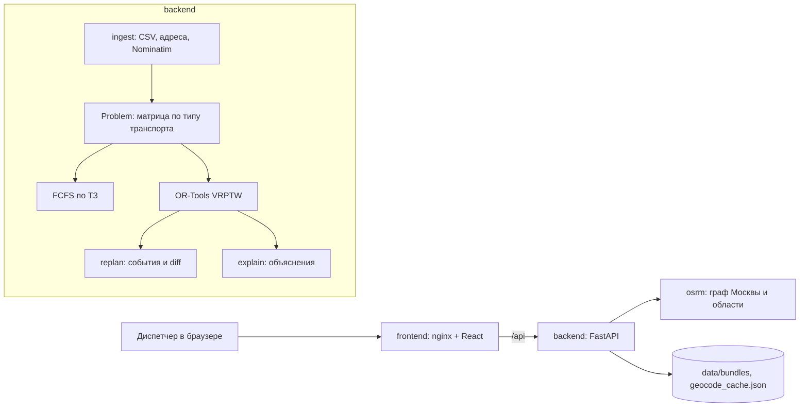

# Планировщик маршрутов выездных инженеров

[](https://github.com/earlyr1/beeline-routing/actions/workflows/ci.yml)
[](https://github.com/earlyr1/beeline-routing/actions/workflows/lint.yml)
[](https://github.com/earlyr1/beeline-routing/actions/workflows/typecheck.yml)
[](https://github.com/earlyr1/beeline-routing/actions/workflows/ci.yml?query=branch%3Amain)
[](https://github.com/earlyr1/beeline-routing/actions/workflows/ci.yml?query=branch%3Amain)
[](https://github.com/earlyr1/beeline-routing/actions/workflows/ci.yml?query=branch%3Amain)


Прототип помощника диспетчера для кейса «Билайн Бизнес» (Лидеры цифровой трансформации). Сервис загружает заявки дня, распределяет их между инженерами с учётом навыков, временных окон, смен и типа транспорта, строит маршруты по дорогам Москвы и области, перестраивает план после событий и объясняет каждое решение простыми словами.

## TL;DR для жюри

Видео, 4 минуты: весь путь пользователя ниже, с субтитрами — что показано и куда нажимать.

https://github.com/user-attachments/assets/7b3fd33b-04d8-4edf-aec0-457751857061

- Демо: https://81.26.188.190.nip.io
- Браузер сам спросит логин и пароль во всплывающем окне: они в описании решения на платформе.

Три реальных региона Билайна (Восток, Юго-восток, Югоцентр), 205 заявок, утренний план посчитан заранее, ночью ([Ночной план](#ночной-план)):

| Показатель | Наш план | Диспетчеры Билайна | Базовый (FCFS из ТЗ) |
|---|---|---|---|
| Инженеров (бригад) | **24** | 35 | 35 |
| Пробег, км | **775,5** | 856,7 | 1670,1 |
| Не назначено | **0** | 2 | 61 |
| Нарушений ограничений | **0** | 35 | 0 |

Бригада = один выездной инженер (в выгрузке «Бригада Арташкин»), в интерфейсе — «Инженеров». Числа — суммы трёх регионов из таблицы [«Результаты на данных Билайна»](#результаты-на-данных-билайна). Базовый — FCFS из ТЗ: заявки по порядку поступления достаются первому подходящему инженеру; ограничений он не нарушает, потому что заявки, которые не влезают, просто оставляет без исполнителя. Нарушения — записи по нашей оценке времени в пути: опоздание к окну, конец работы после смены, переезд велобригады длиннее 15 км; у одной заявки их может быть две. Северо-Запад сгенерирован нами: наш план 9 бригад и 272,5 км против 12 и 390,0 у простой эвристики вместо диспетчеров.

### Путь пользователя

Девять шагов по порядку, около 10–15 минут: каждый показывает свою часть сервиса. Подробный сценарий показа — в разделе [Сценарий демонстрации](#сценарий-демонстрации).

1. **Открыть день.** На экране загрузки, в ряду «Или открыть день региона», нажать «Восток»: появится карточка региона с числом заявок и инженеров. Внизу карточки, под «Нагрузка инженеров», нажать «Спланировать» (на ноутбуке придётся прокрутить). План появится сразу; слева в шапке, под «Восток» и «Сейчас …», — серая пометка «Утренний план: ночной поиск 4 ч 47 мин» (подсказка при наведении). На Востоке ждите: «Инженеров 8 из 12», «Пробег 241,8 км», «Назначено 66», «Не назначено 0»; во вкладке «Сравнение» у диспетчеров 12 инженеров, 282,0 км, 2 не назначено.
   Альтернативы:
   - другой регион: «Юго-восток», «Югоцентр», «Северо-Запад (сгенерирован нами)»;
   - свой файл — шаг 9;
   - нагрузка и обед: до «Спланировать» ползунок «Нагрузка инженеров» («Спокойный день», «Обычный день», «На пределе») и галочка «Обед по плану». С другой нагрузкой или без обеда ночной план не подходит: пометки «Утренний план…» не будет, план ищется до 30 с (без обеда — до 5 с).

2. **План и карта.** Маршруты бригад на карте, у каждой свой цвет. Сверху полоса метрик: «Инженеров», «Пробег», «Назначено», «Не назначено»; у инженеров и пробега — разница «… к базовому».
   Альтернативы: в шапке список «Нагрузка» и кнопка «с обедом» (клик переключает в «без обеда»); после изменения появятся «Применить» и «Отмена», «Применить» считает день заново и сбрасывает события. Кнопка «Весь план» в правом верхнем углу карты закрывает карточку заявки и показывает все маршруты. «Другие данные» — назад к экрану загрузки.

3. **Почему так.** Клик по заявке на карте или во вкладке «Заявки» открывает её карточку в правой колонке над вкладками; маршрут её бригады выделяется, остальные гаснут. Кнопка «Почему?» под коротким выводом в карточке открывает панель слева от карты: «Проверки», «Почему такой выбор», «Другие инженеры» (кто ещё мог взять заявку и сколько лишних км это стоило бы). Закрыть — ✕ или Esc.
   Альтернативы:
   - страница бригады: клик по подчёркнутому имени в строке «Арташкин: приезд …, начало …» под выводом или строка во вкладке «Бригады» — маршрут, личный таймлайн, история событий, а её «Почему?» разбирает маршрут. Список «Бригада:» в карточке не трогать, он переназначает заявку (шаг 6);
   - во вкладке «Заявки» — список «Инженер» и фильтр «Без исполнителя»;
   - вкладка «Таймлайн» — все бригады на шкале дня.

4. **Сравнение с диспетчерами.** Вкладка «Сравнение»: колонки «Базовый (FCFS)», «Оптимизированный», «Диспетчеры», «Оптимизированный к базовому» — инженеры, пробег, назначено, не назначено, нарушения. Ниже — «Пробег по инженерам». До событий числа совпадают с таблицей «Результаты на данных Билайна»; после событий «Оптимизированный» — уже пересчитанный план. Вернуть утренний — «Сброс событий» → «Сбросить».
   Альтернативы: другой регион — «Другие данные» → кнопка региона → «Спланировать». Если меняли нагрузку или обед, сначала верните «Обычный день» и галочку «Обед по плану», иначе пометки «Утренний план…» не будет и цифры разойдутся с таблицей. На Северо-Западе вкладка сама пишет, что «диспетчеры» там не решения людей.

5. **Часы дня**. Под шапкой полоса часов: кнопка ▶, подпись «1 ч = 6 с», время и ползунок с отметками часов. ▶ проигрывает день, ❚❚ — пауза, ползунок двигает время вручную. Бригады едут по маршрутам, у заявок статусы «В пути», «В работе», «Выполнена». В конце шкалы выпадает окно «Итоги дня»: утро против итога, события и звонки (закрытое окно открывает кнопка «Итоги дня» у часов).
   Альтернативы: ползунок назад до события — план без него, вперёд — снова с ним. Клик по метке над ползунком («Срочная», «Задержка», «Изменение», «Звонок»…) открывает список событий этого времени («События 13:00»): «Варианты…» — сменить выбор, «Удалить событие».

6. **Событие и выбор варианта.** Перетащить ползунок часов к отметке «13» (ровно 13:00 не обязательно; для точности — клик по ползунку и ←/→, шаг 1 мин). Красная кнопка «Срочная заявка» справа в шапке: тип «Авария» уже выбран, хватает адреса или «Указать точку на карте» → «Добавить и перепланировать». «Время события» подставится с часов; если поставить его позже часов, окно вариантов откроется, только когда часы до него дойдут. Часы останавливаются на времени события, открывается окно «Как исправить план»: «Оптимально по дню», «Минимум перестановок», «Ничего не менять» с числами «Без инженера», «Опоздания», «Бригад», «Переносов», «Пробег». Лучший вариант помечен «Рекомендуем». «Выбрать» — план меняется, под часами баннер «Новых назначений … · перенесено … · снято …» (закрыть — «Скрыть»); если часы шли, они продолжат. Окно открывается не по типу события, а по результату: здесь «Ничего не менять» оставляет аварию без инженера, а пересчёт её пристраивает. Событие, после которого «Ничего не менять» ломает план не больше пересчёта, применяется сразу, и у его метки на шкале написано «Вариант: Ничего не менять — выбирать было не из чего»; сменить вариант — «Варианты…».
   Альтернативы:
   - срочная заявка с карты: клик по пустому месту → «Добавить заявку здесь»;
   - тип работ: «Авария», «Подключение», «Ремонт у клиента», «Дозаказ оборудования». У «Авария» окно, длительность, транспорт и оборудование свёрнуты в серую строку под адресом («Авария · 80 мин · любой транспорт · как можно скорее»), ссылка «Изменить» в этой строке их раскрывает. У остальных типов поля видны сразу: «Как можно скорее» или «Окно визита» — двухчасовой слот от 10:00–12:00 до 20:00–22:00;
   - в окне вариантов справа карточка «Другая бригада…» → «Выбрать бригаду»: отдать заявку выбранной бригаде и увидеть «Цена решения против «Оптимально по дню»»;
   - переназначить заявку: в её карточке открыть список «Бригада:» и выбрать другую — заявка встанет в маршрут этой бригады, а если так план ломается больше, чем при пересчёте, откроется то же окно;
   - события бригады: кнопки «Смена транспорта», «Задержка» (15, 30, 60 мин или своё число), «Недоступен» в шапке страницы бригады → «Перепланировать»; окно вариантов — по тому же правилу;
   - заявка: «Изменить» в карточке (адрес, окно, длительность, навык, приоритет, транспорт → «Сохранить и перепланировать»; правка тоже может открыть окно вариантов); «Отменить» → внизу по центру уведомление с отсчётом 5 с: ✕ или Esc — не отменять, ✓ — отменить сразу;
   - «Сброс событий» → «Сбросить» возвращает утренний план, часы встают на начало дня.

7. **Кому позвонить — вкладка «Коммуникации»**. На Востоке, пока часы не дошли до 14:00: вкладка «Заявки», Ctrl+F «57866» (ул. Окская, д. 48/2) → «Изменить» → в «Окно визита» выбрать 16:00–18:00 → «Сохранить и перепланировать» (окна вариантов не будет: маршрут принимает новое окно и без пересчёта; оно откроется, только если в шаге 6 выбрали «Ничего не менять» и авария осталась без инженера) → вкладка «Коммуникации»: жёлтая строка «окно было 14:00–16:00 → стало 16:00–18:00». В списке только клиенты, которым не выполняется обещанное окно, с пометкой «Сегодня не приедем», «Вне окна» или «Новое окно»; у двух последних — слот, который назвать клиенту. «✓ Согласовано» ставит на шкалу событие «Звонок» во время часов: названное окно становится окном заявки, а «сегодня не приедем» переносит её, и она считается в «Не назначено». «Снять отметку» убирает событие со шкалы. Число ждущих звонка стоит на вкладке.
   Альтернативы: «✕ Клиент отказался» → «Отменить и пересчитать остаток дня» или «Отменить, маршруты не трогать». Пустой список («Звонить некому…») — тоже результат: визиты сдвинулись внутри окон.

8. **Помощник — вкладка «Рекомендуемые изменения»**. На Востоке: «Арташкин заболел после обеда» → «Отправить»; пока ответ не пришёл, кнопка пишет «Разбираю…». Перед показом каждое предложение проверяют правила сервиса; план меняется только после «Применить» ([Помощник диспетчера](#помощник-диспетчера)).
   Альтернативы: «Отклонить», «Применить все», «Отклонить все». Помощник предлагает срочную заявку, отмену и правку заявки, недоступность, смену транспорта или задержку инженера, либо задаёт уточняющий вопрос. Пример в поле ввода («…на Дубининской») — про Югоцентр.

9. **Свой файл**. Скачать, например, [data/raw/east_synthetic.csv](data/raw/east_synthetic.csv) (на GitHub — «Download raw file»). «Другие данные» → «Загрузить CSV или JSON» или перетащить файл: сырая выгрузка в формате кейса или готовый набор данных (JSON). Полоса прогресса показывает этап: «Чтение файла» → «Поиск адресов на карте» → «Расчёт расстояний». Сервис узнаёт регион по адресу офиса и показывает карточку разбора: заявки, инженеры, «Адреса на карте» по точности; если в файле есть проблемы — «Пропущено строк» и «Замечания к окнам» (на файлах `data/raw` их нет). Дальше «Спланировать», как в шаге 1.
   Альтернативы: те же нагрузка и обед перед «Спланировать». Ночной план подхватывается, только если задача дня совпала с ночным расчётом; иначе план ищется при загрузке.


## Что умеет

- Загрузка сырого CSV Билайна или готового JSON-бандла, фоновый предподсчёт с прогрессом. Под выбором файла — ряд «Или открыть день региона»: «Восток», «Юго-восток», «Югоцентр» и «Северо-Запад (сгенерирован нами)», у каждой кнопки заявки и бригады дня. День региона открывается одним нажатием, тем же путём, что и загруженный файл. Окна заявок в файле проверяются, но не подменяются: строка, у которой окно кончается не позже начала или уходит дальше горизонта планирования, пропускается с причиной (в такое окно не приедешь никогда), а окно вне рабочего дня, слишком короткое окно приезда и окна не по сетке попадают в отчёт разбора замечанием — с номером строки, номером заявки и обоими числами. Файл остаётся источником правды: заявка с замечанием остаётся в дне со своим окном, окно аварии на весь день (00:01–23:59) замечанием не считается, а если файл правили в Excel, день строится по нему, а не по подготовленному бандлу региона. У заявки, которая из-за своего окна осталась без инженера, причина в карточке называет те же числа. На восьми файлах `data/raw` проверка не находит ничего и не теряет ни одной строки.
- Два плана на один день: базовый FCFS строго по ТЗ и оптимизированный OR-Tools, плюс реальное распределение диспетчеров для сравнения.
- Нагрузка инженеров из трёх шагов: 😌 «Спокойный день», 😐 «Обычный день» и 🥵 «На пределе». Чем выше нагрузка, тем дороже оптимизатору каждый новый инженер; базовый FCFS от неё не зависит. Выбирается ползунком перед планированием и меняется прямо в шапке рядом с метриками вместе с обедом: оба выбора применяются одной кнопкой «Применить», день пересчитывается заново, события дня сбрасываются, часы встают на начало дня.
- Обязательные метрики ТЗ: число задействованных инженеров, пробег по каждому и суммарно.
- Ночной план: утренний план каждого региона можно заранее искать долгим поиском, как ежедневный батч. Если задача дня та же, сервис берёт его при загрузке без поиска и пишет под часами в шапке, сколько шёл ночной поиск: «Утренний план: ночной поиск 4 ч 47 мин»; события дня пересчитываются от него, как от любого утреннего плана. Подробнее — в разделе «Ночной план».
- Окно визита диспетчер не придумывает, а выбирает из сетки: рабочий день 10:00–22:00 нарезан на двухчасовые слоты 10:00–12:00 … 20:00–22:00 — ровно те окна, которыми пользуются настоящие диспетчеры Билайна (у 205 заявок трёх реальных регионов выгрузки других окон нет, весь день стоит только у аварий). Сетку задаёт конфиг от смены и длины окна, сервер отдаёт её клиенту, и она действует везде, где окно выбирают или предлагают: диалоги срочной заявки и правки заявки, окно, которое вкладка «Коммуникации» советует назвать клиенту, и окно, которое предлагает помощник. Окно вне сетки сервер от диспетчера не принимает — ни из диалога, ни звонком клиенту, ни подтверждением предложения помощника, и снять «как можно скорее» тоже можно только выбором слота; заявки самих данных на сетку не кладутся — там окно аварии на весь день; если окно в файле с сеткой не совпало, сервис говорит об этом в отчёте разбора, но оставляет окно как есть.
- События дня: срочная заявка с окном из сетки или «как можно скорее», отмена и изменение заявки (адрес, окно, длительность, навык, приоритет, требование к транспорту), недоступность инженера, смена транспорта инженера (например, сломалась машина или выдали автомобиль), задержка инженера с прогнозом опозданий, переназначение заявки на выбранную бригаду из карточки заявки, звонок клиенту («✓ Согласовано» во вкладке «Коммуникации»). Переназначенная заявка закреплена за бригадой и в следующих событиях, пока бригада может её взять. Начатые визиты закрепляются, визит, к которому инженер уже выехал, не переназначается, изменения показываются баннером, а к плану до события возвращает ползунок часов.
- Варианты исправления: на любое событие сервис считает три варианта — «Оптимально по дню», «Минимум перестановок» и «Ничего не менять» (только само событие: чужие маршруты как есть, заявки, оставшиеся без бригады, так и остаются; заявку, которую диспетчер отдал бригаде, та вставляет в свой маршрут и пропускает то, на что уже не успевает), — сравнивает их по клиентам без инженера и опозданиям, бригадам, переносам заявок и километрам и рекомендует лучший. Окно выбора открывается по результату, а не по типу события: часы встают на событии, только если «Ничего не менять» оставляет больше клиентов без инженера или с опозданием, чем лучший пересчёт (аварии и срочные считаются первыми). Иначе событие применяется с «Ничего не менять», а выбор, как и любой, можно поменять с метки события на шкале. У события об одной заявке, которая после него остаётся в работе (срочная заявка, правка заявки, звонок с окном), есть четвёртый вариант — отдать её конкретной бригаде: план считается по запросу, когда бригада названа, и карточка показывает цену такого решения по сравнению с «Оптимально по дню».
- Бригада «с выходного» отдельной кнопки не требует, её заменяет цена. В пересчёте участвуют все бригады дня, и бригада без начатой работы, в том числе не попавшая в утренний план, стоит решателю полную цену нового инженера (её задаёт нагрузка дня), а уже работающая — ничего. Поэтому свободную бригаду пересчёт зовёт, только когда без неё выходит дороже, обычно когда иначе заявки остаются без инженера.
- Часы дня: ползунок текущего времени от 09:00 до конца смен с запуском в темпе 1 час за 6 секунд. События живут на шкале со своим временем: план в любой момент равен исходному плану плюс все события до ползунка. Отвели ползунок до события — план вернулся без него, вернули после — событие снова в плане. Пересчёт идёт при отпускании ползунка и при пересечении события.
- Итоги дня: когда часы доходят до конца шкалы, выпадает окно «Итоги дня» — утренний план против итога (инженеры, пробег, назначено и выполнено, без инженера и из них перенесено со звонком, нарушения, опоздания), итог к базовому FCFS и к диспетчерам, события дня по видам и звонки: сколько клиентов согласовано и сколько ещё ждут. Окно выпадает один раз на приход часов в конец дня, закрытое открывает кнопка «Итоги дня» у часов.
- Где бригады сейчас: на карте маркер каждой бригады едет по линии маршрута, в списке заявок статусы «Выполнена», «В работе» и «В пути», на таймлайнах линия текущего времени.
- Карта маршрутов на Яндекс Картах; без ключа или при ошибке загрузки та же карта рисуется на подложке OpenStreetMap.
- Объяснение по любой заявке: какие ограничения проверены, кто ещё мог взять заявку и во сколько километров это обошлось бы.
- Объяснение маршрута инженера: порядок визитов, запас до конца окон, пробег и окончание работы относительно смены.
- Обед по плану включён по умолчанию и переключается там же, галочкой перед планированием и кнопкой в шапке: 45 минут с началом через 3–6 часов после начала смены, в оптимизированном плане и в FCFS. Обед виден полосой на таймлайне и строкой в маршруте бригады.
- Страница бригады: личный таймлайн, маршрут, история событий и кнопки «Смена транспорта», «Задержка», «Недоступен». Имена бригад кликабельны в списке заявок, в карточке заявки и на таймлайне, из заявки можно вернуться к бригаде.
- Отмена заявки из её карточки, из списка заявок и из вкладки «Коммуникации». Отмена уходит на сервер через 5 секунд: пока в уведомлении «Заявка … отменена» идёт отсчёт, «✓» применяет её сразу, а «✕» или Esc позволяют передумать, и на сервер ничего не уходит; вернуть отменённую заявку позже нельзя. Клик по пустому месту карты предлагает «Добавить заявку здесь»: открывается срочная заявка с этой точкой, адрес подставляется по координатам.
- Срочная заявка начинается с типа работ: «Авария», «Подключение», «Ремонт у клиента» или «Дозаказ оборудования». Тип сам заполняет навык, длительность, требование к транспорту и оборудование по нормативам организаторов; цифры присылает сервер из того же конфига, по которому собраны заявки дня. Сразу выбрана авария: она «как можно скорее», поэтому форма сворачивается до места и времени события, а заполненное видно одной строкой («Авария · 80 мин · автомобиль · как можно скорее»). 80 минут — работа на адресе без 20 минут дороги из норматива 100: дорогу сервис считает сам по карте (подробнее в «Подготовке данных»), и подсказка у длительности говорит об этом в диалоге. «Изменить» раскрывает поля, и любое значение можно поправить. Уровень распределения заявка получает от своего типа работ, как заявка дня: срочное подключение помечено «Подключение».
- Оборудование как ограничение: бригада получает железки (роутеры, приставки, колонки) в офисе утром сразу на весь день, по умолчанию 6 единиц, и заявка с оборудованием тратит одну. Бригада из Подмосковья, которая начинает день дома, везёт такой же запас. Больше, чем бригада увезла, ей не назначат ни оптимизатор, ни базовый FCFS; при перепланировании выданное не возвращается. У заявки метка «Оборудование», на странице бригады видно, сколько единиц она взяла утром и сколько осталось к текущему времени, а заявка, которую некому взять из-за оборудования, получает об этом отдельную причину.
- Три уровня приоритета распределения: авария → подключение → ремонт и дозаказ. Когда дня не хватает на всех, планировщик снимает сначала ремонт и дозаказ, потом подключение и только в последнюю очередь аварию. Уровень идёт от типа работ, а не от навыка: дозаказ делит навык с подключением, но остаётся на нижнем уровне. В списке заявок и в карточке подключение помечено меткой уровня; аварию и так видно по «Срочная» и приставке URG-.
- Заявка со статусом «Отменена» в выгрузке — обычная заявка дня: клиент отказывался уже после приезда инженера, время и дорога потрачены. Шкала времени в начале дня пустая, отмену диспетчер ставит сам.
- Причина для каждой неназначенной заявки: нет навыка, нет транспорта, не помещается в окно или смену, нет свободных исполнителей, адрес не найден. Причина видна в строке заявки; фильтр «Без исполнителя» во вкладке «Заявки» оставляет только такие заявки, и под открытой страницей бригады тоже: видно, какую из них можно ей отдать. Их число стоит на самой вкладке.
- Адреса понимаются и в формате выгрузки, и в ручной записи диспетчера: «Москва, Перовская улица 42к1», «ул. Перовская, дом 42, корпус 1».
- Срочная заявка всюду подписана «URG-<номер>»: и пришедшая с данными дня со своим билайновским номером (авария из выгрузки, например URG-24980), и заявка дня, которую диспетчер сделал срочной правкой, и добавленная диспетчером. Так же её называют сообщения сервера («Заявка URG-24980 уже в работе с 10:08, отменить её нельзя.») и помощник диспетчера. Номер заявки от подписи не меняется: в событиях, API и бандле он остаётся сырым.

## Быстрый старт в Docker

Нужно: Docker Desktop с Compose 2.24 или новее, 4 ГБ памяти для Docker, 5 ГБ на диске, интернет при первой сборке.

```bash
cp .env.example .env                                   # ключи Яндекс Карт и LLM необязательны
docker compose --profile prepare run --rm --build osrm-prepare   # граф дорог, один раз, ~3.5 мин
docker compose up -d --build
```

Откройте http://localhost:8000. Документация API: http://localhost:8000/api/docs.

Поднимаются четыре сервиса: интерфейс, backend, OSRM и Postgres, в котором живёт день диспетчера (раздел «Состояние дня»). Учётные данные базы подставляются сами, править `.env` ради них не нужно, наружу база не торчит. Схему приводят в порядок миграции backend на старте.

Кроме первой сборки сеть не нужна: граф OSRM собирается локально, а бандлы дня, матрицы общественного транспорта (`data/transit`) и ночные планы (`data/bundles/<регион>/night_plan.json`) лежат в репозитории и копируются в образ backend. Точные цифры раздела «Результаты на данных Билайна» и пометка «Утренний план: ночной поиск …» — на демо-стенде: его граф собран из той же выгрузки OpenStreetMap, которую качает `osrm-prepare`, но OSRM, собранный заново, расходится с ним на метры в отдельных парах точек. Тогда отпечаток задачи (раздел «Ночной план») другой, и утренний план ищется при загрузке, до 30 секунд, начиная с маршрутов ночного файла. Хуже он не получается: на графе, собранном с нуля 25.09.2026, Восток, Югоцентр и Северо-Запад дали те же бригады и километры, Юго-восток — 360,8 км вместо 361,9.

На экране загрузки два пути к данным. Основной — выбрать файл: сырую выгрузку Билайна (`data/raw/<регион>_synthetic.csv`) или готовый бандл JSON. Именно по нему идёт демонстрация из ТЗ, поэтому кнопка «Загрузить CSV или JSON» с перетаскиванием файла стоит первой. Второй путь — ряд «Или открыть день региона» под выбором файла: «Восток», «Юго-восток», «Югоцентр» и «Северо-Запад (сгенерирован нами)», на каждой кнопке заявки и бригады дня. Нажатие открывает день региона из `data/bundles` без файлового диалога: это и запасной путь, когда диалог выбора файла подводит, и способ за секунды показать любой из четырёх регионов, когда спрашивают про остальные. Дальше оба пути одинаковы: тот же предподсчёт, тот же отчёт, тот же ночной план и та же пометка «Утренний план: ночной поиск …». Названия регионов, числа заявок и бригад и подпись «сгенерирован нами» приходят с сервера (`GET /api/scenarios`), день региона запускает `POST /api/scenarios/<регион>` и отвечает тем же статусом датасета, что и загрузка файла. «Северо-Запад» — не данные Билайна, он сгенерирован нами (раздел «Подготовка данных» и [docs/assumptions.md](docs/assumptions.md)): об этом говорит кнопка, потом заголовок отчёта «Северо-Запад — сгенерирован нами» с пометкой под ним, а во вкладке «Сравнение» — подпись, что «диспетчеры» этого региона не решения людей, а наша эвристика. Та же пометка появляется, когда его `north_west_synthetic.csv` загружают файлом.

Открывайте именно `localhost`, а не `127.0.0.1`: ключ Яндекс Карт ограничен по HTTP Referer значением `localhost`, на другом адресе карта не загрузится. У бесплатного ключа суточный лимит запросов, лишний раз страницу не перезагружайте: перезагрузка в той же вкладке восстанавливает план, но заново загружает карту. Без ключа или если Яндекс Карты не загрузились, план показывается на подложке OpenStreetMap.

Подложка Яндекс Карт при первом показе дорисовывается за несколько секунд: сначала видна только часть тайлов. Кнопка «Весь план» перерисовывает карту сразу.

Шаг `osrm-prepare` скачивает выгрузку OpenStreetMap по Центральному федеральному округу от 22.09.2026 (876 МБ) — ту, из которой собран граф демо-стенда; если Geofabrik её когда-нибудь уберёт, скачивается свежая. Дальше он вырезает Москву и область (218 МБ) и собирает граф OSRM в volume `osrm-data`. Повторный запуск ничего не делает. Без графа сервис работает на расстояниях по прямой, а отчёт предподсчёта показывает `matrix_source: haversine`.

Проверка backend без интерфейса:

```bash
docker compose up -d --build --wait backend osrm
docker compose exec backend python scripts/smoke_api.py
```

Скрипт загружает бандл Востока, строит план, применяет три демо-события, запрашивает объяснение и линии маршрутов и печатает метрики.

Сервер для жюри в Yandex Cloud — HTTPS по IP, пароль на всё, выкат из GitHub Actions после зелёных тестов — описан в [docs/deploy.md](docs/deploy.md).

## Разработка без Docker

Backend (Python 3.12 и [uv](https://docs.astral.sh/uv/)):

```bash
docker compose up -d osrm                        # по желанию: OSRM на http://localhost:5050
cd backend
uv sync
OSRM_URL=http://localhost:5050 GEOCODER=cache-only uv run uvicorn app.api.main:app --reload --port 8001
```

Frontend: `cd frontend && npm ci && npm run dev`, dev-сервер Vite проксирует `/api` на `http://localhost:8001`.

Тесты, линтер и типы:

```bash
cd backend
uv run pytest
uv run ruff format --check app tests scripts && uv run ruff check app tests scripts
uv run mypy                                      # то же, что make typecheck: app, scripts и tests
```

Базы для этого не нужно: без `DATABASE_URL` день живёт в памяти процесса, как раньше. Тесты уровня API идут дважды — на памяти и на Postgres (`test_x[memory]` и `test_x[postgres]`), чтобы две реализации хранилища не разошлись незаметно; без `TEST_DATABASE_URL` постгресовые половины пропускаются, и в конце обычного прогона их видно как `skipped`. `make test-db` поднимает базу на время прогона, гоняет по ней всё помеченное маркером `db` и убирает базу за собой. В `make check` он не входит — предкоммитный прогон не должен требовать Docker, — поэтому `make test` в конце сам напоминает, что тесты базы остались непрогнанными.

Линтер, типы, тесты и фронт разом — `make check`. Стиль и типы ловятся и раньше, на самом коммите: `make pre-commit-install` один раз ставит [pre-commit](https://pre-commit.com/) инструментом uv и вешает его на `git commit`. Хук ставится на репозиторий, а не на рабочую копию: он общий для всех `git worktree`, а на ветках без `.pre-commit-config.yaml` коммит проходит без проверок. Тестов в хуке нет, коммит остаётся быстрым. Хук смотрит на файлы коммита: ruff исправляет и форматирует Python в `backend`, mypy проверяет весь backend в его окружении uv, а для всего репозитория — синтаксис YAML и TOML, забытые маркеры конфликта слияния, новые файлы больше 1 МБ (кроме презентации) и приватные ключи. Если ruff что-то поправил, коммит прерывается: исправленное остаётся в рабочей копии, его надо `git add` и закоммитить заново. Весь репозиторий разом — `uvx pre-commit run --all-files`; хуки описаны в `.pre-commit-config.yaml`, настройки mypy — в `[tool.mypy]` файла `backend/pyproject.toml`.

Бейджи в начале README живые. `ci`, `lint` и `typecheck` — бейджи самого GitHub Actions: итог последнего прогона одноимённого workflow на `main`. `lint` и `typecheck` гоняют ruff и mypy отдельно ради своих бейджей, выкат же ждёт тех же проверок в `ci`. Тесты и покрытие считает `ci.yml`: покрытие backend — сумма прогона без базы и прогона на Postgres (job `coverage`), фронта — `vitest --coverage`, тесты — по отчётам JUnit всех трёх прогонов. SVG рисует `backend/scripts/badges.py`, а job `badges` кладёт их в ветку `badges` после каждого пуша в `main`, чем бы ни кончились тесты, если коммит всё ещё верхушка `main`. Так бейджи всегда про последний `main`, а не про последний зелёный: упал тест — `tests` красный и показывает, сколько упало; покрытие ниже порога или при упавшем vitest — измеренный процент, но красный; отчёта нет (job упал раньше тестов, покрытие не считалось) — серый `unknown`. Покрытие считается по строкам, порог чуть ниже измеренного — `FAIL_UNDER` job `coverage` и `thresholds` в `frontend/vite.config.ts`; ниже порога CI красный и выкат не идёт. Локально: `make test PYTEST_ARGS=--cov` (без половин `[postgres]`, поэтому процент ниже) и `cd frontend && npx vitest run --coverage`. Python, React и Docker — просто факты о стеке. Репозиторий закрытый: бейджи видят те, у кого к нему есть доступ.

Переменные окружения backend:

| Переменная | По умолчанию | Назначение |
|---|---|---|
| `DATA_DIR` | `data` в корне репозитория | бандлы, ночные планы, матрицы 2ГИС (`transit`) и кэш геокодера |
| `CACHE_PATH` | `$DATA_DIR/cache.sqlite` | кэш матриц и линий OSRM |
| `OSRM_URL` | не задан | адрес OSRM; без него расстояния по прямой |
| `GEOCODER` | `nominatim` | `cache-only` не ходит в сеть за новыми адресами |
| `TRANSIT_MATRIX_DIR` | `$DATA_DIR/transit` | матрицы 2ГИС для общественного транспорта из файлов каталога, читаются при старте; каталог лежит в репозитории и едет в образе |
| `SOLVER_TIME_LIMIT_S` | `5` | лимит поиска OR-Tools для плана дня без обеда и для пересчёта по событиям, секунды |
| `SOLVER_TIME_LIMIT_LUNCH_S` | `30` | лимит поиска OR-Tools для плана дня с обедом, секунды |
| `SOLVER_WORKERS` | число ядер, не больше 4 | процессов для одновременного поиска OR-Tools разными стратегиями; `1` ищет одной стратегией в процессе backend |
| `DATABASE_URL` | не задан | Postgres, в котором живёт день диспетчера (`postgresql://…`); в compose подставляется сам. Без него день живёт в памяти процесса и теряется при перезапуске |
| `YANDEX_MAPS_API_KEY` | не задан | ключ JavaScript API Яндекс Карт, отдаётся фронту через `/api/config`; без него карта на OpenStreetMap |
| `LLM_BASE_URL`, `LLM_API_KEY`, `LLM_MODEL` | не заданы | OpenAI-совместимый API помощника; ключ необязателен для локальных моделей |
| `LLM_TOOL_MODE` | `auto` | `tools` только вызов инструментов, `json` только JSON в ответе, `auto` инструменты с переходом на JSON |

## Помощник диспетчера

Вкладка «Рекомендуемые изменения» принимает сообщение обычным языком, например «Арташкин заболел после обеда, а клиент на Дубининской отказался». Backend отправляет модели правила и состояние дня, модель отвечает вызовами инструментов: срочная заявка, отмена, изменение заявки, недоступность инженера, смена транспорта, задержка инженера или уточняющий вопрос. Инструмента возврата отменённой заявки нет: на «верните заявку 57866» помощник отвечает, что возврат не поддерживается. Модель ничего не меняет сама. Каждый ответ проверяется без участия модели: инженер и заявка должны однозначно найтись, время не раньше текущего, адрес срочной заявки находится геокодером, событие не противоречит плану. Заявку можно назвать номером, улицей или подписью из интерфейса «URG-<номер>»: префикс срочной заявки помощник отбрасывает и ищет заявку по её номеру. Прошедшие проверку предложения ждут решения диспетчера, остальные показываются с причиной. Кнопки «Применить» и «Применить все» отправляют событие в тот же пересчёт, что и ручные кнопки, поэтому карта, списки и баннер изменений обновляются одинаково.

Подойдёт любой OpenAI-совместимый провайдер. Для экономии выбирайте недорогую модель с поддержкой вызова инструментов; если провайдер инструменты не поддерживает, `LLM_TOOL_MODE=auto` сам перейдёт на JSON-ответ. Промпт растёт с числом заявок: для 66 заявок Востока это около 20 тысяч символов на сообщение.

Проверенная бесплатная связка — OpenRouter: `LLM_BASE_URL=https://openrouter.ai/api/v1`, ключ из кабинета (`openrouter.ai/settings/keys`), `LLM_MODEL=nex-agi/nex-n2.5-mini:free`. На семи фразах диспетчера, прогнанных через настоящий путь сервиса на дне Востока, эта модель выбрала верный инструмент семь раз из семи, ответ занимает 3–4 секунды (срочная заявка с новым адресом дольше: там ещё работает геокодер). Бесплатные модели делят общий пул провайдера, поэтому любая из них в любой момент может ответить `429`: держите наготове вторую, например `inclusionai/ling-3.0-flash-vl:free`. Лимит бесплатного тарифа — 20 запросов в минуту и 50 в сутки, для показа этого хватает с запасом. Помощник — единственное место сервиса, которому нужна сеть; всё остальное считается локально, и без ключа сервис работает как раньше, просто без вкладки «Рекомендуемые изменения».

Проверка без интерфейса:

```bash
docker compose exec backend python scripts/smoke_proposals.py "Арташкин заболел после обеда" --approve
```

## Подготовка данных

Бандлы регионов `data/bundles/<регион>/bundle.json` собираются из `data/raw` скриптом и лежат в git вместе с отчётами `report.md`:

```bash
cd backend
uv run python -m app.synth.prepare --region all --osrm-url http://localhost:5050 --geocoder cache-only
```

Без `--geocoder cache-only` новые адреса геокодируются через публичный Nominatim не чаще раза в секунду. Скрипт завершается с ошибкой, если базовый вариант не уступает оптимизированному: так проверяется требование ТЗ о конфликте в данных. Все досинтезированные поля и коэффициенты описаны в [docs/assumptions.md](docs/assumptions.md).

Время работ на адресе берётся из официальных нормативов организаторов («Нормативы.xlsx»): подключение 70 минут, авария 80, дозаказ 20, локальная заявка 30. В ответах организаторов на вопросы команд для аварии назван норматив 100 минут — это те же 20 минут дороги плюс 80 минут работ из их таблицы. Дорогу сервис считает сам, по матрице OSRM от предыдущего адреса бригады с коэффициентом пробок, поэтому на объекте планируются 80 минут, а дорога добавляется отдельно: взять 100 значило бы посчитать дорогу дважды и раздуть день бригады. То же правило применено ко всем четырём типам работ.

Регион «Северо-Запад» сгенерирован: реальной выгрузки по нему нет. Пара CSV в формате выгрузки Билайна собирается из реальных адресов OpenStreetMap и описания региона с выдуманными бригадами, дальше работает тот же `prepare`. В регионе сложнее ездить: петли Москвы-реки с редкими мостами (Строгино, Мнёвники, Терехово, Крылатское), Химкинское водохранилище и канал имени Москвы, Сходня и железные дороги.

```bash
cd backend
uv run python -m app.synth.generate_region --spec config/regions/north_west.yaml --fetch   # обновить адреса из Overpass API
uv run python -m app.synth.generate_region --spec config/regions/north_west.yaml           # CSV из сохранённых адресов
uv run python -m app.synth.prepare --region north_west --osrm-url http://localhost:5050
```

Пешком и общественный транспорт — один вид транспорта «Общественный транспорт и пешком». Если обе точки пары нашлись в одной матрице 2ГИС `data/transit/<регион>.json`, время берётся из неё. Точка дня привязывается к ближайшей точке матрицы не дальше 150 м, так что метры расхождения геокодера и порядок точек не важны; если у региона дня есть матрица, а часть точек к ней не привязалась, сервис пишет об этом в лог при старте дня. `python -m scripts.transit_error` показывает, сколько точек бандлов привязалось. Остальные пары считаются формулой: быстрее из «пешком» (d × 1.3 при 5 км/ч) и поездки 22.5 + 2.8·d минут, где d — км по прямой. Так считаются пары с новой точкой (срочная заявка, изменённый адрес), пары дальше 50 км, которые демо-ключ 2ГИС не строит, и пары без маршрута. Формула подобрана по 23 тыс. пар матриц 2ГИС: средняя ошибка 19% против 28% у прежней модели, в пределах ±25% попадают 73% пар против 62%. Матрицы лежат в репозитории (`data/transit/<регион>.json`) и копируются в образ backend, поэтому сервис берёт минуты 2ГИС на любой машине, без ключа и без сети; пересчитывает их демо-ключом `scripts/transit_matrix.py`, и после пересчёта образ надо пересобрать. Бандлы и их отчёты `report.md` посчитаны без матриц — в этом режиме их пишет `prepare` (раздел «Результаты на данных Билайна»).

У бригад без автомобиля ограничено одно плечо маршрута: велосипед не дальше 15 км, общественный транспорт не дальше 25 км, у автомобиля предела нет. Без предела бригады без автомобиля уезжали дальше, чем на них ездят: в базовом плане Юго-востока велобригада получала плечи 21 и 20 км, бригады на общественном транспорте — 28 и 31 км, а оптимизатор в разных прогонах отправлял в Каширу то велобригаду с маршрутом в 105 км, то бригаду на общественном транспорте с маршрутом в 136 км. По смене такой маршрут проходит, потому что снять заявку дороже любого пробега, по здравому смыслу — нет. Предел в километрах, а не в минутах: так он не зависит от коэффициента пробок и запаса на дорогу и совпадает с числом, которое диспетчер видит в маршруте.

```bash
cd backend
uv run python -m scripts.transit_matrix --region all --dry-run            # план расхода запросов демо-ключа
TWOGIS_API_KEY=... uv run python -m scripts.transit_matrix --region all   # матрицы в data/transit, backend читает их при старте
uv run python -m scripts.transit_error                                    # ошибка формулы против матриц по регионам и расстояниям
```

## Ночной план

Поиск при загрузке дня ограничен 30 секундами (с обедом) и иногда останавливается в локальном оптимуме: на Югоцентре с матрицами 2ГИС поиск за 30 секунд даёт 7 бригад и 142.60 км, а ночной поиск находит план на 6 бригад и 171.79 км — по весам он дешевле, потому что бригада стоит дороже лишних километров. На Юго-востоке то же самое: 11 бригад и 311.76 км за 30 секунд против 10 и 361.87 за ночь. На Востоке число бригад совпадает, а километры нет: 280.86 за 30 секунд против 241.80 за ночь. В промышленной версии утренний план — ежедневный батч (например, задача Airflow): ночью план каждого региона ищется столько, сколько не жалко, а днём события пересчитываются от почти оптимального плана за секунды. В прототипе батч запускается командой:

```bash
docker compose up -d osrm                  # скрипту нужен тот же OSRM, что и сервису
cd backend
uv run python -m scripts.night_plan --region all --minutes 120
docker compose up -d --build backend       # ночные планы копируются в образ вместе с бандлами
```

При локальном запуске расчёт идёт часами: на это время подключите питание и не давайте компьютеру уснуть. `--minutes` — лимит поиска на регион, `--workers` — процессов поиска на регион (больше 4 не нужно: в портфеле четыре стратегии), `--parallel` — сколько регионов искать одновременно, `--out` — другой каталог вместо `data/bundles`, `--osrm off` — расстояния по прямой (только с `--out`: сервис в docker-compose считает с OSRM, и такой план ему не подойдёт). По умолчанию процессов не больше ядер: на 10 ядрах четыре региона идут сразу по два процесса, и вся ночь занимает один лимит — 2 часа, плюс по 30 секунд живого поиска на регион. День региона скрипт собирает тем же кодом, что и сервис: бандл, OSRM, матрицы 2ГИС из `data/transit`, нагрузка «Обычный день», обед по плану. Сначала каждый регион ищется так же, как сервис при загрузке дня, на той же задаче: те же стратегии (`SOLVER_WORKERS`) и лимит 30 секунд, по региону за раз. Долгий поиск стартует от лучшего из этого плана и прежнего ночного, поэтому записанный план по цели не хуже 30-секундного. Прежний файл с тем же отпечатком, который дешевле по цели, не перезаписывается. Если OSRM ответил на проверку, но не отдал матрицу, регион не записывается: план по прямой сервису с OSRM не подойдёт. В конце скрипт печатает по каждому региону новый ночной план (и сколько на самом деле шёл поиск), живой поиск 30 секунд на той же задаче, прежний ночной план, оптимизированный план из `report.md` (30 секунд, без матриц 2ГИС: при 2ГИС это другая задача) и план диспетчеров: бригады, километры, заявки без исполнителя.

Результат — `data/bundles/<регион>/night_plan.json`, рядом с бандлом. В файле только номера и числа: отпечаток задачи, лимит поиска, сколько поиск шёл на самом деле, число процессов, время расчёта, маршруты номерами заявок по бригадам и итоги. Сколько шёл поиск, скрипт меряет сам: если компьютер при локальном запуске уснул, поиск короче лимита, и пометка в интерфейсе покажет настоящее время. Запуск, стартовавший от прежнего плана той же задачи, прибавляет время прежнего поиска: короткая проба после двухчасового расчёта не превратит «2 ч» в «12 с». Минут 2ГИС в нём нет: отпечаток — хэш SHA-256.

Отпечаток задачи — хэш всего, что определяет оптимизацию дня: заявок и бригад (поля, которые читают солверы и проверка ограничений), обеда, весов цели и запаса на дорогу уровня нагрузки, а также минут и километров, которыми солвер реально пользуется, с OSRM, пробками и 2ГИС. Порядок строк во входных данных на него не влияет, одинаковый отпечаток получают локальный запуск и Linux-контейнер, готовый бандл и сырой CSV того же дня. Сервис при загрузке дня берёт ночной план утренним без поиска, только если отпечаток совпал, а маршруты файла проходят проверку всех ограничений и назначают столько же заявок. Иначе — выбрали другую нагрузку или обед, поменялись заявки, OSRM или файлы 2ГИС — план ищется при загрузке, как раньше; если маршруты ночного плана на этой задаче ещё допустимы, поиск стартует от них и не даёт план хуже. Почему ночной план взят или нет, backend пишет в лог одной строкой («Ночной план региона east не подошёл: отпечаток задачи другой …»); посмотреть: `docker compose logs backend | grep "Ночной план"`. Матрицы входят в отпечаток, поэтому ночной план надо считать на том же графе OSRM, каким пользуется сервис: граф сервера для жюри собран 23.09.2026 из выгрузки Geofabrik от 22.09, отпечаток прежних ночных планов с ним не совпал, и 24.09.2026 планы пересчитаны на этом графе — локальный OSRM переведён на граф сервера.

Пометка «Утренний план: ночной поиск …» под часами в шапке значит, что утренний план взят из ночного расчёта; подсказка у неё — когда он посчитан и что события дня пересчитываются на месте. После событий пометка остаётся: она про утренний план, а метрики рядом — уже план после пересчёта. У плана, найденного при загрузке, пометки нет. Ночные планы, как бандлы и матрицы 2ГИС, лежат в репозитории и копируются в образ backend. Без поиска утренний план получает сервис с графом стенда: цифры в таблице «Результаты на данных Билайна» ниже. Чистый клон собирает граф из той же выгрузки, но пересобранный OSRM расходится со стендом на метры в отдельных парах, поэтому там утренний план ищется при загрузке, начиная с ночных маршрутов (раздел «Быстрый старт в Docker»). Что даёт тот же день без ночных планов и без матриц, разобрано там же, в «Других режимах».

## Сценарий демонстрации

1. Загрузить `data/raw/east_synthetic.csv`. Сервис узнаёт регион по адресу офиса, показывает прогресс и отчёт предподсчёта. По ТЗ показываем именно сырую выгрузку; кнопка «Восток» в ряду «Или открыть день региона» открывает тот же день без файлового диалога — на случай, если диалог подведёт, и на вопрос про другие регионы.
2. Нажать «Спланировать».
3. Показать заявки и маршруты на карте, полоску метрик с тремя колонками: FCFS, оптимизированный план, диспетчеры.
4. Открыть заявку и показать объяснение: в карточке короткий вывод, кнопка «Почему?» открывает слева от карты панель с проверенными ограничениями, альтернативными инженерами и факторами выбора. Та же кнопка на странице бригады разбирает маршрут.
   Клик по имени бригады или строка во вкладке «Бригады» открывает страницу бригады с маршрутом, личным таймлайном и историей событий. На карте кликаются только заявки: маркеры бригад клик пропускают к заявке под ними.
5. Добавить срочную заявку, отменить заявку или сделать инженера недоступным. Срочная заявка открывается кнопкой сверху или кликом по карте «Добавить заявку здесь», события бригады открываются с её страницы.
   Время события берётся с часов дня (для демо поставьте часы на 13:00); в срочной заявке заранее выбрана «Авария», и хватает адреса или точки на карте. У других типов работ окно выбирается из сетки слотов, и по умолчанию подставлен ближайший слот, в который ещё успеваем: слот, где до конца осталось меньше, чем идут работы, клиенту не называют, а прошедших слотов в списке нет вовсе. В диалогах событий бригады заранее выбрана эта бригада.
   Альтернатива: написать то же событие во вкладке «Рекомендуемые изменения» и нажать «Применить».
   «Смена транспорта» показывает оба направления: пересадка с автомобиля на велосипед отдаёт другим заявки, которым нужен автомобиль, а выданный автомобиль позволяет инженеру брать такие заявки и ездить быстрее.
   Кнопка «Изменить» в строке заявки или в её карточке открывает форму правки: например, клиент попросил перенести визит на после 16:00. Сохранение перестраивает план так же, как остальные события, а баннер показывает, что поменялось.
   В карточке заявки список бригад позволяет переназначить её вручную (бригада текущего плана выделена): заявка встаёт в маршрут выбранной бригады, а если так план ломается больше, чем при пересчёте, часы останавливаются, и окно предлагает «Оптимально по дню», «Минимум перестановок» или «Ничего не менять».
   «Задержка» на странице бригады показывает прогноз опозданий: баннер сравнивает, к скольким клиентам инженер опоздал бы без перепланирования, с планом после пересчёта.
   Полоса «Время дня» под метриками двигает текущее время: «Запустить» проигрывает день в темпе 1 час за 6 секунд, метки на шкале показывают события, а новое событие со страницы бригады, с красной кнопки «Срочная заявка» или с карты встаёт на время, выставленное на часах. Метку можно удалить, а ползунком вернуться к состоянию до события; «Сброс событий» рядом со срочной заявкой убирает все события разом и возвращает утренний план. Когда часы доходят до события, после которого «Ничего не менять» ломает план больше пересчёта (недоступность бригады, авария, бывает и правка заявки), открывается окно с тремя вариантами исправления: выберите, и часы пойдут дальше. Остальные события часы проходят без остановки. У срочной заявки в окне можно назвать бригаду («я не согласен с оптимизатором») и увидеть, чего это стоит.
6. Показать, что изменилось: перенесённые и снятые заявки, сдвиги времени, закреплённые начатые визиты.
   Вкладка «Коммуникации» собирает, кому звонить. Клиенту обещали не минуту, а окно, поэтому звонок нужен ровно там, где обещание не выполняется: «сегодня не приедем, обещали окно 18:00–20:00», «не попадаем в окно 12:00–14:00 — назовите окно 14:00–16:00» или «окно было 12:00–14:00 → стало 16:00–18:00». Минуты плана в строке нет и по телефону её не называют: если окно заявки план не выполняет, вкладка сама предлагает слот сетки, в который попадает визит, а «✓ Согласовано» ставит на шкалу событие «Звонок» с этим окном: оно становится окном заявки, и дальше решатель его держит. Если визита нет, звонок записывает «сегодня не приедем»: заявка переносится, план держит её среди заявок без инженера с причиной «Перенесена, клиенту сообщили», и она считается в «Не назначено» — это провал дня, и метрика его показывает. «Снять отметку» удаляет событие со шкалы, и заявка возвращается к прежнему. Красным — клиент остаётся без визита или визит выходит за его окно, жёлтым — окно стало другим и клиент должен узнать новое. Переезд визита внутри окна и смена бригады строки не создают: бригада в строке — справка. Сравнивается не последнее событие, а то, что знает клиент: пока ему не звонили — окно, с которым заявка вошла в день (у принятой среди дня — окно приёма), после «✓ Согласовано» — окно, о котором договорились, поэтому строка возвращается, если обещание разошлось с планом снова. Визит, который к времени на часах уже начался или закончился, из списка уходит: бригада у клиента, звонить поздно. Отметка — событие шкалы, поэтому часы, отмотанные назад раньше звонка, снимают и её, а про события впереди часов вкладка предупреждает. «✕ Клиент отказался» отменяет заявку: с пересчётом остатка дня или без него — тогда следующие клиенты бригады остаются на своих временах, а у неё появляется окно. Как и любая отмена, она 5 секунд ждёт в уведомлении, где её можно не делать.
7. Сравнить с базовым вариантом по числу инженеров и пробегу.

## Схема решения



- `backend/app/domain` — модели заявки, инженера, события, плана; они же JSON-схема.
- `backend/app/ingest`, `backend/app/synth` — чтение выгрузки, геокодинг, досинтез, сборка бандлов.
- `backend/app/geo`, `backend/app/solvers` — матрицы, симуляция маршрута, FCFS, OR-Tools.
- `backend/app/planning` — сессия дня, события, diff, объяснения.
- `backend/app/api` — FastAPI, загрузка с фоновым предподсчётом, реестр датасетов перед хранилищем.
- `backend/app/state` — день диспетчера в Postgres: схема, кодек снимков, миграции.
- `frontend` — интерфейс диспетчера.
- Контракт API: [docs/superpowers/specs/2026-09-15-api-contract.md](docs/superpowers/specs/2026-09-15-api-contract.md).

## Логика оптимизации

Все ограничения проверяет одна функция симуляции маршрута: навык заявки есть у инженера, требуемый транспорт совпадает, одно плечо не длиннее предела для транспорта бригады (велосипед 15 км, общественный транспорт 25 км), работа начинается внутри временного окна, заканчивается до конца смены, у бригады осталась единица оборудования, если заявке оно нужно, заявка не отменена. Маршрут начинается в стартовой точке инженера, возврат не нужен. Стартовая точка — офис региона: там бригада утром получает оборудование на весь день (ответ организаторов, вопрос 4). Бригада, у которой в контрольном распределении этого дня больше половины заявок в удалённых городах Подмосковья (Кашира, Ступино, Домодедово), начинает день дома, в своём городе (вопрос 13): в выгрузке это четыре бригады Юго-востока, остальные начинают в офисе.

**Базовый вариант (FCFS)** повторяет ТЗ: заявки в порядке файла назначаются первому по порядку инженеру, которому заявка подходит и помещается в конец маршрута. Порядок визитов равен порядку назначения.

**Оптимизированный план** решает задачу маршрутизации с временными окнами в OR-Tools. Навык и транспорт ограничивают допустимых инженеров заявки, окна и смены задаются измерением времени, возможность не назначить заявку стоит штраф. Плечо длиннее предела транспорта запрещено в самой модели: такая дуга не дорогая, а недопустимая, поэтому дальнюю заявку возьмёт бригада на машине или не возьмёт никто. Дневной запас оборудования бригады — отдельное измерение вместимости: заявка с оборудованием тратит одну единицу, и больше, чем бригада увезла утром, ей не назначить. Веса целевой функции задают порядок: сначала назначить все заявки (закреплённые диспетчером важнее всех, дальше по приоритету распределения — авария, подключение, ремонт и дозаказ), затем задействовать меньше инженеров, затем проехать меньше километров. Стоимость нового инженера выбирает диспетчер ползунком нагрузки; значение по умолчанию совпадает с таблицей результатов ниже. Поиск: `PATH_CHEAPEST_ARC` и `GUIDED_LOCAL_SEARCH` с лимитом 30 секунд для плана дня с обедом (`SOLVER_TIME_LIMIT_LUNCH_S`) и 5 секунд для плана без обеда и для пересчёта по событиям (`SOLVER_TIME_LIMIT_S`). OR-Tools ищет в одном потоке, поэтому при `SOLVER_WORKERS` больше 1 за тот же лимит в отдельных процессах идут до четырёх стратегий (`PATH_CHEAPEST_ARC` и `PARALLEL_CHEAPEST_INSERTION` с `GUIDED_LOCAL_SEARCH`, `PATH_CHEAPEST_ARC` с `SIMULATED_ANNEALING`, `SAVINGS` с `TABU_SEARCH`), и берётся план с наименьшей стоимостью по тем же весам. Варианты «Оптимально по дню» и «Минимум перестановок» при событии считаются одновременно и делят процессы поровну, поэтому выбор появляется через 5 секунд, а не через 10. Если для дня есть ночной план с тем же отпечатком задачи, утренний план берётся из него без поиска (раздел «Ночной план»).

**Перепланирование** закрепляет визиты, начатые до времени события, и визит, к которому инженер уже выехал, переносит старт инженера в адрес последнего такого визита и решает оставшуюся часть дня заново, подсказывая солверу прошлый план и штрафуя перенос заявок к другим инженерам. Инженер, который уже работал сегодня, не штрафуется как «новый» задействованный.

**Объяснения** строятся без LLM: проверки ограничений берутся из симуляции, альтернативы считаются самой дешёвой допустимой вставкой заявки в маршрут каждого другого инженера.

## Результаты на данных Билайна

Четыре региона, 17.08.2026, матрица OSRM, общественный транспорт по матрицам 2ГИС из `data/transit`, утренний план из ночного поиска (`data/bundles/<регион>/night_plan.json`: поиск от прежнего ночного плана — сначала около 1 ч 47 мин, затем ещё 3 ч от найденного, всего 4 ч 46–48 мин на регион), нагрузка «Обычный день» (запас на дорогу ×1,10, не меньше +5 минут), обед 45 минут и дневной запас оборудования 6 единиц на бригаду в оптимизированном плане и в FCFS. Так сервис считает у всех: и матрицы, и ночные планы лежат в репозитории и копируются в образ backend, поэтому их получает и docker-compose, и `docker run`, и чистый клон на чужом ноутбуке. Отпечаток задачи совпадает во всех четырёх регионах, поэтому поиска при загрузке дня нет вовсе: план появляется за десятые доли секунды, под часами стоит пометка «Утренний план: ночной поиск 4 ч 47 мин» (на Юго-востоке 4 ч 46 мин, на Югоцентре 4 ч 48 мин). «Нарушений» — число записей о нарушении окна, смены или предела плеча в нашей модели: у одной заявки их может быть две (и начало позже окна, и окончание позже смены). В таблице 43 записи приходятся на 40 заявок; две из них — плечи велобригады Востока длиннее предела в 15 км. Цифры сняты 24.09.2026, после пересчёта ночных планов на графе OSRM сервера, тем же кодом, каким считает сервис, по одному региону за раз.

| Регион | План | Инженеров | Км | Назначено | Не назначено | Нарушений |
|---|---|---|---|---|---|---|
| Восток | Базовый (FCFS по ТЗ) | 12 | 359.57 | 49 | 17 | 0 |
| Восток | Оптимизированный (ночной поиск 4 ч 47 мин) | 8 | 241.80 | 66 | 0 | 0 |
| Восток | Диспетчеры (контрольное распределение) | 12 | 282.04 | 64 | 2 | 7 |
| Юго-восток | Базовый (FCFS по ТЗ) | 12 | 1006.69 | 49 | 34 | 0 |
| Юго-восток | Оптимизированный (ночной поиск 4 ч 46 мин) | 10 | 361.87 | 83 | 0 | 0 |
| Юго-восток | Диспетчеры (контрольное распределение) | 12 | 342.93 | 83 | 0 | 24 |
| Югоцентр | Базовый (FCFS по ТЗ) | 11 | 303.79 | 46 | 10 | 0 |
| Югоцентр | Оптимизированный (ночной поиск 4 ч 48 мин) | 6 | 171.79 | 56 | 0 | 0 |
| Югоцентр | Диспетчеры (контрольное распределение) | 11 | 231.73 | 56 | 0 | 4 |
| Северо-Запад* | Базовый (FCFS по ТЗ) | 12 | 537.12 | 53 | 19 | 0 |
| Северо-Запад* | Оптимизированный (ночной поиск 4 ч 47 мин) | 9 | 272.51 | 72 | 0 | 0 |
| Северо-Запад* | Диспетчеры (контрольное распределение) | 12 | 389.98 | 71 | 1 | 8 |

По трём настоящим регионам это 24 бригады и 775 км на все 205 заявок — против 35 бригад и 857 км у диспетчеров и 35 бригад, 1670 км и 61 заявки без исполнителя у базового варианта. Этой таблицей посчитаны слайды презентации, и её же показывает экран — те же числа стоят в [docs/demo.md](docs/demo.md). Повторяется она без подготовки: `docker compose up -d --build`, кнопка региона на экране загрузки — план берётся из ночного файла без поиска. Планы диспетчеров сервис не пересчитывает: они лежат в бандле и в любом режиме одинаковы.

Если ночной план не подошёл — поменяли нагрузку или обед, тронули данные или матрицы, — день ищется при загрузке 30 секунд, и с теми же матрицами 2ГИС это даёт 8 инженеров и 280.86 км на Востоке, 11 и 311.76 на Юго-востоке, 7 и 142.60 на Югоцентре, 9 и 281.28 на Северо-Западе: в двух регионах из четырёх бригад становится больше, потому что за 30 секунд поиск останавливается в худшем по цели локальном оптимуме, а бригада стоит дороже лишних километров.

Очередь уровней «авария → подключение → ремонт и дозаказ» в самой таблице не видна и не может быть видна: во всех четырёх регионах бригад хватает на все заявки, и жертвовать нечем. Уровни решают там, где ресурса не хватает, и этот выбор закреплён тестами солвера, а не таблицей. Порядок визитов в плане диспетчеров выбираем мы сами (в выгрузке его нет): сначала та заявка, чьё окно закрывается раньше. На расстояниях по прямой (без OSRM) оптимизированный план задействует 9, 12, 6 и 9 инженеров против 12, 12, 11 и 12 у FCFS, и на Юго-востоке две заявки остаются без исполнителя — с OSRM там назначены все 83.

Матрицы пересчитаны 21.09.2026 вместе с переездом стартов бригад в офис, поэтому офисы в них есть: `scripts.transit_error` привязывает к матрицам все точки дня всех четырёх регионов (78, 84, 67 и 95 из стольких же), и предупреждения о привязке в логе старта дня больше нет. Матрица Юго-востока осталась от 16.09: его офис привязывается к точке в 119 метрах, и из 2ГИС берётся 63% пар дня против 97–98% у остальных.

\* «Северо-Запад» сгенерирован, его «диспетчеры» — простая эвристика, а не решения людей. Как обед и нагрузка меняют решения планировщика, разобрано в [docs/research/2026-09-15-obed-i-nagruzka.md](docs/research/2026-09-15-obed-i-nagruzka.md).

### Другие режимы: чем `prepare` пишет отчёты бандлов

Отчёты `data/bundles/*/report.md` записаны в третьем режиме: матрица OSRM, общественный транспорт по формуле без матриц 2ГИС, живой поиск с лимитом 30 секунд (не ночной план), остальные условия те же. Это условия сборки бандлов, а не работающего сервиса: чтобы в них попасть, надо убрать и `data/transit`, и `night_plan.json`. Таблица ниже повторяет отчёты последней сборки до сотых и оставлена здесь, чтобы их было с чем сверить.

| Регион | План | Инженеров | Км | Назначено | Не назначено | Нарушений |
|---|---|---|---|---|---|---|
| Восток | Базовый (FCFS по ТЗ) | 12 | 359.57 | 49 | 17 | 0 |
| Восток | Оптимизированный (OR-Tools, 30 с) | 8 | 269.54 | 66 | 0 | 0 |
| Восток | Диспетчеры (контрольное распределение) | 12 | 282.04 | 64 | 2 | 7 |
| Юго-восток | Базовый (FCFS по ТЗ) | 12 | 1012.03 | 50 | 33 | 0 |
| Юго-восток | Оптимизированный (OR-Tools, 30 с) | 11 | 318.12 | 83 | 0 | 0 |
| Юго-восток | Диспетчеры (контрольное распределение) | 12 | 342.93 | 83 | 0 | 24 |
| Югоцентр | Базовый (FCFS по ТЗ) | 11 | 297.62 | 46 | 10 | 0 |
| Югоцентр | Оптимизированный (OR-Tools, 30 с) | 6 | 182.96 | 56 | 0 | 0 |
| Югоцентр | Диспетчеры (контрольное распределение) | 11 | 231.73 | 56 | 0 | 4 |
| Северо-Запад* | Базовый (FCFS по ТЗ) | 12 | 537.12 | 53 | 19 | 0 |
| Северо-Запад* | Оптимизированный (OR-Tools, 30 с) | 9 | 273.6 | 72 | 0 | 0 |
| Северо-Запад* | Диспетчеры (контрольное распределение) | 12 | 389.98 | 71 | 1 | 8 |

Считает её тот же портфель стратегий, что работает в сервисе при `SOLVER_WORKERS` больше 1; с одной стратегией поиск за те же 30 секунд иногда приходит в заметно худший локальный оптимум. Строки диспетчеров те же, что и выше: их план лежит в бандле. Базовый FCFS от ночного плана не зависит, а от матриц 2ГИС зависит: без них у Юго-востока 1012.03 км и 33 заявки без исполнителя против 1006.69 и 34 в таблице выше, у Югоцентра 297.62 км против 303.79; Восток и Северо-Запад совпадают до сотых.

Есть и промежуточный случай: удалить только `data/transit`, оставив ночные планы. Отпечаток задачи станет другим, день начнёт искаться при загрузке, но маршруты ночного файла на новой задаче обычно ещё допустимы, и первая стратегия стартует от них — по цели не хуже. Этот случай измерен до пересчёта 24.09, на прежнем графе OSRM и с ночными планами от 21.09, и с нынешними не повторялся: Восток дал те же 8 инженеров и 241.80 км, Юго-восток — 10 инженеров и 351.57 км вместо 11 и 318.12, Югоцентр — 6 и 173.09, Северо-Запад — 9 и 273.60. Маршруты Северо-Запада без матриц 2ГИС тогда оказались недопустимы (13 нарушений, первое — заявка 33320: начало 14:43 позже окна до 12:00 на 163 минуты), и его день искался с нуля; в лог шла строка «Ночной план региона north_west не подошёл».

## Данные

| Сущность | Поля | Единицы |
|---|---|---|
| Заявка | номер, адрес, координаты, длительность, окно, приоритет, уровень распределения, навык, требуемый транспорт, нужно ли оборудование, статус | минуты, `HH:MM`, широта и долгота |
| Инженер | номер, имя бригады, стартовая точка, смена, 1–3 навыка, транспорт, доступность, дневной запас оборудования | `HH:MM`, широта и долгота, единицы |
| Событие | тип, время, номер заявки или инженера (у переназначения оба), полная заявка для срочной | `HH:MM` |
| План | маршруты с визитами (прибытие, начало, окончание, пробег участка), неназначенные с причинами, метрики | км с 2 знаками, минуты |

Справочники: навыки — Локальные работы, Работы на подключение и дозаказы, Аварийные работы; транспорт — Автомобиль, Велосипед, Общественный транспорт и пешком; приоритет — Обычная, Срочная; уровень распределения — Авария, Подключение, Ремонт и дозаказ.

## Состояние дня

Полная карта — где лежит что и что переживает перезапуск — в [docs/state.md](docs/state.md).

День диспетчера — загруженные заявки и бригады, утренний план, события шкалы с выбранными вариантами, текущее время и согласованные с клиентами окна — живёт в Postgres. Перезапуск backend его не теряет: диспетчер не перезагружает вкладку и видит тот же план, ту же шкалу и то же время, что минуту назад.

Планы именно **хранятся, а не выводятся заново**. Поиск OR-Tools ограничен по времени, поэтому два запуска на одной задаче дают разные маршруты: «восстановим день, повторив события» показало бы другой план, чем тот, который диспетчер уже обсудил с бригадой. Поэтому в базу едет готовый снимок плана после каждого шага шкалы, и при подъёме дня решатель не запускается ни разу. Повторная запись того же шага ничего не меняет — остаётся первый план, тот, который видели.

| Таблица | Что в ней |
|---|---|
| `days` | день: входные данные и контрольное распределение, отчёт разбора, статус, текущее время, счётчики номеров событий и планов |
| `timeline_entries` | события шкалы: время, само событие, ответы геокодера, выбранная стратегия; среди них и отметки «✓ Согласовано» вкладки «Коммуникации» — событие «Коммуникация» |
| `plans` | готовые планы по ключу шага (принятые события до шага, событие шага); утренний план — строка с пустым ключом |
| `proposals` | предложения помощника со своими статусами |

Матрица дороги в базу не едет: это чистая функция от точек дня, и при подъёме её собирает тот же код из kv-кэша (`backend-cache`) или у OSRM. Сам kv-кэш остаётся в SQLite: это кэш, а не факты, и его потеря стоит одного повторного запроса к OSRM.

Схема лежит в `backend/migrations/*.sql` — обычный SQL, без ORM; применяет их [yoyo-migrations](https://ollycope.com/software/yoyo/latest/), драйвер [psycopg 3](https://www.psycopg.org/psycopg3/). Backend прогоняет миграции сам на старте, до первого запроса: `docker compose restart backend` приводит схему в порядок без лишних действий. Ошибка миграции не даёт сервису стартовать — это громко и правильно: тихо уехать в память нельзя, иначе диспетчер будет думать, что день сохраняется.

```bash
make db        # поднять только базу
make psql      # заглянуть в неё глазами
make migrate   # применить миграции вручную (обычно backend делает это сам)
make rollback  # откатить последнюю миграцию
```

`make rollback` откатывает последнюю миграцию. Откат `0003` возвращает пустую таблицу прежних отметок звонков `agreed_windows` (день с событием «Коммуникация» прежняя сборка всё равно не поднимет), откат `0002` (ключи шагов шкалы) ничего не делает, откат `0001` сносит таблицы — **вместе с ними уходят все сохранённые дни**. Нужен он ровно тогда, когда схему надо переиграть на месте; на показе делать там нечего.

Сервис рассчитан ровно на **один процесс** backend (один воркер uvicorn — так он и запускается в образе). Второй процесс на той же базе погасит чужой считающийся день и молча положит свой курсор поверх чужого: ревизия шкалы ловит только события.

**Без Postgres сервис работает как раньше.** Пустой `DATABASE_URL` — запуск uvicorn руками и тесты — и день живёт в памяти процесса: перезапуск его теряет, фронт показывает привычное «Прежний план недоступен: сервис перезапускался».

Это же запасной ход, если на показе с базой что-то не так: убрать строку `DATABASE_URL` из `docker-compose.yml` и пересоздать **только** backend — `docker compose up -d --no-deps backend`. Пересобирать образ не нужно и нельзя: переменная в него не печётся, а пересборка на показе меняет бандлы и цифры. Ключ `--no-deps` здесь обязателен: у backend стоит `depends_on: postgres (service_healthy)`, и обычный `docker compose up -d backend` при незапустившейся базе не создаст ни backend, ни фронт за ним (у фронта такая же жёсткая зависимость от backend). Убрать заодно и блок `depends_on: postgres` — тоже рабочий путь, просто правок на одну больше. А вот заданный `DATABASE_URL` при недоступной базе роняет сервис на старте, и это сознательно.

`docker compose down` тома не трогает. **`docker compose down -v` сносит и день, и kv-кэш, и граф OSRM** — это единственная команда, которой стоит бояться.

## Известные ограничения

- День хранится в Postgres и переживает перезапуск backend (раздел «Состояние дня»), но запущенный в этот момент предподсчёт не возобновляется: такой день помечается ошибкой «Предподсчёт прервал перезапуск сервиса», его нужно загрузить заново. Шаг шкалы, который решатель считал в момент перезапуска, посчитается заново — его никто не видел. Без `DATABASE_URL` день по-прежнему живёт в памяти процесса и теряется вместе с ним. База держит 20 последних дней, память процесса — 8.
- Один загруженный файл описывает один регион; объединение регионов не реализовано.
- Пробки учтены коэффициентом по часу окна заявки, а не временем фактического выезда.
- Общественный транспорт и пешком считаются по минутам 2ГИС только для пар из матриц `data/transit`, остальные пары по формуле без расписаний и часа суток; линии маршрутов для общественного транспорта прямые.
- Оптимизированный план ищется с лимитом времени и находит локальный оптимум, а не лучший план вообще (утренний план ночной расчёт ищет дольше, пересчёт по событиям — всегда 5 секунд): при другом `SOLVER_TIME_LIMIT_S`, `SOLVER_WORKERS` или на заметно более медленном процессоре километры могут отличаться от таблиц результатов. На той же машине без посторонней нагрузки пересборка бандлов повторяет таблицу режима `prepare` до сотых, но оптимум чувствителен даже к весам, которые итог не меняют: когда четыре заявки Востока перестали быть срочными, поиск с теми же восемью бригадами и всеми 66 заявками пришёл к 234.23 км вместо прежних 220.95 (с лимитом 90 секунд — к 227.02; это ещё при старте бригад из медоида их истории, а не из офиса).
- Демо-событие «инженер недоступен» в бандле — инженер с наибольшим числом визитов после 13:00 в оптимизированном плане, поэтому при пересборке бандла он может смениться; без плана берётся бригада с наибольшим числом заявок в контрольном файле. В интерфейсе инженера выбирает диспетчер.
- Предложения помощника хранятся в базе вместе с днём (без `DATABASE_URL` — в памяти процесса). Качество распознавания зависит от выбранной модели; поиск заявки по части адреса простой, при нескольких совпадениях помощник просит уточнить номер.
- Векторная подложка Яндекс Карт догружает тайлы постепенно, первые секунды после показа часть карты может быть пустой.
- После смены транспорта линии уже пройденных участков маршрута на карте рисуются по новому транспорту (для общественного транспорта прямыми). На время, километры и назначения это не влияет.
- Две задержки подряд, пока инженер ещё едет к заявке, не складываются: вторая считается от времени события, а не от уже сдвинутого приезда. На объекте и у свободного инженера задержки складываются.

## Идеи развития

- Перейти на событийную архитектуру (event sourcing) и отказаться от диспетчера как обязательного звена. Состояние дня собирается из журнала событий, а события приходят из двух источников: заявки, которые поступают и меняются в системах Билайна, и сами инженеры, которые отчитываются о рабочем дне: выехал, на месте, закончил работу, задерживаюсь, сменился транспорт. Планировщик пересчитывает маршруты на каждое событие сам, человек только наблюдает за днём и разбирает исключения, а журнал хранит полную историю и позволяет воспроизвести любое решение.
- Откалибровать коэффициенты пробок по историческим данным и перейти на время в пути, зависящее от момента выезда.
- Несколько регионов в одном плане: бригада на границе районов сможет брать заявки соседнего региона.
- Перенести помощника диспетчера на модель внутри контура Билайна и дать ей инструменты чтения вместо состояния дня целиком. Сейчас модель получает весь день одним JSON — на 72 заявках это 26 тысяч символов — и сама переводит фамилию бригады в её номер; однажды она поняла «Ворожцов заболел» правильно, написала в объяснении про Ворожцова, а номер поставила чужой. С инструментами модель спрашивает только то, что нужно: `найти_бригаду(фамилия)`, `список_бригад()`, `расписание_бригады(номер)`, `найти_заявку(номер или адрес)`, `свободные_окна(бригада, время)` — а номер, адрес и окна отдаёт наш код, который их не путает. Промпт становится коротким, модель — можно брать меньше, данные клиентов не покидают контур. Предлагать изменения модель по-прежнему может только инструментами `propose_*`, и каждое подтверждает диспетчер.
- Добавить работы на двух инженеров и разные типы оборудования вместо одной обезличенной единицы.
- Прогноз опозданий по фактическим отметкам инженеров в течение дня.
