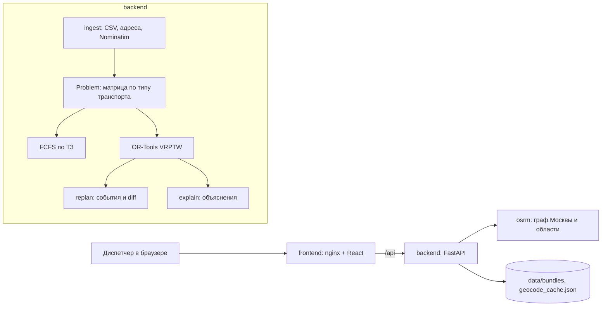

# План 2: перепланирование, объяснения, API и инфраструктура Implementation Plan

> **For agentic workers:** REQUIRED SUB-SKILL: Use superpowers:subagent-driven-development (recommended) or superpowers:executing-plans to implement this plan task-by-task. Steps use checkbox (`- [ ]`) syntax for tracking.

**Goal:** Поверх ядра из Плана 1 поднять backend по API-контракту: события дня с закреплением начатых визитов, diff планов, объяснения языком диспетчера, загрузку с фоновым предподсчётом, линии маршрутов, docker compose с OSRM по графу Москвы и области, README и описание допущений.

**Architecture:** `backend/app/planning` содержит логику без веба: неизменяемый снимок дня `PlanningSession`, функцию `apply_event`, которая возвращает новый снимок, `compute_diff` и `build_explanation`. `backend/app/api` это тонкий слой FastAPI: реестр датасетов в памяти, фоновая обработка загрузки, роуты строго по контракту. Инфраструктура: сервисы compose `frontend` (образ из Плана 3), `backend`, `osrm` и одноразовый `osrm-prepare` под профилем `prepare`.

**Tech Stack:** Python 3.12, uv 0.12, FastAPI, uvicorn, python-multipart, OR-Tools 9.15, pydantic 2, httpx, pytest, ruff; Docker Compose 2.24+, OSRM v26.9.0 (MLD, профиль car), osmium-tool, выгрузка Geofabrik.

**Spec:** `docs/superpowers/specs/2026-09-15-field-service-routing-design.md` (разделы 2, 3.3, 7, 8, 9, 13, 15), `docs/superpowers/specs/2026-09-15-api-contract.md`, `docs/superpowers/plans/2026-09-15-plan-1-backend-core.md`.

## Global Constraints

- Все пункты Global Constraints Плана 1 действуют: Python `>=3.12,<3.13`, команды только через `uv` из каталога `backend`, время в коде в минутах и `HH:MM` в JSON через `HHMM`, тексты для диспетчера на русском, все ограничения проверяет только `simulate_route`, тесты не ходят в сеть.
- Файлы Плана 1 не меняются. План 2 использует их имена без изменений: `make_problem(requests, engineers, *, model, traffic, osrm=None, cache=None) -> Problem`, `Problem` и `EngineerState`, `simulate_route(problem, state, request_ids) -> SimResult`, `exclusion(request, state) -> Exclusion | None`, `OrToolsSolver(time_limit_s).solve(problem)`, `FcfsSolver().solve(problem)`, `TravelModel`, `TrafficProfile.load(path)`, `OsrmClient(base_url).route_geometry(points)` и `.health()`, `KVCache(path)`, `parse_beeline_csv(data) -> RawFile`, `geocode_address(raw, district, geocoder, cache) -> GeoResult`, `JsonGeocodeCache`, `NominatimGeocoder`, `SynthConfig.load(path)`, `build_requests(cfg, synthetic, control, geocode)`, `load_bundle(path)`, `save_bundle(bundle, path)`, тестовые помощники `tests.helpers.eng`, `req`, `OFFICE_LAT`, `OFFICE_LON`.
- JSON ответов совпадает с `docs/superpowers/specs/2026-09-15-api-contract.md`, кроме пунктов раздела «Отклонения от контракта».
- Ошибки API: тело `{"detail": "текст на русском"}`. Ошибка валидации тела запроса превращается в одну строку `Некорректный запрос: …` с кодом 422.
- `PlanningSession` неизменяемая: `apply_event` возвращает новую сессию и не трогает входную.
- Инженер стартует из `Engineer.start_lat/start_lon` (медоид истории бригады). Нигде не предполагать, что старт совпадает с офисом; офис бандла нужен только для определения региона.
- Зависимости FastAPI объявляются через `Annotated[..., Depends(...)]` (правило ruff `B008`).
- Перед каждым коммитом: `uv run ruff format app tests` и `uv run ruff check app tests` (с Task 5 ещё `scripts`).
- Порты: frontend `8000` на хосте, OSRM `127.0.0.1:5050` на хосте (порт 5000 на macOS часто занят AirPlay Receiver), backend наружу не публикуется.
- Образы: `python:3.12-slim`, `ghcr.io/astral-sh/uv:0.12.13`, `ghcr.io/project-osrm/osrm-backend:v26.9.0-debian` (есть arm64).
- Сообщение каждого коммита заканчивается строками:
  `Co-Authored-By: Claude Opus 5 (1M context) <noreply@anthropic.com>` и
  `Claude-Session: https://claude.ai/code/session_01ES9WBRMChrK8yPZ6LyrqNQ`.

## Отклонения от контракта (прочитать Планам 3 и 4)

1. `PlanningState.baseline` это FCFS, пересчитанный на текущей задаче после событий с теми же закреплёнными визитами, а не на исходных данных дня.
2. `POST /api/datasets/{id}/plan` без событий возвращает план, посчитанный при предподсчёте. Если события были, день пересобирается заново: `version` = прежняя + 1 (не сбрасывается в 1), `events` = `[]`, `now` = `"00:00"`, `previous_plan` = `null`.
3. `DatasetStatus.stage` при `status: "failed"` остаётся на этапе, где случилась ошибка. `progress` считает только геокодируемые адреса; когда геокодировать нечего, это `{"done": 0, "total": 0}`.
4. `PlanDiff.time_shifts` включает и заявки, перенесённые к другому инженеру (`engineer_id` новый). `removed[].reason` равен «Заявка отменена», тексту причины неназначения или «Снята с плана».
5. `RouteGeometry`: первый участок начинается в стартовой точке инженера, участок на каждый визит с координатами (закреплённые тоже). `source: "osrm"` только если все участки построены по дорогам; для `transport: "public"` всегда `"straight"`. `plan=previous` без событий даёт 404.
6. `Explanation.alternatives`: сначала допустимые по возрастанию `extra_km`, затем недопустимые. У закреплённого визита альтернатив нет. `summary` начинается с «Исполнитель <имя>.».
7. Дополнительно: Swagger по `/api/docs`, схема по `/api/openapi.json` (доступны через прокси фронта).
8. Загрузка файла «Контрольное распределение» завершает предподсчёт со статусом `failed` и текстом «Это файл «Контрольное распределение». Загрузите «Синтетические данные» региона.».

## Точки расширения для Плана 4

- Применение предложения: `from app.planning.session import apply_event, EventRejected`. Сигнатура `apply_event(session: PlanningSession, event: Event, ctx: PlanningContext) -> PlanningSession`; при конфликте с состоянием бросает `EventRejected(текст)`, который отдаётся как 422.
- Контекст планирования: `deps.ingest.planning` (`PlanningContext`).
- Датасет: `deps.registry.get(dataset_id) -> DatasetRecord | None`. Читать и менять `record.session` только внутри `with record.lock:`.
- Ответ со состоянием: `app.api.schemas.to_planning_state(session) -> PlanningState`.
- Зависимость роутов: `from app.api.routes import Deps` (`Annotated[AppDeps, Depends(get_deps)]`).
- Настройки LLM: `deps.settings.llm_base_url`, `deps.settings.llm_api_key`, `deps.settings.llm_model`, `deps.settings.llm_enabled`.
- Подключение нового роутера: в `backend/app/api/app.py` внутри `create_app` строка `app.include_router(proposals_router)` после `app.include_router(router)`.

## Карта файлов

| Файл | Ответственность |
|---|---|
| `backend/app/planning/models.py` | `PlanDiff` и его части, `Explanation`, `ConstraintCheck`, `Alternative`, `AppliedEvent` |
| `backend/app/planning/diff.py` | что изменилось между двумя планами |
| `backend/app/planning/session.py` | `PlanningSession`, `PlanningContext`, `start_session`, `pin_problem`, `apply_event`, `EventRejected` |
| `backend/app/planning/explain.py` | объяснение заявки: ограничения, альтернативы, факторы |
| `backend/app/settings.py` | настройки из переменных окружения |
| `backend/app/api/schemas.py` | модели ответов API, `to_planning_state` |
| `backend/app/api/registry.py` | датасеты в памяти: статус, подготовленный день, сессия |
| `backend/app/api/geometry.py` | линии маршрутов: OSRM или прямые |
| `backend/app/api/ingest_service.py` | фоновый предподсчёт загрузки, определение региона |
| `backend/app/api/deps.py` | сборка зависимостей из настроек |
| `backend/app/api/routes.py` | эндпоинты контракта |
| `backend/app/api/app.py`, `backend/app/api/main.py` | фабрика приложения и точка входа uvicorn |
| `backend/scripts/smoke_api.py` | сквозная проверка живого backend |
| `backend/tests/planning_helpers.py`, `backend/tests/api_helpers.py` | помощники тестов |
| `backend/Dockerfile`, `.dockerignore` | образ backend |
| `scripts/osrm_prepare.sh`, `infra/osrm/Dockerfile.prepare` | сборка графа OSRM |
| `docker-compose.yml`, `.env.example` | запуск всего стенда |
| `README.md`, `docs/assumptions.md` | документация по разделу 5 ТЗ |

## Проверено при планировании

- Код задач 1–5 собран поверх финального кода Плана 1 и прогнан в Python 3.12: 108 тестов (80 Плана 1 и 28 новых), `ruff format --check` и `ruff check` чистые.
- `uv add` для FastAPI выполнен uv 0.12.13: в `uv.lock` 40 пакетов.
- Пайплайн `osrm-prepare` на Apple Silicon в Docker Desktop с 8 ГБ памяти: скачивание 876 МБ за 148 с, обрезка bbox за 9 с (218 МБ), `osrm-extract` 33 с (пик памяти 2.0 ГБ), `osrm-partition` 7 с (0.9 ГБ), `osrm-customize` 2 с (0.5 ГБ), всего 199 с. `osrm-routed` поднимается за 1 с и занимает 367 МБ; table 3×3 за 7 мс, table 110×110 за 211 мс без пустых ячеек, route за 3 мс.
- `docker compose config`, повторный `docker compose --profile prepare run --rm --build osrm-prepare` (пропускает сборку).
- Сквозной смоук в compose (`backend` + `osrm`): три региона по бандлу, загрузка сырого CSV Востока с определением региона по адресу офиса, три демо-события на регион примерно по 3 с каждое, линии OSRM у автомобилистов и прямые у общественного транспорта. Образ backend 217 МБ.
- `prepare` с OSRM на трёх регионах: 16 с, самопроверка OK везде (таблица в README, Task 7).

---

### Task 1: Diff двух планов

**Files:**
- Create: `backend/app/planning/__init__.py`, `backend/app/planning/models.py`, `backend/app/planning/diff.py`
- Test: `backend/tests/test_diff.py`

**Interfaces:**
- Consumes: `app.domain.models.Plan`, `Route`, `Visit`, `Metrics`, `Unassigned`, `Event`; `app.domain.enums.ReasonCode`; `app.domain.timeutil.HHMM` (План 1).
- Produces:
  - `app.planning.models`: `DiffMove(request_id, from_engineer_id, to_engineer_id)`, `DiffAssign(request_id, engineer_id)`, `DiffRemove(request_id, engineer_id, reason)`, `DiffShift(request_id, engineer_id, old_start: HHMM, new_start: HHMM, delta_min: int)`, `PlanDiff(moved, added, removed, reordered_engineers: list[str], time_shifts, metrics_before: Metrics, metrics_after: Metrics)`, `ConstraintCheck(name, ok, detail)`, `Alternative(engineer_id, feasible, extra_km: float | None = None, start: HHMM | None = None, reason)`, `Explanation(request_id, status: Literal["assigned", "unassigned", "cancelled"], engineer_id=None, summary, factors, constraints, visit=None, alternatives, unassigned=None)`, `AppliedEvent(id, event: Event, version: int)`.
  - `app.planning.diff.compute_diff(before: Plan, after: Plan, cancelled_ids: Collection[str] = ()) -> PlanDiff`.

Правила diff: заявка «перенесена», если есть в обоих планах у разных инженеров; «добавлена», если есть только в новом; «снята», если есть только в старом. Инженер попадает в `reordered_engineers`, если относительный порядок его заявок, общих для обоих планов, изменился. Сдвиг времени фиксируется для любой заявки из обоих планов, у которой изменилось начало работ.

- [ ] **Step 1: Создать пакет**

```bash
mkdir -p backend/app/planning && touch backend/app/planning/__init__.py
```

- [ ] **Step 2: Написать падающий тест**

`backend/tests/test_diff.py`:

```python
from app.domain.enums import ReasonCode
from app.domain.models import Metrics, Plan, Route, Unassigned, Visit
from app.planning.diff import compute_diff


def _plan(routes, unassigned=()):
    built = [
        Route(
            engineer_id=eid,
            visits=[
                Visit(request_id=rid, arrival=start, start=start, end=start + 30, leg_km=1.0, leg_min=5)
                for rid, start in visits
            ],
        )
        for eid, visits in routes.items()
    ]
    metrics = Metrics(
        engineers_used=sum(1 for r in built if r.visits),
        km_per_engineer={},
        total_km=0.0,
        assigned=sum(len(r.visits) for r in built),
        unassigned=len(unassigned),
    )
    return Plan(solver="ortools", routes=built, unassigned=list(unassigned), metrics=metrics)


def test_diff_detects_moves_additions_removals_reorders_and_shifts():
    before = _plan({"E1": [("A", 600), ("B", 700), ("C", 800)], "E2": [("D", 600)]})
    after = _plan(
        {"E1": [("B", 600), ("A", 700)], "E2": [("D", 600), ("C", 900), ("U", 1000)]},
        unassigned=[Unassigned(request_id="X", reason_code=ReasonCode.NO_SKILL, reason_text="нет")],
    )
    diff = compute_diff(before, after)
    assert [(m.request_id, m.from_engineer_id, m.to_engineer_id) for m in diff.moved] == [("C", "E1", "E2")]
    assert [(a.request_id, a.engineer_id) for a in diff.added] == [("U", "E2")]
    assert diff.removed == []
    assert diff.reordered_engineers == ["E1"]
    shifts = {s.request_id: s.delta_min for s in diff.time_shifts}
    assert shifts == {"B": -100, "A": 100, "C": 100}
    assert diff.metrics_before.assigned == 4 and diff.metrics_after.assigned == 5


def test_removed_reason_prefers_cancellation_then_unassigned_text():
    before = _plan({"E1": [("A", 600), ("B", 700), ("C", 800)]})
    after = _plan(
        {"E1": []},
        unassigned=[
            Unassigned(
                request_id="B",
                reason_code=ReasonCode.NO_FREE_ENGINEER,
                reason_text="Нет свободных исполнителей",
            )
        ],
    )
    diff = compute_diff(before, after, cancelled_ids={"A"})
    assert [(r.request_id, r.reason) for r in diff.removed] == [
        ("A", "Заявка отменена"),
        ("B", "Нет свободных исполнителей"),
        ("C", "Снята с плана"),
    ]


def test_diff_serializes_times_as_hhmm():
    before = _plan({"E1": [("A", 600)]})
    after = _plan({"E1": [("A", 615)]})
    dumped = compute_diff(before, after).model_dump(mode="json")
    assert dumped["time_shifts"][0] == {
        "request_id": "A",
        "engineer_id": "E1",
        "old_start": "10:00",
        "new_start": "10:15",
        "delta_min": 15,
    }
```

- [ ] **Step 3: Убедиться, что тест падает**

Run: `cd backend && uv run pytest tests/test_diff.py -v`
Expected: ошибка сбора `ModuleNotFoundError: No module named 'app.planning.diff'`.

- [ ] **Step 4: Модели перепланирования и объяснений**

`backend/app/planning/models.py`:

```python
"""Объекты перепланирования и объяснений (см. docs/superpowers/specs/2026-09-15-api-contract.md)."""

from __future__ import annotations

from typing import Literal

from pydantic import BaseModel, Field

from app.domain.models import Event, Metrics, Unassigned, Visit
from app.domain.timeutil import HHMM


class DiffMove(BaseModel):
    request_id: str
    from_engineer_id: str
    to_engineer_id: str


class DiffAssign(BaseModel):
    request_id: str
    engineer_id: str


class DiffRemove(BaseModel):
    request_id: str
    engineer_id: str
    reason: str


class DiffShift(BaseModel):
    request_id: str
    engineer_id: str
    old_start: HHMM
    new_start: HHMM
    delta_min: int


class PlanDiff(BaseModel):
    moved: list[DiffMove] = Field(default_factory=list)
    added: list[DiffAssign] = Field(default_factory=list)
    removed: list[DiffRemove] = Field(default_factory=list)
    reordered_engineers: list[str] = Field(default_factory=list)
    time_shifts: list[DiffShift] = Field(default_factory=list)
    metrics_before: Metrics
    metrics_after: Metrics


class ConstraintCheck(BaseModel):
    name: str
    ok: bool
    detail: str


class Alternative(BaseModel):
    engineer_id: str
    feasible: bool
    extra_km: float | None = None
    start: HHMM | None = None
    reason: str


class Explanation(BaseModel):
    request_id: str
    status: Literal["assigned", "unassigned", "cancelled"]
    engineer_id: str | None = None
    summary: str
    factors: list[str] = Field(default_factory=list)
    constraints: list[ConstraintCheck] = Field(default_factory=list)
    visit: Visit | None = None
    alternatives: list[Alternative] = Field(default_factory=list)
    unassigned: Unassigned | None = None


class AppliedEvent(BaseModel):
    id: str
    event: Event
    version: int
```

- [ ] **Step 5: Функция diff**

`backend/app/planning/diff.py`:

```python
"""Что изменилось между двумя планами."""

from __future__ import annotations

from collections.abc import Collection

from app.domain.models import Plan, Visit
from app.planning.models import DiffAssign, DiffMove, DiffRemove, DiffShift, PlanDiff


def _assignments(plan: Plan) -> dict[str, tuple[str, Visit]]:
    return {visit.request_id: (route.engineer_id, visit) for route in plan.routes for visit in route.visits}


def compute_diff(before: Plan, after: Plan, cancelled_ids: Collection[str] = ()) -> PlanDiff:
    old, new = _assignments(before), _assignments(after)
    unassigned_text = {item.request_id: item.reason_text for item in after.unassigned}

    moved = [
        DiffMove(request_id=rid, from_engineer_id=old[rid][0], to_engineer_id=new[rid][0])
        for rid in old
        if rid in new and old[rid][0] != new[rid][0]
    ]
    added = [DiffAssign(request_id=rid, engineer_id=new[rid][0]) for rid in new if rid not in old]
    removed = []
    for rid, (engineer_id, _) in old.items():
        if rid in new:
            continue
        reason = "Заявка отменена" if rid in cancelled_ids else unassigned_text.get(rid, "Снята с плана")
        removed.append(DiffRemove(request_id=rid, engineer_id=engineer_id, reason=reason))

    old_order = {route.engineer_id: [v.request_id for v in route.visits] for route in before.routes}
    reordered = []
    for route in after.routes:
        new_seq = [v.request_id for v in route.visits]
        old_seq = old_order.get(route.engineer_id, [])
        common_old = [rid for rid in old_seq if rid in set(new_seq)]
        common_new = [rid for rid in new_seq if rid in set(old_seq)]
        if common_old != common_new:
            reordered.append(route.engineer_id)

    shifts = [
        DiffShift(
            request_id=rid,
            engineer_id=new[rid][0],
            old_start=old[rid][1].start,
            new_start=new[rid][1].start,
            delta_min=new[rid][1].start - old[rid][1].start,
        )
        for rid in new
        if rid in old and new[rid][1].start != old[rid][1].start
    ]
    return PlanDiff(
        moved=moved,
        added=added,
        removed=removed,
        reordered_engineers=reordered,
        time_shifts=shifts,
        metrics_before=before.metrics,
        metrics_after=after.metrics,
    )
```

- [ ] **Step 6: Прогнать тест**

Run: `cd backend && uv run pytest tests/test_diff.py -v`
Expected: `3 passed`.

- [ ] **Step 7: Весь набор и линтер**

Run: `cd backend && uv run pytest && uv run ruff format --check app tests && uv run ruff check app tests`
Expected: `87 passed`, `All checks passed!`.

- [ ] **Step 8: Commit**

```bash
git add backend/app/planning backend/tests/test_diff.py
git commit -m "feat(planning): add plan diff and planning response models" -m $'Co-Authored-By: Claude Opus 5 (1M context) <noreply@anthropic.com>\nClaude-Session: https://claude.ai/code/session_01ES9WBRMChrK8yPZ6LyrqNQ'
```

### Task 2: Сессия дня и события

**Files:**
- Create: `backend/app/planning/session.py`, `backend/tests/planning_helpers.py`
- Test: `backend/tests/test_session.py`

**Interfaces:**
- Consumes: `make_problem`, `Problem` (поля `states`, `open_request_ids`, `pinned`, `previous_assignment`, `previous_order`, `now`; метод `request_node`), `EngineerState(engineer, start_node, available_from, available_until)`, `OrToolsSolver`, `FcfsSolver`, `TravelModel`, `TrafficProfile`, `OsrmClient`, `KVCache`, `GeoResult` (План 1); `compute_diff`, `AppliedEvent`, `PlanDiff` (Task 1); `tests.helpers.eng`, `req`, `OFFICE_LAT`, `OFFICE_LON` (План 1).
- Produces:
  - `app.planning.session.EventRejected(ValueError)`: текст для диспетчера.
  - `PlanningContext(model: TravelModel, traffic: TrafficProfile, osrm: OsrmClient | None = None, cache: KVCache | None = None, time_limit_s: int = 3, geocode: Callable[[str, str], GeoResult] | None = None)`.
  - `PlanningSession` (frozen dataclass): `dataset_id`, `region`, `office`, `requests`, `engineers`, `control: Plan | None`, `problem: Problem`, `plan`, `baseline`, `previous_plan=None`, `last_diff: PlanDiff | None = None`, `events: list[AppliedEvent]`, `now: int = 0`, `version: int = 1`; методы `request(request_id) -> Request | None`, `engineer(engineer_id) -> Engineer | None`.
  - `start_session(dataset_id, region, office, requests, engineers, control, ctx) -> PlanningSession`.
  - `pin_problem(problem: Problem, plan: Plan, now: int) -> Problem`.
  - `apply_event(session: PlanningSession, event: Event, ctx: PlanningContext) -> PlanningSession` (точка входа для Плана 4).
  - Помощники тестов `tests/planning_helpers.py`: `OFFICE`, `context(**overrides)`, `day_requests()`, `day_engineers()`, `new_session(ctx=None, requests=None, engineers=None)`, `routes(plan) -> dict[str, list[str]]`, `busy_engineer(plan) -> str`.

Правила применения события:

- `event.time` не раньше `session.now`, иначе отказ.
- Визиты, начатые до `event.time`, закрепляются за своим инженером вместе с порядком (`pinned: true`).
- Инженер продолжает из узла последнего закреплённого визита, не раньше `max(конец этого визита, event.time, начало смены)`.
- `cancel`: отказ, если заявка не найдена, уже отменена или уже начата. `restore`: отказ, если заявка не отменена или её окно закончилось раньше `event.time`.
- `engineer_unavailable`: `available = false`, `unavailable_from = event.time`; начатый визит доканчивается и не считается нарушением.
- `urgent`: приоритет принудительно `urgent`; отказ при повторном номере или окне, закончившемся до события; без координат адрес геокодируется через `ctx.geocode`.
- После изменения входных данных матрица строится заново через `make_problem` (кэш OSRM по набору точек), затем `pin_problem`, затем OR-Tools с подсказкой прошлого плана и штрафом за перенос, FCFS на той же задаче и `compute_diff`.

- [ ] **Step 1: Помощники тестов**

`backend/tests/planning_helpers.py`:

```python
from app.domain.models import Office
from app.geo.matrix import TrafficProfile, TravelModel
from app.planning.session import PlanningContext, start_session
from tests.helpers import OFFICE_LAT, OFFICE_LON, eng, req

OFFICE = Office(
    region="t", title="Тест", address="г. Москва, ул Юных Ленинцев, д 83с 4", lat=OFFICE_LAT, lon=OFFICE_LON
)


def context(**overrides):
    values = dict(model=TravelModel(), traffic=TrafficProfile({}), time_limit_s=1)
    values.update(overrides)
    return PlanningContext(**values)


def day_requests():
    return [
        req("R1", 1, 0, "10:00", "12:00"),
        req("R2", 1.2, 0, "14:00", "16:00"),
        req("R3", -1, 0, "15:00", "17:00"),
    ]


def day_engineers():
    return [eng("E1"), eng("E2")]


def new_session(ctx=None, requests=None, engineers=None):
    return start_session(
        "d_test",
        "t",
        OFFICE,
        requests or day_requests(),
        engineers or day_engineers(),
        None,
        ctx or context(),
    )


def routes(plan):
    return {route.engineer_id: [visit.request_id for visit in route.visits] for route in plan.routes}


def busy_engineer(plan):
    return next(route.engineer_id for route in plan.routes if route.visits)
```

- [ ] **Step 2: Написать падающий тест**

`backend/tests/test_session.py`:

```python
import pytest

from app.domain.enums import EventType, Priority, RequestStatus
from app.domain.models import Event
from app.ingest.geocode import GeoResult
from app.planning.session import EventRejected, apply_event
from tests.helpers import req
from tests.planning_helpers import busy_engineer, context, new_session, routes


def test_start_session_builds_optimized_and_baseline_plans():
    session = new_session()
    assert session.plan.solver == "ortools" and session.baseline.solver == "fcfs"
    assert session.plan.metrics.engineers_used == 1
    assert (session.version, session.now, session.events) == (1, 0, [])


def test_cancel_future_request_pins_past_and_reports_diff():
    session = new_session()
    ctx = context()
    updated = apply_event(session, Event(type=EventType.CANCEL, time="13:00", request_id="R2"), ctx)

    assert updated.request("R2").status == RequestStatus.CANCELLED
    assert session.request("R2").status == RequestStatus.ACTIVE  # исходная сессия не изменилась
    engineer_id = busy_engineer(updated.plan)
    first = updated.plan.routes[[r.engineer_id for r in updated.plan.routes].index(engineer_id)].visits[0]
    assert (first.request_id, first.pinned) == ("R1", True)
    assert "R2" not in [rid for seq in routes(updated.plan).values() for rid in seq]
    assert [(r.request_id, r.reason) for r in updated.last_diff.removed] == [("R2", "Заявка отменена")]
    assert (updated.version, updated.now, len(updated.events)) == (2, 780, 1)
    assert updated.previous_plan == session.plan
    assert updated.baseline.solver == "fcfs"
    assert any(v.pinned for route in updated.baseline.routes for v in route.visits)


def test_cannot_cancel_started_request():
    session = new_session()
    with pytest.raises(EventRejected, match="уже в работе"):
        apply_event(session, Event(type=EventType.CANCEL, time="10:15", request_id="R1"), context())


def test_event_time_cannot_go_back():
    ctx = context()
    session = apply_event(new_session(), Event(type=EventType.CANCEL, time="13:00", request_id="R2"), ctx)
    with pytest.raises(EventRejected, match="раньше текущего времени"):
        apply_event(session, Event(type=EventType.RESTORE, time="12:00", request_id="R2"), ctx)


def test_restore_returns_request_to_plan():
    ctx = context()
    cancelled = apply_event(new_session(), Event(type=EventType.CANCEL, time="13:00", request_id="R2"), ctx)
    restored = apply_event(cancelled, Event(type=EventType.RESTORE, time="13:30", request_id="R2"), ctx)
    assert restored.request("R2").status == RequestStatus.ACTIVE
    assert [a.request_id for a in restored.last_diff.added] == ["R2"]


def test_restore_after_window_is_rejected():
    ctx = context()
    cancelled = apply_event(new_session(), Event(type=EventType.CANCEL, time="11:00", request_id="R2"), ctx)
    with pytest.raises(EventRejected, match="уже прошло"):
        apply_event(cancelled, Event(type=EventType.RESTORE, time="16:30", request_id="R2"), ctx)


def test_engineer_unavailable_moves_future_work_to_another_engineer():
    session = new_session()
    engineer_id = busy_engineer(session.plan)
    other = "E2" if engineer_id == "E1" else "E1"
    updated = apply_event(
        session, Event(type=EventType.ENGINEER_UNAVAILABLE, time="13:00", engineer_id=engineer_id), context()
    )
    assert routes(updated.plan)[engineer_id] == ["R1"]
    assert sorted(routes(updated.plan)[other]) == ["R2", "R3"]
    assert {(m.request_id, m.to_engineer_id) for m in updated.last_diff.moved} == {
        ("R2", other),
        ("R3", other),
    }
    engineer = updated.engineer(engineer_id)
    assert (engineer.available, engineer.unavailable_from) == (False, 780)


def test_urgent_request_is_added_and_geocoded_when_needed():
    geocoded = []

    def geocode(address, district):
        geocoded.append(address)
        return GeoResult(55.7505, 37.61, "house", address)

    urgent = req("U1", 0, 0, "13:00", "15:00", duration=60).model_copy(update={"lat": None, "lon": None})
    updated = apply_event(
        new_session(), Event(type=EventType.URGENT, time="13:00", request=urgent), context(geocode=geocode)
    )
    assert geocoded == ["адрес U1"]
    assert [a.request_id for a in updated.last_diff.added] == ["U1"]
    stored = updated.events[0].event.request
    assert (stored.priority, stored.lat, stored.geocode_precision) == (Priority.URGENT, 55.7505, "house")


def test_urgent_with_existing_id_is_rejected():
    duplicate = req("R1", 0, 0, "13:00", "15:00")
    with pytest.raises(EventRejected, match="уже есть"):
        apply_event(new_session(), Event(type=EventType.URGENT, time="13:00", request=duplicate), context())
```

- [ ] **Step 3: Убедиться, что тест падает**

Run: `cd backend && uv run pytest tests/test_session.py -v`
Expected: ошибка сбора `ModuleNotFoundError: No module named 'app.planning.session'`.

- [ ] **Step 4: Сессия и события**

`backend/app/planning/session.py`:

```python
"""Состояние планирования одного датасета и применение событий дня."""

from __future__ import annotations

from collections.abc import Callable
from dataclasses import dataclass, field, replace

from app.domain.enums import EventType, Priority, RequestStatus
from app.domain.models import Engineer, Event, Office, Plan, Request, Visit
from app.domain.timeutil import fmt_hhmm
from app.geo.kvcache import KVCache
from app.geo.matrix import TrafficProfile, TravelModel
from app.geo.osrm import OsrmClient
from app.ingest.geocode import GeoResult
from app.planning.diff import compute_diff
from app.planning.models import AppliedEvent, PlanDiff
from app.solvers.fcfs import FcfsSolver
from app.solvers.ortools_solver import OrToolsSolver
from app.solvers.problem import EngineerState, Problem, make_problem


class EventRejected(ValueError):
    """Событие нельзя применить. Текст сообщения показывается диспетчеру (HTTP 422)."""


@dataclass
class PlanningContext:
    model: TravelModel
    traffic: TrafficProfile
    osrm: OsrmClient | None = None
    cache: KVCache | None = None
    time_limit_s: int = 3
    geocode: Callable[[str, str], GeoResult] | None = None


@dataclass(frozen=True)
class PlanningSession:
    dataset_id: str
    region: str
    office: Office
    requests: list[Request]
    engineers: list[Engineer]
    control: Plan | None
    problem: Problem
    plan: Plan
    baseline: Plan
    previous_plan: Plan | None = None
    last_diff: PlanDiff | None = None
    events: list[AppliedEvent] = field(default_factory=list)
    now: int = 0
    version: int = 1

    def request(self, request_id: str) -> Request | None:
        return next((r for r in self.requests if r.id == request_id), None)

    def engineer(self, engineer_id: str) -> Engineer | None:
        return next((e for e in self.engineers if e.id == engineer_id), None)


def _solve(problem: Problem, ctx: PlanningContext) -> tuple[Plan, Plan]:
    return OrToolsSolver(time_limit_s=ctx.time_limit_s).solve(problem), FcfsSolver().solve(problem)


def start_session(
    dataset_id: str,
    region: str,
    office: Office,
    requests: list[Request],
    engineers: list[Engineer],
    control: Plan | None,
    ctx: PlanningContext,
) -> PlanningSession:
    problem = make_problem(
        requests, engineers, model=ctx.model, traffic=ctx.traffic, osrm=ctx.osrm, cache=ctx.cache
    )
    plan, baseline = _solve(problem, ctx)
    return PlanningSession(
        dataset_id=dataset_id,
        region=region,
        office=office,
        requests=list(requests),
        engineers=list(engineers),
        control=control,
        problem=problem,
        plan=plan,
        baseline=baseline,
    )


def pin_problem(problem: Problem, plan: Plan, now: int) -> Problem:
    """Закрепляет визиты, начатые до now, и переносит старт инженеров в текущую точку."""
    routes = {route.engineer_id: route for route in plan.routes}
    pinned: dict[str, list[Visit]] = {}
    previous_assignment: dict[str, str] = {}
    previous_order: dict[str, list[str]] = {}
    pinned_ids: set[str] = set()
    states: list[EngineerState] = []
    for state in problem.states:
        engineer_id = state.engineer.id
        visits = routes[engineer_id].visits if engineer_id in routes else []
        done = [visit for visit in visits if visit.start < now]
        rest = [visit.request_id for visit in visits if visit.start >= now]
        start_node, available_from = state.start_node, max(state.available_from, now)
        if done:
            start_node = problem.request_node(done[-1].request_id)
            available_from = max(available_from, done[-1].end)
        pinned[engineer_id] = [visit.model_copy(update={"pinned": True}) for visit in done]
        pinned_ids.update(visit.request_id for visit in done)
        previous_order[engineer_id] = rest
        previous_assignment.update({request_id: engineer_id for request_id in rest})
        states.append(EngineerState(state.engineer, start_node, available_from, state.available_until))
    return replace(
        problem,
        states=states,
        open_request_ids=[rid for rid in problem.open_request_ids if rid not in pinned_ids],
        pinned=pinned,
        previous_assignment=previous_assignment,
        previous_order=previous_order,
        now=now,
    )


def _started_visits(plan: Plan, now: int) -> dict[str, Visit]:
    return {visit.request_id: visit for route in plan.routes for visit in route.visits if visit.start < now}


def _apply_to_inputs(
    session: PlanningSession, event: Event, ctx: PlanningContext
) -> tuple[list[Request], list[Engineer], Event]:
    now = event.time
    requests = [request.model_copy() for request in session.requests]
    engineers = [engineer.model_copy() for engineer in session.engineers]
    by_id = {request.id: request for request in requests}
    started = _started_visits(session.plan, now)

    if event.type in (EventType.CANCEL, EventType.RESTORE):
        request = by_id.get(event.request_id or "")
        if request is None:
            raise EventRejected(f"Заявка {event.request_id} не найдена.")
        if event.type == EventType.CANCEL:
            if request.status == RequestStatus.CANCELLED:
                raise EventRejected(f"Заявка {request.id} уже отменена.")
            if request.id in started:
                raise EventRejected(
                    f"Заявка {request.id} уже в работе с {fmt_hhmm(started[request.id].start)}, отменить её нельзя."
                )
            request.status = RequestStatus.CANCELLED
        else:
            if request.status != RequestStatus.CANCELLED:
                raise EventRejected(f"Заявка {request.id} не отменена, возвращать нечего.")
            if request.window_end < now:
                raise EventRejected(
                    f"Окно заявки {request.id} ({fmt_hhmm(request.window_start)}–{fmt_hhmm(request.window_end)}) "
                    f"уже прошло, вернуть её в план нельзя."
                )
            request.status = RequestStatus.ACTIVE
        return requests, engineers, event

    if event.type == EventType.ENGINEER_UNAVAILABLE:
        engineer = next((e for e in engineers if e.id == event.engineer_id), None)
        if engineer is None:
            raise EventRejected(f"Инженер {event.engineer_id} не найден.")
        if not engineer.available:
            raise EventRejected(
                f"{engineer.name} уже недоступен с {fmt_hhmm(engineer.unavailable_from or 0)}."
            )
        engineer.available = False
        engineer.unavailable_from = now
        return requests, engineers, event

    new = event.request.model_copy(update={"priority": Priority.URGENT, "status": RequestStatus.ACTIVE})
    if new.id in by_id:
        raise EventRejected(f"Заявка с номером {new.id} уже есть в плане.")
    if new.window_end < now:
        raise EventRejected(
            f"Окно срочной заявки заканчивается в {fmt_hhmm(new.window_end)}, это раньше времени события "
            f"{fmt_hhmm(now)}."
        )
    if (new.lat is None or new.lon is None) and ctx.geocode is not None:
        geo = ctx.geocode(new.address, new.district)
        new = new.model_copy(update={"lat": geo.lat, "lon": geo.lon, "geocode_precision": geo.precision})
    requests.append(new)
    return requests, engineers, event.model_copy(update={"request": new})


def apply_event(session: PlanningSession, event: Event, ctx: PlanningContext) -> PlanningSession:
    """Применяет одно событие дня и возвращает НОВУЮ сессию; входная не меняется.

    Бросает EventRejected, если событие противоречит текущему состоянию.
    """
    if event.time < session.now:
        raise EventRejected(
            f"Время события {fmt_hhmm(event.time)} раньше текущего времени плана {fmt_hhmm(session.now)}."
        )
    requests, engineers, stored_event = _apply_to_inputs(session, event, ctx)
    base = make_problem(
        requests, engineers, model=ctx.model, traffic=ctx.traffic, osrm=ctx.osrm, cache=ctx.cache
    )
    problem = pin_problem(base, session.plan, event.time)
    plan, baseline = _solve(problem, ctx)
    cancelled = {request.id for request in requests if request.status == RequestStatus.CANCELLED}
    version = session.version + 1
    applied = AppliedEvent(id=f"ev_{len(session.events) + 1}", event=stored_event, version=version)
    return replace(
        session,
        requests=requests,
        engineers=engineers,
        problem=problem,
        plan=plan,
        baseline=baseline,
        previous_plan=session.plan,
        last_diff=compute_diff(session.plan, plan, cancelled),
        events=[*session.events, applied],
        now=event.time,
        version=version,
    )
```

- [ ] **Step 5: Прогнать тест**

Run: `cd backend && uv run pytest tests/test_session.py -v`
Expected: `9 passed` (около 15 секунд: каждый тест решает OR-Tools с лимитом 1 с).

- [ ] **Step 6: Весь набор и линтер**

Run: `cd backend && uv run pytest && uv run ruff format --check app tests && uv run ruff check app tests`
Expected: `96 passed`, `All checks passed!`.

- [ ] **Step 7: Commit**

```bash
git add backend/app/planning/session.py backend/tests/planning_helpers.py backend/tests/test_session.py
git commit -m "feat(planning): apply day events with pinned visits and warm-started replanning" -m $'Co-Authored-By: Claude Opus 5 (1M context) <noreply@anthropic.com>\nClaude-Session: https://claude.ai/code/session_01ES9WBRMChrK8yPZ6LyrqNQ'
```

### Task 3: Объяснения по заявке

**Files:**
- Create: `backend/app/planning/explain.py`
- Test: `backend/tests/test_explain.py`

**Interfaces:**
- Consumes: `simulate_route`, `exclusion`, `Exclusion`, `Problem`, `EngineerState`, `SKILL_RU`, `TRANSPORT_RU`, `fmt_hhmm` (План 1); `Explanation`, `ConstraintCheck`, `Alternative` (Task 1); `apply_event`, помощники `tests/planning_helpers.py` (Task 2).
- Produces:
  - `app.planning.explain.build_explanation(problem: Problem, plan: Plan, request: Request) -> Explanation`.
  - `app.planning.explain.best_insertion(problem, state, sequence: list[str], request_id: str) -> Insertion | None`, где `Insertion(extra_km: float, start: int)`.

Правила объяснения:

- Отменённая заявка: `status: "cancelled"`, одна фраза.
- Неназначенная: `summary` = текст причины из плана; четыре проверки («Навык», «Транспорт», «Временное окно», «Смена») по всем инженерам; альтернативы по каждому инженеру. Без координат проверок и альтернатив нет.
- Назначенная и закреплённая: проверки и фраза, что работа уже началась.
- Назначенная: проверки по визиту; альтернатива для каждого другого инженера это причина отсева или самая дешёвая допустимая вставка в его текущий незакреплённый маршрут; факторы: срочность, сравнение пробега с лучшей альтернативой, «ещё один исполнитель», итог метрик плана.

- [ ] **Step 1: Написать падающий тест**

`backend/tests/test_explain.py`:

```python
from app.domain.enums import EventType, ReasonCode, RequestStatus, Skill
from app.domain.models import Event, Request
from app.planning.explain import build_explanation
from app.planning.session import apply_event
from tests.helpers import eng, req
from tests.planning_helpers import busy_engineer, context, day_requests, new_session


def _explain(session, request_id):
    return build_explanation(session.problem, session.plan, session.request(request_id))


def test_assigned_request_lists_constraints_alternatives_and_factors():
    session = new_session(engineers=[eng("E1"), eng("E2"), eng("E3", skills=[Skill.EMERGENCY])])
    explanation = _explain(session, "R1")
    assert explanation.status == "assigned"
    assert explanation.engineer_id == busy_engineer(session.plan)
    assert [(c.name, c.ok) for c in explanation.constraints] == [
        ("Навык", True),
        ("Транспорт", True),
        ("Временное окно", True),
        ("Смена", True),
    ]
    by_engineer = {a.engineer_id: a for a in explanation.alternatives}
    assert by_engineer["E3"].feasible is False and by_engineer["E3"].reason == "Нет навыка «Локальные работы»"
    idle = [a for a in explanation.alternatives if a.feasible]
    assert idle and "ещё одного инженера" in idle[0].reason
    assert any("ещё одного исполнителя" in factor for factor in explanation.factors)
    assert explanation.summary.startswith("Исполнитель Инженер E")


def test_unassigned_request_reuses_reason_and_checks_constraints():
    requests = day_requests() + [req("X1", 1, 0, "10:00", "12:00", skill=Skill.EMERGENCY)]
    session = new_session(requests=requests, engineers=[eng("E1", skills=[Skill.LOCAL])])
    explanation = _explain(session, "X1")
    assert explanation.status == "unassigned"
    assert explanation.unassigned.reason_code == ReasonCode.NO_SKILL
    assert explanation.constraints[0].ok is False
    assert explanation.alternatives[0].reason == "Нет навыка «Аварийные работы»"


def test_cancelled_request():
    ctx = context()
    session = apply_event(new_session(), Event(type=EventType.CANCEL, time="13:00", request_id="R2"), ctx)
    explanation = _explain(session, "R2")
    assert explanation.status == "cancelled" and session.request("R2").status == RequestStatus.CANCELLED


def test_pinned_visit_is_explained_as_started():
    session = apply_event(
        new_session(), Event(type=EventType.CANCEL, time="13:00", request_id="R2"), context()
    )
    explanation = _explain(session, "R1")
    assert explanation.visit.pinned
    assert "уже началась" in explanation.factors[0]


def test_request_without_coordinates():
    lost = Request(
        id="L1", address="нигде", duration_min=30, window_start="10:00", window_end="12:00", skill=Skill.LOCAL
    )
    session = new_session(requests=day_requests() + [lost])
    explanation = _explain(session, "L1")
    assert explanation.unassigned.reason_code == ReasonCode.ADDRESS_NOT_FOUND
    assert explanation.alternatives == [] and explanation.constraints == []
```

- [ ] **Step 2: Убедиться, что тест падает**

Run: `cd backend && uv run pytest tests/test_explain.py -v`
Expected: ошибка сбора `ModuleNotFoundError: No module named 'app.planning.explain'`.

- [ ] **Step 3: Объяснения**

`backend/app/planning/explain.py`:

```python
"""Объяснение по заявке языком диспетчера: ограничения, альтернативы, факторы выбора."""

from __future__ import annotations

from dataclasses import dataclass

from app.domain.enums import SKILL_RU, TRANSPORT_RU, Priority, RequestStatus
from app.domain.models import Engineer, Plan, Request, Visit
from app.domain.timeutil import fmt_hhmm
from app.planning.models import Alternative, ConstraintCheck, Explanation
from app.solvers.eligibility import Exclusion, exclusion
from app.solvers.problem import EngineerState, Problem
from app.solvers.simulate import simulate_route

KM_EPSILON = 0.05


@dataclass(frozen=True)
class Insertion:
    extra_km: float
    start: int


def _open_sequence(plan: Plan, engineer_id: str) -> list[str]:
    route = next((r for r in plan.routes if r.engineer_id == engineer_id), None)
    return [visit.request_id for visit in route.visits if not visit.pinned] if route else []


def _route_km(problem: Problem, state: EngineerState, sequence: list[str]) -> float:
    return sum(visit.leg_km for visit in simulate_route(problem, state, sequence).visits)


def best_insertion(
    problem: Problem, state: EngineerState, sequence: list[str], request_id: str
) -> Insertion | None:
    """Самая дешёвая по километрам допустимая вставка заявки в маршрут инженера."""
    base = _route_km(problem, state, sequence)
    best: Insertion | None = None
    for position in range(len(sequence) + 1):
        candidate = sequence[:position] + [request_id] + sequence[position:]
        sim = simulate_route(problem, state, candidate)
        if not sim.feasible:
            continue
        extra = round(sum(visit.leg_km for visit in sim.visits) - base, 2)
        if best is None or extra < best.extra_km:
            best = Insertion(extra_km=extra, start=sim.visits[position].start)
    return best


def _alternative(
    problem: Problem, plan: Plan, state: EngineerState, request: Request
) -> tuple[Alternative, bool]:
    """Возвращает альтернативу и признак «инженер сейчас без заявок»."""
    engineer = state.engineer
    reason = exclusion(request, state)
    if reason == Exclusion.NO_SKILL:
        return Alternative(
            engineer_id=engineer.id, feasible=False, reason=f"Нет навыка «{SKILL_RU[request.skill]}»"
        ), False
    if reason == Exclusion.NO_TRANSPORT:
        return Alternative(
            engineer_id=engineer.id,
            feasible=False,
            reason=f"Нужен транспорт «{TRANSPORT_RU[request.transport_required]}», "
            f"у инженера «{TRANSPORT_RU[engineer.transport]}»",
        ), False
    if reason == Exclusion.UNAVAILABLE:
        since = f" с {fmt_hhmm(engineer.unavailable_from)}" if engineer.unavailable_from is not None else ""
        return Alternative(
            engineer_id=engineer.id, feasible=False, reason=f"Инженер недоступен{since}"
        ), False

    sequence = [rid for rid in _open_sequence(plan, engineer.id) if rid != request.id]
    idle = not sequence and not problem.pinned.get(engineer.id)
    insertion = best_insertion(problem, state, sequence, request.id)
    if insertion is None:
        alone = simulate_route(problem, state, [request.id])
        text = (
            "Не успевает в окно или смену даже без других заявок"
            if not alone.feasible
            else "Не помещается в окно или смену вместе со своими заявками"
        )
        return Alternative(engineer_id=engineer.id, feasible=False, reason=text), idle
    note = ", но придётся задействовать ещё одного инженера" if idle else ""
    return Alternative(
        engineer_id=engineer.id,
        feasible=True,
        extra_km=insertion.extra_km,
        start=insertion.start,
        reason=f"Может взять: пробег +{insertion.extra_km:.1f} км, начало {fmt_hhmm(insertion.start)}{note}",
    ), idle


def _window_detail(request: Request, visit: Visit) -> str:
    text = (
        f"Прибытие {fmt_hhmm(visit.arrival)}, начало {fmt_hhmm(visit.start)}, окно "
        f"{fmt_hhmm(request.window_start)}–{fmt_hhmm(request.window_end)}"
    )
    if visit.start > visit.arrival:
        text += f", ожидание {visit.start - visit.arrival} мин"
    if visit.late_min:
        return text + f", опоздание {visit.late_min} мин"
    return text + f", запас до конца окна {request.window_end - visit.start} мин"


def _assigned_constraints(request: Request, engineer: Engineer, visit: Visit) -> list[ConstraintCheck]:
    required = request.transport_required
    if required is None:
        transport_detail = f"Требований к транспорту нет, у инженера «{TRANSPORT_RU[engineer.transport]}»"
    else:
        transport_detail = (
            f"Нужен «{TRANSPORT_RU[required]}», у инженера «{TRANSPORT_RU[engineer.transport]}»"
        )
    until = engineer.shift_end
    if not engineer.available and engineer.unavailable_from is not None and not visit.pinned:
        until = min(until, engineer.unavailable_from)
    return [
        ConstraintCheck(
            name="Навык",
            ok=request.skill in engineer.skills,
            detail=f"Нужен «{SKILL_RU[request.skill]}», у инженера: "
            f"{', '.join(SKILL_RU[skill] for skill in engineer.skills)}",
        ),
        ConstraintCheck(name="Транспорт", ok=required in (None, engineer.transport), detail=transport_detail),
        ConstraintCheck(name="Временное окно", ok=visit.late_min == 0, detail=_window_detail(request, visit)),
        ConstraintCheck(
            name="Смена",
            ok=visit.end <= until,
            detail=f"Окончание работы {fmt_hhmm(visit.end)}, смена до {fmt_hhmm(until)}",
        ),
    ]


def _unassigned_constraints(problem: Problem, request: Request) -> list[ConstraintCheck]:
    states = problem.states
    skilled = [s for s in states if request.skill in s.engineer.skills]
    required = request.transport_required
    with_transport = [s for s in skilled if required is None or s.engineer.transport == required]
    eligible = [s for s in states if exclusion(request, s) is None]
    solo = [(s, simulate_route(problem, s, [request.id]).visits[0]) for s in eligible]
    window_ok = any(visit.late_min == 0 for _, visit in solo)
    shift_ok = any(visit.end <= s.available_until for s, visit in solo)
    window = f"{fmt_hhmm(request.window_start)}–{fmt_hhmm(request.window_end)}"
    transport_detail = (
        "Требований к транспорту нет"
        if required is None
        else f"Нужен «{TRANSPORT_RU[required]}»: подходящих инженеров {len(with_transport)}"
    )
    return [
        ConstraintCheck(
            name="Навык",
            ok=bool(skilled),
            detail=f"Инженеров с навыком «{SKILL_RU[request.skill]}»: {len(skilled)}",
        ),
        ConstraintCheck(name="Транспорт", ok=bool(with_transport), detail=transport_detail),
        ConstraintCheck(
            name="Временное окно",
            ok=window_ok,
            detail=(
                f"Хотя бы один доступный подходящий инженер успевает к окну {window}"
                if window_ok
                else f"Ни один доступный подходящий инженер не успевает к окну {window}"
            ),
        ),
        ConstraintCheck(
            name="Смена",
            ok=shift_ok,
            detail=(
                "Хотя бы один подходящий инженер заканчивает работу в пределах смены"
                if shift_ok
                else "Ни один подходящий инженер не заканчивает работу в пределах смены"
            ),
        ),
    ]


def build_explanation(problem: Problem, plan: Plan, request: Request) -> Explanation:
    if request.status == RequestStatus.CANCELLED:
        return Explanation(
            request_id=request.id, status="cancelled", summary="Заявка отменена и в плане не участвует."
        )

    assigned = next(
        (
            (route.engineer_id, visit)
            for route in plan.routes
            for visit in route.visits
            if visit.request_id == request.id
        ),
        None,
    )
    if assigned is None:
        item = next((u for u in plan.unassigned if u.request_id == request.id), None)
        located = problem.has_request(request.id)
        alternatives = [_alternative(problem, plan, s, request)[0] for s in problem.states] if located else []
        return Explanation(
            request_id=request.id,
            status="unassigned",
            summary=item.reason_text if item else "Заявка не назначена.",
            constraints=_unassigned_constraints(problem, request) if located else [],
            alternatives=alternatives,
            unassigned=item,
        )

    engineer_id, visit = assigned
    engineer = problem.state(engineer_id).engineer
    constraints = _assigned_constraints(request, engineer, visit)
    if visit.pinned:
        return Explanation(
            request_id=request.id,
            status="assigned",
            engineer_id=engineer_id,
            summary=f"Исполнитель {engineer.name} начал работу в {fmt_hhmm(visit.start)}, визит закреплён.",
            factors=["Работа уже началась к моменту последнего события, поэтому заявка не переназначается."],
            constraints=constraints,
            visit=visit,
        )

    state = problem.state(engineer_id)
    own_sequence = _open_sequence(plan, engineer_id)
    without = [rid for rid in own_sequence if rid != request.id]
    own_extra = round(_route_km(problem, state, own_sequence) - _route_km(problem, state, without), 2)

    evaluated = [
        _alternative(problem, plan, s, request) for s in problem.states if s.engineer.id != engineer_id
    ]
    feasible = sorted((pair for pair in evaluated if pair[0].feasible), key=lambda pair: pair[0].extra_km)
    infeasible = [pair for pair in evaluated if not pair[0].feasible]

    factors: list[str] = []
    if request.priority == Priority.URGENT:
        factors.append("Срочная заявка: при нехватке времени планировщик назначает её в первую очередь.")
    if not feasible:
        factors.append("Другие инженеры взять заявку не могут: причины указаны в списке альтернатив.")
    else:
        best, _ = feasible[0]
        best_name = problem.state(best.engineer_id).engineer.name
        delta = best.extra_km - own_extra
        if delta > KM_EPSILON:
            factors.append(
                f"Кратчайшая вставка: у лучшей альтернативы ({best_name}) пробег больше на {delta:.1f} км."
            )
        elif delta < -KM_EPSILON:
            factors.append(
                f"Локально {best_name} взял бы заявку с пробегом на {-delta:.1f} км меньше, но в общем плане "
                f"так получается меньше задействованных инженеров или меньший суммарный пробег."
            )
        else:
            factors.append(f"У {best_name} такой же пробег, назначение сохраняет стабильность плана.")
        if all(idle for _, idle in feasible):
            factors.append(
                "Передача любому другому подходящему инженеру задействовала бы ещё одного исполнителя."
            )
    factors.append(
        f"В плане задействовано инженеров: {plan.metrics.engineers_used}, суммарный пробег "
        f"{plan.metrics.total_km:.1f} км."
    )
    return Explanation(
        request_id=request.id,
        status="assigned",
        engineer_id=engineer_id,
        summary=(
            f"Исполнитель {engineer.name}. Навык и транспорт подходят, работа начнётся в "
            f"{fmt_hhmm(visit.start)} в окне {fmt_hhmm(request.window_start)}–{fmt_hhmm(request.window_end)}, "
            f"заявка добавляет к маршруту {own_extra:.1f} км."
        ),
        factors=factors,
        constraints=constraints,
        visit=visit,
        alternatives=[pair[0] for pair in feasible] + [pair[0] for pair in infeasible],
    )
```

- [ ] **Step 4: Прогнать тест**

Run: `cd backend && uv run pytest tests/test_explain.py -v`
Expected: `5 passed`.

- [ ] **Step 5: Весь набор и линтер**

Run: `cd backend && uv run pytest && uv run ruff format --check app tests && uv run ruff check app tests`
Expected: `101 passed`, `All checks passed!`.

- [ ] **Step 6: Commit**

```bash
git add backend/app/planning/explain.py backend/tests/test_explain.py
git commit -m "feat(planning): explain assignments with constraint checks and alternatives" -m $'Co-Authored-By: Claude Opus 5 (1M context) <noreply@anthropic.com>\nClaude-Session: https://claude.ai/code/session_01ES9WBRMChrK8yPZ6LyrqNQ'
```

### Task 4: Настройки, схемы API, реестр датасетов и линии маршрутов

**Files:**
- Create: `backend/app/settings.py`, `backend/app/api/__init__.py`, `backend/app/api/schemas.py`, `backend/app/api/registry.py`, `backend/app/api/geometry.py`
- Test: `backend/tests/test_settings.py`, `backend/tests/test_geometry.py`

**Interfaces:**
- Consumes: `OsrmClient`, `OsrmError`, `LatLon`, `KVCache`, `Transport`, модели домена (План 1); `PlanDiff`, `AppliedEvent` (Task 1); `PlanningSession` и помощники тестов (Task 2).
- Produces:
  - `app.settings.BACKEND_DIR`, `REPO_ROOT`, `Settings(data_dir, cache_path, osrm_url, yandex_maps_api_key, llm_base_url, llm_api_key, llm_model, geocoder, solver_time_limit_s)` со свойствами `bundles_dir`, `geocode_cache_path`, `llm_enabled` и `Settings.from_env(env: Mapping[str, str] | None = None)`. Переменные: `DATA_DIR`, `CACHE_PATH`, `OSRM_URL`, `YANDEX_MAPS_API_KEY`, `LLM_BASE_URL`, `LLM_API_KEY`, `LLM_MODEL`, `GEOCODER` (`nominatim` или `cache-only`), `SOLVER_TIME_LIMIT_S`.
  - `app.api.schemas`: `GeocodingCounts`, `NotFoundAddress`, `UploadReport`, `Progress`, `DatasetStatus`, `PlanningState`, `RouteLeg`, `RouteGeometry`, `ClientConfig`, `to_planning_state(session) -> PlanningState`.
  - `app.api.registry`: `PreparedDay(region, region_title, office, requests, engineers, control)`, `DatasetRecord(dataset_id, status, stage, done, total, report, error, prepared, session, lock)` с методом `status_model() -> DatasetStatus`, `DatasetRegistry` с `create() -> DatasetRecord` и `get(dataset_id) -> DatasetRecord | None`.
  - `app.api.geometry.route_geometry(session, engineer_id, which: str, osrm, cache) -> RouteGeometry`; бросает `LookupError` с текстом для 404.

- [ ] **Step 1: Создать пакет**

```bash
mkdir -p backend/app/api && touch backend/app/api/__init__.py
```

- [ ] **Step 2: Написать падающие тесты**

`backend/tests/test_settings.py`:

```python
import pytest

from app.settings import Settings


def test_settings_from_env_defaults_and_overrides(tmp_path):
    settings = Settings.from_env(
        {
            "DATA_DIR": str(tmp_path),
            "OSRM_URL": "http://osrm:5000",
            "LLM_BASE_URL": "x",
            "LLM_MODEL": "m",
            "YANDEX_MAPS_API_KEY": " ",
        }
    )
    assert settings.bundles_dir == tmp_path / "bundles"
    assert settings.cache_path == tmp_path / "cache.sqlite"
    assert settings.geocode_cache_path == tmp_path / "geocode_cache.json"
    assert settings.yandex_maps_api_key is None
    assert settings.llm_enabled and settings.solver_time_limit_s == 3 and settings.geocoder == "nominatim"


def test_settings_reject_unknown_geocoder():
    with pytest.raises(ValueError):
        Settings.from_env({"GEOCODER": "google"})
```

`backend/tests/test_geometry.py`:

```python
import httpx

from app.api.geometry import route_geometry
from app.domain.enums import Transport
from app.geo.kvcache import KVCache
from app.geo.osrm import OsrmClient
from tests.helpers import eng
from tests.planning_helpers import busy_engineer, new_session


def test_osrm_legs_are_cached_and_public_transport_uses_straight_lines():
    calls = []

    def handler(request):
        calls.append(request.url.path)
        return httpx.Response(
            200,
            json={
                "code": "Ok",
                "routes": [{"geometry": {"coordinates": [[37.6, 55.75], [37.61, 55.751], [37.62, 55.752]]}}],
            },
        )

    osrm = OsrmClient("http://osrm:5000", client=httpx.Client(transport=httpx.MockTransport(handler)))
    cache = KVCache(":memory:")
    session = new_session()
    engineer_id = busy_engineer(session.plan)

    first = route_geometry(session, engineer_id, "current", osrm, cache)
    second = route_geometry(session, engineer_id, "current", osrm, cache)
    assert first.source == "osrm" and len(first.legs) == 3
    assert first.legs[0].coordinates[1] == [37.61, 55.751]
    assert second == first and len(calls) == 3

    public = new_session(engineers=[eng("E1", transport=Transport.PUBLIC)])
    straight = route_geometry(public, "E1", "current", osrm, cache)
    assert straight.source == "straight" and all(len(leg.coordinates) == 2 for leg in straight.legs)


def test_osrm_failure_falls_back_to_straight():
    def handler(request):
        return httpx.Response(500)

    osrm = OsrmClient("http://osrm:5000", client=httpx.Client(transport=httpx.MockTransport(handler)))
    session = new_session()
    result = route_geometry(session, busy_engineer(session.plan), "current", osrm, None)
    assert result.source == "straight"
```

- [ ] **Step 3: Убедиться, что тесты падают**

Run: `cd backend && uv run pytest tests/test_settings.py tests/test_geometry.py -v`
Expected: ошибки сбора `ModuleNotFoundError: No module named 'app.settings'` и `ModuleNotFoundError: No module named 'app.api.geometry'`.

- [ ] **Step 4: Настройки**

`backend/app/settings.py`:

```python
"""Настройки backend из переменных окружения."""

from __future__ import annotations

import os
from collections.abc import Mapping
from dataclasses import dataclass
from pathlib import Path

BACKEND_DIR = Path(__file__).resolve().parents[1]
REPO_ROOT = BACKEND_DIR.parent
GEOCODERS = ("nominatim", "cache-only")


@dataclass(frozen=True)
class Settings:
    data_dir: Path
    cache_path: Path
    osrm_url: str | None
    yandex_maps_api_key: str | None
    llm_base_url: str | None
    llm_api_key: str | None
    llm_model: str | None
    geocoder: str
    solver_time_limit_s: int

    @property
    def bundles_dir(self) -> Path:
        return self.data_dir / "bundles"

    @property
    def geocode_cache_path(self) -> Path:
        return self.data_dir / "geocode_cache.json"

    @property
    def llm_enabled(self) -> bool:
        return bool(self.llm_base_url and self.llm_model)

    @classmethod
    def from_env(cls, env: Mapping[str, str] | None = None) -> Settings:
        env = os.environ if env is None else env

        def optional(name: str) -> str | None:
            value = (env.get(name) or "").strip()
            return value or None

        data_dir = Path(optional("DATA_DIR") or REPO_ROOT / "data")
        geocoder = optional("GEOCODER") or "nominatim"
        if geocoder not in GEOCODERS:
            raise ValueError(f"GEOCODER должен быть одним из: {', '.join(GEOCODERS)}")
        return cls(
            data_dir=data_dir,
            cache_path=Path(optional("CACHE_PATH") or data_dir / "cache.sqlite"),
            osrm_url=optional("OSRM_URL"),
            yandex_maps_api_key=optional("YANDEX_MAPS_API_KEY"),
            llm_base_url=optional("LLM_BASE_URL"),
            llm_api_key=optional("LLM_API_KEY"),
            llm_model=optional("LLM_MODEL"),
            geocoder=geocoder,
            solver_time_limit_s=int(optional("SOLVER_TIME_LIMIT_S") or 3),
        )
```

- [ ] **Step 5: Схемы ответов**

`backend/app/api/schemas.py`:

```python
"""Модели ответов API (docs/superpowers/specs/2026-09-15-api-contract.md)."""

from __future__ import annotations

from typing import Literal

from pydantic import BaseModel, Field

from app.domain.enums import Transport
from app.domain.models import Engineer, Office, Plan, Request
from app.domain.timeutil import HHMM
from app.planning.models import AppliedEvent, PlanDiff
from app.planning.session import PlanningSession

DatasetStatusValue = Literal["processing", "ready", "failed"]
DatasetStage = Literal["parsing", "geocoding", "matrix", "solving", "ready"]


class GeocodingCounts(BaseModel):
    house: int = 0
    street: int = 0
    locality: int = 0
    none: int = 0


class NotFoundAddress(BaseModel):
    request_id: str
    address: str


class UploadReport(BaseModel):
    region: str
    region_title: str
    source: Literal["beeline_csv", "bundle"]
    requests: int
    engineers: int
    skipped_rows: list[str] = Field(default_factory=list)
    geocoding: GeocodingCounts
    not_found: list[NotFoundAddress] = Field(default_factory=list)
    matrix_source: Literal["osrm", "haversine"]


class Progress(BaseModel):
    done: int
    total: int


class DatasetStatus(BaseModel):
    dataset_id: str
    status: DatasetStatusValue
    stage: DatasetStage
    progress: Progress
    report: UploadReport | None = None
    error: str | None = None


class PlanningState(BaseModel):
    dataset_id: str
    version: int
    region: str
    office: Office
    now: HHMM
    requests: list[Request]
    engineers: list[Engineer]
    plan: Plan
    previous_plan: Plan | None = None
    baseline: Plan
    control: Plan | None = None
    last_diff: PlanDiff | None = None
    events: list[AppliedEvent] = Field(default_factory=list)
    matrix_source: Literal["osrm", "haversine"]


class RouteLeg(BaseModel):
    to_request_id: str
    coordinates: list[list[float]]


class RouteGeometry(BaseModel):
    engineer_id: str
    transport: Transport
    source: Literal["osrm", "straight"]
    legs: list[RouteLeg]


class ClientConfig(BaseModel):
    yandex_maps_api_key: str | None
    llm_enabled: bool
    osrm_available: bool


def to_planning_state(session: PlanningSession) -> PlanningState:
    return PlanningState(
        dataset_id=session.dataset_id,
        version=session.version,
        region=session.region,
        office=session.office,
        now=session.now,
        requests=session.requests,
        engineers=session.engineers,
        plan=session.plan,
        previous_plan=session.previous_plan,
        baseline=session.baseline,
        control=session.control,
        last_diff=session.last_diff,
        events=session.events,
        matrix_source=session.problem.travel.base.source,
    )
```

- [ ] **Step 6: Реестр датасетов**

`backend/app/api/registry.py`:

```python
"""Датасеты в памяти процесса: статус предподсчёта и текущая сессия планирования."""

from __future__ import annotations

import threading
import uuid
from dataclasses import dataclass, field

from app.api.schemas import DatasetStatus, Progress, UploadReport
from app.domain.models import Engineer, Office, Plan, Request
from app.planning.session import PlanningSession


@dataclass
class PreparedDay:
    region: str
    region_title: str
    office: Office
    requests: list[Request]
    engineers: list[Engineer]
    control: Plan | None


@dataclass
class DatasetRecord:
    dataset_id: str
    status: str = "processing"
    stage: str = "parsing"
    done: int = 0
    total: int = 0
    report: UploadReport | None = None
    error: str | None = None
    prepared: PreparedDay | None = None
    session: PlanningSession | None = None
    lock: threading.RLock = field(default_factory=threading.RLock)

    def status_model(self) -> DatasetStatus:
        with self.lock:
            return DatasetStatus(
                dataset_id=self.dataset_id,
                status=self.status,
                stage=self.stage,
                progress=Progress(done=self.done, total=self.total),
                report=self.report,
                error=self.error,
            )


class DatasetRegistry:
    def __init__(self) -> None:
        self._items: dict[str, DatasetRecord] = {}
        self._lock = threading.Lock()

    def create(self) -> DatasetRecord:
        record = DatasetRecord(dataset_id=f"d_{uuid.uuid4().hex[:8]}")
        with self._lock:
            self._items[record.dataset_id] = record
        return record

    def get(self, dataset_id: str) -> DatasetRecord | None:
        with self._lock:
            return self._items.get(dataset_id)
```

- [ ] **Step 7: Линии маршрутов**

`backend/app/api/geometry.py`:

```python
"""Линии маршрутов для карты: OSRM по дорогам или прямые отрезки."""

from __future__ import annotations

import json

import httpx

from app.api.schemas import RouteGeometry, RouteLeg
from app.domain.enums import Transport
from app.geo.kvcache import KVCache
from app.geo.osrm import LatLon, OsrmClient, OsrmError
from app.planning.session import PlanningSession


def _leg(
    start: LatLon, end: LatLon, osrm: OsrmClient | None, cache: KVCache | None
) -> tuple[list[list[float]], bool]:
    straight = [[start[1], start[0]], [end[1], end[0]]]
    if osrm is None:
        return straight, False
    key = "osrm-route:" + json.dumps([[round(v, 6) for v in start], [round(v, 6) for v in end]])
    cached = cache.get(key) if cache is not None else None
    if cached is not None:
        return json.loads(cached), True
    try:
        coordinates = osrm.route_geometry([start, end])
    except (httpx.HTTPError, OsrmError, KeyError, IndexError):
        return straight, False
    if cache is not None:
        cache.set(key, json.dumps(coordinates))
    return coordinates, True


def route_geometry(
    session: PlanningSession,
    engineer_id: str,
    which: str,
    osrm: OsrmClient | None,
    cache: KVCache | None,
) -> RouteGeometry:
    """Бросает LookupError с текстом для пользователя, если инженера или плана нет."""
    engineer = session.engineer(engineer_id)
    if engineer is None:
        raise LookupError(f"Инженер {engineer_id} не найден.")
    plan = session.plan if which == "current" else session.previous_plan
    if plan is None:
        raise LookupError("Предыдущего плана нет: событий ещё не было.")
    route = next((r for r in plan.routes if r.engineer_id == engineer_id), None)
    visits = route.visits if route is not None else []
    use_osrm = osrm if engineer.transport != Transport.PUBLIC else None
    position: LatLon = (engineer.start_lat, engineer.start_lon)
    legs: list[RouteLeg] = []
    all_roads = True
    for visit in visits:
        request = session.request(visit.request_id)
        if request is None or request.lat is None or request.lon is None:
            continue
        destination: LatLon = (request.lat, request.lon)
        coordinates, by_road = _leg(position, destination, use_osrm, cache)
        all_roads = all_roads and by_road
        legs.append(RouteLeg(to_request_id=visit.request_id, coordinates=coordinates))
        position = destination
    source = "osrm" if use_osrm is not None and all_roads else "straight"
    return RouteGeometry(engineer_id=engineer_id, transport=engineer.transport, source=source, legs=legs)
```

- [ ] **Step 8: Прогнать тесты**

Run: `cd backend && uv run pytest tests/test_settings.py tests/test_geometry.py -v`
Expected: `4 passed`.

- [ ] **Step 9: Весь набор и линтер**

Run: `cd backend && uv run pytest && uv run ruff format --check app tests && uv run ruff check app tests`
Expected: `105 passed`, `All checks passed!`.

- [ ] **Step 10: Commit**

```bash
git add backend/app/settings.py backend/app/api backend/tests/test_settings.py backend/tests/test_geometry.py
git commit -m "feat(api): add settings, response schemas, dataset registry and route geometry" -m $'Co-Authored-By: Claude Opus 5 (1M context) <noreply@anthropic.com>\nClaude-Session: https://claude.ai/code/session_01ES9WBRMChrK8yPZ6LyrqNQ'
```

### Task 5: Загрузка с предподсчётом и FastAPI-приложение

**Files:**
- Modify: `backend/pyproject.toml`, `backend/uv.lock` (через `uv add`)
- Create: `backend/app/api/ingest_service.py`, `backend/app/api/deps.py`, `backend/app/api/routes.py`, `backend/app/api/app.py`, `backend/app/api/main.py`, `backend/scripts/smoke_api.py`, `backend/tests/api_helpers.py`
- Test: `backend/tests/test_api.py`

**Interfaces:**
- Consumes: всё из Tasks 1–4; `parse_beeline_csv`, `RawFile`, `load_bundle`, `save_bundle`, `Bundle`, `GeoResult`, `GeoHit`, `Geocoder`, `JsonGeocodeCache`, `NominatimGeocoder`, `geocode_address`, `SynthConfig`, `build_requests`, `make_problem`, `TravelModel`, `TrafficProfile` (План 1).
- Produces:
  - `app.api.ingest_service`: `BundleStore(bundles_dir)` с `all() -> dict[str, Bundle]`; `IngestDeps(bundles, synth_config, geocode, planning)`; `detect_region(raw: RawFile, bundles: dict[str, Bundle]) -> Bundle`; `preprocess_upload(record: DatasetRecord, filename: str, data: bytes, deps: IngestDeps) -> None`.
  - `app.api.deps`: `AppDeps(settings, registry, ingest, osrm, kv)`, `build_deps(settings: Settings, geocoder_override: Geocoder | None = None) -> AppDeps`.
  - `app.api.routes`: `router`, `get_deps`, `Deps = Annotated[AppDeps, Depends(get_deps)]`.
  - `app.api.app.create_app(deps: AppDeps | None = None) -> FastAPI`; `app.api.main:app` для uvicorn.
  - Эндпоинты контракта кроме чата и предложений (План 4): `GET /api/health`, `GET /api/config`, `POST /api/upload`, `GET /api/datasets/{id}`, `POST /api/datasets/{id}/plan`, `GET /api/datasets/{id}/state`, `POST /api/datasets/{id}/events`, `GET /api/datasets/{id}/explain/{request_id}`, `GET /api/datasets/{id}/routes/{engineer_id}/geometry?plan=current|previous`.
  - `backend/scripts/smoke_api.py [base_url] [path]`: сквозная проверка, только стандартная библиотека.

Правила загрузки:

- `.json` разбирается как `Bundle`; заявки без координат геокодируются.
- `.csv` разбирается как выгрузка Билайна. «Контрольное распределение» отклоняется. Регион определяется по адресу офиса (регистр, пробелы и «ё» не важны), иначе по доле районов больше половины. Если номера заявок совпадают с бандлом региона, берутся заявки и план диспетчеров из бандла; иначе заявки строятся по правилам синтеза с живым геокодингом и без плана диспетчеров. Инженеры и офис всегда из бандла региона.
- Этапы: `parsing`, `geocoding`, `matrix`, `solving`, `ready`. Первый план считается сразу при предподсчёте.

- [ ] **Step 1: Добавить зависимости**

Run: `cd backend && uv add "fastapi>=0.115" "uvicorn[standard]>=0.30" "python-multipart>=0.0.9"`
Expected: в `dependencies` файла `pyproject.toml` появились три строки, `uv.lock` обновлён, `Resolved 40 packages` или близкое число.

- [ ] **Step 2: Помощники тестов API**

`backend/tests/api_helpers.py`:

```python
import hashlib

from fastapi.testclient import TestClient

from app.api.app import create_app
from app.api.deps import build_deps
from app.domain.models import Bundle
from app.ingest.bundle import save_bundle
from app.ingest.geocode import GeoHit
from app.settings import Settings
from tests.planning_helpers import OFFICE, day_engineers, day_requests

HEADER = "Заявка;Тип заявки BK;Тип заявки HD;Начало;Окончание;Район;Адрес;Гигабитное подключение\r\n"


class HashGeocoder:
    def lookup(self, query):
        digest = hashlib.sha256(query.encode()).digest()
        return GeoHit(55.74 + digest[0] / 255 * 0.02, 37.59 + digest[1] / 255 * 0.03, "building")


def sample_bundle():
    requests = [r.model_copy(update={"district": "Таганский"}) for r in day_requests()]
    return Bundle(region="t", office=OFFICE, requests=requests, engineers=day_engineers())


def make_client(tmp_path, bundle=None):
    bundle = bundle or sample_bundle()
    save_bundle(bundle, tmp_path / "bundles" / bundle.region / "bundle.json")
    settings = Settings(
        data_dir=tmp_path,
        cache_path=tmp_path / "cache.sqlite",
        osrm_url=None,
        yandex_maps_api_key="test-key",
        llm_base_url=None,
        llm_api_key=None,
        llm_model=None,
        geocoder="cache-only",
        solver_time_limit_s=1,
    )
    deps = build_deps(settings, geocoder_override=HashGeocoder())
    return TestClient(create_app(deps)), deps


def csv_bytes(rows, office=OFFICE.address, encoding="cp1251"):
    lines = [HEADER]
    for request_id, start, end, address in rows:
        lines.append(
            f"{request_id};Локальная заявка;Нет линка;17.08.2026 {start};17.08.2026 {end};Таганский;"
            f"{address};Нет\r\n"
        )
    if office:
        lines.append(f"Адрес Офиса;{office};;;;;;\r\n")
    return "".join(lines).encode(encoding)


def upload(client, name, data):
    response = client.post("/api/upload", files={"file": (name, data, "application/octet-stream")})
    assert response.status_code == 202, response.text
    return response.json()["dataset_id"]
```

- [ ] **Step 3: Написать падающий тест**

`backend/tests/test_api.py`:

```python
from app.api.registry import DatasetRecord
from tests.api_helpers import csv_bytes, make_client, sample_bundle, upload


def _ready_dataset(client):
    dataset_id = upload(client, "bundle.json", sample_bundle().model_dump_json().encode())
    status = client.get(f"/api/datasets/{dataset_id}").json()
    assert status["status"] == "ready", status
    return dataset_id


def test_health_and_config(tmp_path):
    client, _ = make_client(tmp_path)
    assert client.get("/api/health").json() == {"status": "ok"}
    assert client.get("/api/config").json() == {
        "yandex_maps_api_key": "test-key",
        "llm_enabled": False,
        "osrm_available": False,
    }
    assert client.get("/api/openapi.json").json()["info"]["title"] == "Планировщик выездных инженеров"
    assert client.get("/api/docs").status_code == 200


def test_upload_bundle_then_plan(tmp_path):
    client, _ = make_client(tmp_path)
    response = client.post(
        "/api/upload",
        files={"file": ("bundle.json", sample_bundle().model_dump_json().encode(), "application/json")},
    )
    assert response.status_code == 202
    assert response.json()["status"] == "processing"
    dataset_id = response.json()["dataset_id"]

    status = client.get(f"/api/datasets/{dataset_id}").json()
    assert status["status"] == "ready" and status["stage"] == "ready"
    assert status["report"]["source"] == "bundle"
    assert status["report"]["requests"] == 3 and status["report"]["matrix_source"] == "haversine"

    state = client.post(f"/api/datasets/{dataset_id}/plan").json()
    assert state["version"] == 1 and state["now"] == "00:00"
    assert state["plan"]["solver"] == "ortools" and state["baseline"]["solver"] == "fcfs"
    visits = [visit for route in state["plan"]["routes"] for visit in route["visits"]]
    assert visits and all(len(visit["start"]) == 5 and visit["start"][2] == ":" for visit in visits)
    assert client.get(f"/api/datasets/{dataset_id}/state").json()["version"] == 1


def test_events_explain_geometry_and_replan(tmp_path):
    client, _ = make_client(tmp_path)
    dataset_id = _ready_dataset(client)
    base = f"/api/datasets/{dataset_id}"

    assert client.get(f"{base}/routes/E1/geometry", params={"plan": "previous"}).status_code == 404

    response = client.post(f"{base}/events", json={"type": "cancel", "time": "13:00", "request_id": "R2"})
    assert response.status_code == 200, response.text
    state = response.json()
    assert state["version"] == 2 and state["now"] == "13:00"
    removed = state["last_diff"]["removed"]
    assert [(item["request_id"], item["reason"]) for item in removed] == [("R2", "Заявка отменена")]
    assert state["events"][0]["id"] == "ev_1"

    explanation = client.get(f"{base}/explain/R3").json()
    assert explanation["status"] == "assigned"
    assert [c["name"] for c in explanation["constraints"]] == [
        "Навык",
        "Транспорт",
        "Временное окно",
        "Смена",
    ]
    assert client.get(f"{base}/explain/NOPE").status_code == 404

    busy = next(r["engineer_id"] for r in state["plan"]["routes"] if r["visits"])
    geometry = client.get(f"{base}/routes/{busy}/geometry").json()
    assert geometry["source"] == "straight" and geometry["legs"][0]["to_request_id"] == "R1"
    assert len(geometry["legs"][0]["coordinates"]) == 2
    assert client.get(f"{base}/routes/{busy}/geometry", params={"plan": "previous"}).status_code == 200

    replanned = client.post(f"{base}/plan").json()
    assert replanned["version"] == 3 and replanned["events"] == [] and replanned["now"] == "00:00"


def test_event_errors_are_russian_422(tmp_path):
    client, _ = make_client(tmp_path)
    dataset_id = _ready_dataset(client)
    base = f"/api/datasets/{dataset_id}/events"

    invalid = client.post(base, json={"type": "cancel", "time": "13:00"})
    assert invalid.status_code == 422
    assert invalid.json()["detail"] == "Некорректный запрос: для отмены или возврата нужен request_id"

    rejected = client.post(base, json={"type": "cancel", "time": "13:00", "request_id": "NOPE"})
    assert rejected.status_code == 422 and rejected.json()["detail"] == "Заявка NOPE не найдена."


def test_upload_csv_with_known_ids_reuses_region_bundle(tmp_path):
    client, _ = make_client(tmp_path)
    rows = [(r.id, "10:00", "12:00", r.address) for r in sample_bundle().requests]
    dataset_id = upload(client, "east.csv", csv_bytes(rows))
    status = client.get(f"/api/datasets/{dataset_id}").json()
    assert status["status"] == "ready", status
    assert status["report"]["source"] == "beeline_csv" and status["report"]["region"] == "t"
    assert status["report"]["skipped_rows"] == []


def test_upload_csv_with_new_ids_geocodes_and_detects_region_by_district(tmp_path):
    client, _ = make_client(tmp_path)
    rows = [
        ("N1", "10:00", "12:00", "Город Москва, ул.Таганская, д. 1"),
        ("N2", "14:00", "16:00", "Город Москва, ул.Марксистская, д. 5"),
    ]
    dataset_id = upload(client, "new.csv", csv_bytes(rows, office=None))
    status = client.get(f"/api/datasets/{dataset_id}").json()
    assert status["status"] == "ready", status
    assert status["progress"] == {"done": 2, "total": 2}
    assert status["report"]["geocoding"] == {"house": 2, "street": 0, "locality": 0, "none": 0}
    state = client.post(f"/api/datasets/{dataset_id}/plan").json()
    assert {r["id"] for r in state["requests"]} == {"N1", "N2"} and state["control"] is None


def test_upload_errors(tmp_path):
    client, deps = make_client(tmp_path)
    assert client.post("/api/upload", files={"file": ("x.txt", b"abc", "text/plain")}).status_code == 400
    assert client.post("/api/upload", files={"file": ("x.csv", b"", "text/csv")}).status_code == 400
    control = (
        "Заявка;Тип заявки BK;Статус BK;Тип заявки HD;Начало;Окончание;Район;Адрес;Бригада\r\n"
        "1;Локальная заявка;Выполнена;Нет линка;17.08.2026 10:00;17.08.2026 12:00;Таганский;адрес;Бригада А\r\n"
    )
    dataset_id = upload(client, "control.csv", control.encode("utf-8"))
    status = client.get(f"/api/datasets/{dataset_id}").json()
    assert status["status"] == "failed" and "Контрольное распределение" in status["error"]
    assert client.post(f"/api/datasets/{dataset_id}/plan").status_code == 409
    assert client.get("/api/datasets/d_missing").status_code == 404

    pending = deps.registry.create()
    assert isinstance(pending, DatasetRecord)
    assert client.get(f"/api/datasets/{pending.dataset_id}/state").status_code == 409
```

- [ ] **Step 4: Убедиться, что тест падает**

Run: `cd backend && uv run pytest tests/test_api.py -v`
Expected: ошибка сбора `ModuleNotFoundError: No module named 'app.api.app'`.

- [ ] **Step 5: Фоновый предподсчёт**

`backend/app/api/ingest_service.py`:

```python
"""Фоновый предподсчёт загруженного файла: разбор, регион, геокодинг, матрица, первый план."""

from __future__ import annotations

import threading
from collections import Counter
from collections.abc import Callable
from dataclasses import dataclass
from pathlib import Path

from pydantic import ValidationError

from app.api.registry import DatasetRecord, PreparedDay
from app.api.schemas import GeocodingCounts, NotFoundAddress, UploadReport
from app.domain.models import Bundle, Request
from app.ingest.beeline_csv import RawFile, parse_beeline_csv
from app.ingest.bundle import load_bundle
from app.ingest.geocode import GeoResult
from app.planning.session import PlanningContext, start_session
from app.solvers.problem import make_problem
from app.synth.config import SynthConfig
from app.synth.requests import build_requests

GeocodeFn = Callable[[str, str], GeoResult]


class BundleStore:
    """Подготовленные бандлы регионов из data/bundles/<region>/bundle.json (читаются один раз)."""

    def __init__(self, bundles_dir: Path) -> None:
        self._dir = Path(bundles_dir)
        self._bundles: dict[str, Bundle] | None = None
        self._lock = threading.Lock()

    def all(self) -> dict[str, Bundle]:
        with self._lock:
            if self._bundles is None:
                self._bundles = {
                    path.parent.name: load_bundle(path) for path in sorted(self._dir.glob("*/bundle.json"))
                }
            return self._bundles


@dataclass
class IngestDeps:
    bundles: BundleStore
    synth_config: SynthConfig
    geocode: GeocodeFn
    planning: PlanningContext


def _normalize(text: str) -> str:
    return " ".join(text.casefold().replace("ё", "е").split())


def detect_region(raw: RawFile, bundles: dict[str, Bundle]) -> Bundle:
    if not bundles:
        raise ValueError("Нет подготовленных регионов: запустите prepare и положите бандлы в data/bundles.")
    if raw.office_address:
        for bundle in bundles.values():
            if _normalize(bundle.office.address) == _normalize(raw.office_address):
                return bundle
    districts = [row.district for row in raw.rows]
    scores = {
        region: sum(1 for district in districts if district in {r.district for r in bundle.requests})
        for region, bundle in bundles.items()
    }
    region, score = max(scores.items(), key=lambda item: item[1])
    if not districts or score * 2 <= len(districts):
        raise ValueError(
            "Не удалось определить регион: адрес офиса и районы не совпадают ни с одним регионом."
        )
    return bundles[region]


def _set(record: DatasetRecord, **changes) -> None:
    with record.lock:
        for key, value in changes.items():
            setattr(record, key, value)


def _counting_geocoder(record: DatasetRecord, geocode: GeocodeFn) -> GeocodeFn:
    def wrapped(address: str, district: str) -> GeoResult:
        result = geocode(address, district)
        with record.lock:
            record.done += 1
        return result

    return wrapped


def _geocode_missing(record: DatasetRecord, requests: list[Request], geocode: GeocodeFn) -> list[Request]:
    missing = [r for r in requests if r.lat is None or r.lon is None]
    if not missing:
        return list(requests)
    _set(record, stage="geocoding", done=0, total=len(missing))
    counted = _counting_geocoder(record, geocode)
    result = []
    for request in requests:
        if request.lat is None or request.lon is None:
            geo = counted(request.address, request.district)
            request = request.model_copy(
                update={"lat": geo.lat, "lon": geo.lon, "geocode_precision": geo.precision}
            )
        result.append(request)
    return result


def _read_upload(
    record: DatasetRecord, filename: str, data: bytes, deps: IngestDeps
) -> tuple[PreparedDay, str, list[str]]:
    if filename.lower().endswith(".json"):
        try:
            bundle = Bundle.model_validate_json(data)
        except ValidationError as error:
            first = error.errors()[0]
            location = ".".join(str(part) for part in first["loc"])
            raise ValueError(f"JSON не соответствует схеме бандла: {location}: {first['msg']}") from error
        requests = _geocode_missing(record, bundle.requests, deps.geocode)
        day = PreparedDay(
            bundle.region, bundle.office.title, bundle.office, requests, bundle.engineers, bundle.control_plan
        )
        return day, "bundle", []

    raw = parse_beeline_csv(data)
    if raw.is_control:
        raise ValueError("Это файл «Контрольное распределение». Загрузите «Синтетические данные» региона.")
    if not raw.rows:
        raise ValueError("В файле нет ни одной заявки.")
    reference = detect_region(raw, deps.bundles.all())
    if [row.request_id for row in raw.rows] == [request.id for request in reference.requests]:
        requests, control = list(reference.requests), reference.control_plan
    else:
        _set(record, stage="geocoding", done=0, total=len(raw.rows))
        requests = build_requests(deps.synth_config, raw, None, _counting_geocoder(record, deps.geocode))
        control = None
    day = PreparedDay(
        reference.region, reference.office.title, reference.office, requests, reference.engineers, control
    )
    return day, "beeline_csv", raw.skipped


def preprocess_upload(record: DatasetRecord, filename: str, data: bytes, deps: IngestDeps) -> None:
    try:
        _set(record, stage="parsing")
        day, source, skipped = _read_upload(record, filename, data, deps)
        _set(record, stage="matrix")
        ctx = deps.planning
        problem = make_problem(
            day.requests, day.engineers, model=ctx.model, traffic=ctx.traffic, osrm=ctx.osrm, cache=ctx.cache
        )
        _set(record, stage="solving")
        session = start_session(
            record.dataset_id, day.region, day.office, day.requests, day.engineers, day.control, ctx
        )
        precision = Counter(request.geocode_precision for request in day.requests)
        report = UploadReport(
            region=day.region,
            region_title=day.region_title,
            source=source,
            requests=len(day.requests),
            engineers=len(day.engineers),
            skipped_rows=skipped,
            geocoding=GeocodingCounts(
                house=precision["house"],
                street=precision["street"],
                locality=precision["locality"],
                none=precision["none"],
            ),
            not_found=[
                NotFoundAddress(request_id=r.id, address=r.address)
                for r in day.requests
                if r.lat is None or r.lon is None
            ],
            matrix_source=problem.travel.base.source,
        )
        _set(record, prepared=day, session=session, report=report, status="ready", stage="ready")
    except ValueError as error:
        _set(record, status="failed", error=str(error))
    except Exception as error:  # noqa: BLE001 - любой сбой предподсчёта показываем пользователю
        _set(record, status="failed", error=f"Внутренняя ошибка предподсчёта: {error}")
```

- [ ] **Step 6: Зависимости приложения**

`backend/app/api/deps.py`:

```python
"""Сборка зависимостей приложения из настроек."""

from __future__ import annotations

import threading
from dataclasses import dataclass

from app.api.ingest_service import BundleStore, IngestDeps
from app.api.registry import DatasetRegistry
from app.geo.kvcache import KVCache
from app.geo.matrix import TrafficProfile, TravelModel
from app.geo.osrm import OsrmClient
from app.ingest.geocode import Geocoder, GeoResult, JsonGeocodeCache, NominatimGeocoder, geocode_address
from app.planning.session import PlanningContext
from app.settings import BACKEND_DIR, Settings
from app.synth.config import SynthConfig


@dataclass
class AppDeps:
    settings: Settings
    registry: DatasetRegistry
    ingest: IngestDeps
    osrm: OsrmClient | None
    kv: KVCache


def build_deps(settings: Settings, geocoder_override: Geocoder | None = None) -> AppDeps:
    kv = KVCache(settings.cache_path)
    osrm = OsrmClient(settings.osrm_url) if settings.osrm_url else None
    geocoder = geocoder_override or (NominatimGeocoder() if settings.geocoder == "nominatim" else None)
    cache = JsonGeocodeCache(settings.geocode_cache_path)
    lock = threading.Lock()

    def geocode(address: str, district: str) -> GeoResult:
        with lock:
            try:
                return geocode_address(address, district, geocoder, cache)
            finally:
                cache.save()

    planning = PlanningContext(
        model=TravelModel(),
        traffic=TrafficProfile.load(BACKEND_DIR / "config" / "traffic_profile.yaml"),
        osrm=osrm,
        cache=kv,
        time_limit_s=settings.solver_time_limit_s,
        geocode=geocode,
    )
    ingest = IngestDeps(
        bundles=BundleStore(settings.bundles_dir),
        synth_config=SynthConfig.load(BACKEND_DIR / "config" / "synth_config.yaml"),
        geocode=geocode,
        planning=planning,
    )
    return AppDeps(settings=settings, registry=DatasetRegistry(), ingest=ingest, osrm=osrm, kv=kv)
```

- [ ] **Step 7: Роуты**

`backend/app/api/routes.py`:

```python
from __future__ import annotations

from dataclasses import replace
from typing import Annotated, Literal

from fastapi import APIRouter, BackgroundTasks, Depends, File, HTTPException, UploadFile
from fastapi import Request as HttpRequest

from app.api.deps import AppDeps
from app.api.geometry import route_geometry
from app.api.ingest_service import preprocess_upload
from app.api.registry import DatasetRecord
from app.api.schemas import ClientConfig, DatasetStatus, PlanningState, RouteGeometry, to_planning_state
from app.domain.models import Event
from app.planning.explain import build_explanation
from app.planning.models import Explanation
from app.planning.session import EventRejected, PlanningSession, apply_event, start_session

router = APIRouter(prefix="/api")


def get_deps(request: HttpRequest) -> AppDeps:
    return request.app.state.deps


Deps = Annotated[AppDeps, Depends(get_deps)]


def _record(deps: AppDeps, dataset_id: str) -> DatasetRecord:
    record = deps.registry.get(dataset_id)
    if record is None:
        raise HTTPException(status_code=404, detail=f"Датасет {dataset_id} не найден.")
    return record


def _session(record: DatasetRecord) -> PlanningSession:
    if record.status == "failed":
        raise HTTPException(status_code=409, detail=f"Предподсчёт завершился ошибкой: {record.error}")
    if record.session is None:
        raise HTTPException(status_code=409, detail="Датасет ещё обрабатывается, план не готов.")
    return record.session


@router.get("/health")
def health() -> dict[str, str]:
    return {"status": "ok"}


@router.get("/config", response_model=ClientConfig)
def client_config(deps: Deps) -> ClientConfig:
    return ClientConfig(
        yandex_maps_api_key=deps.settings.yandex_maps_api_key,
        llm_enabled=deps.settings.llm_enabled,
        osrm_available=deps.osrm.health() if deps.osrm is not None else False,
    )


@router.post("/upload", response_model=DatasetStatus, status_code=202)
def upload(background: BackgroundTasks, file: Annotated[UploadFile, File()], deps: Deps) -> DatasetStatus:
    filename = file.filename or ""
    if not filename.lower().endswith((".csv", ".json")):
        raise HTTPException(status_code=400, detail="Поддерживаются файлы .csv и .json.")
    data = file.file.read()
    if not data:
        raise HTTPException(status_code=400, detail="Файл пустой.")
    record = deps.registry.create()
    background.add_task(preprocess_upload, record, filename, data, deps.ingest)
    return record.status_model()


@router.get("/datasets/{dataset_id}", response_model=DatasetStatus)
def dataset_status(dataset_id: str, deps: Deps) -> DatasetStatus:
    return _record(deps, dataset_id).status_model()


@router.post("/datasets/{dataset_id}/plan", response_model=PlanningState)
def build_plan(dataset_id: str, deps: Deps) -> PlanningState:
    record = _record(deps, dataset_id)
    with record.lock:
        session = _session(record)
        if session.events:
            day = record.prepared
            fresh = start_session(
                dataset_id,
                day.region,
                day.office,
                day.requests,
                day.engineers,
                day.control,
                deps.ingest.planning,
            )
            session = replace(fresh, version=session.version + 1)
            record.session = session
        return to_planning_state(session)


@router.get("/datasets/{dataset_id}/state", response_model=PlanningState)
def get_state(dataset_id: str, deps: Deps) -> PlanningState:
    record = _record(deps, dataset_id)
    with record.lock:
        return to_planning_state(_session(record))


@router.post("/datasets/{dataset_id}/events", response_model=PlanningState)
def post_event(dataset_id: str, event: Event, deps: Deps) -> PlanningState:
    record = _record(deps, dataset_id)
    with record.lock:
        session = _session(record)
        try:
            updated = apply_event(session, event, deps.ingest.planning)
        except EventRejected as error:
            raise HTTPException(status_code=422, detail=str(error)) from error
        record.session = updated
        return to_planning_state(updated)


@router.get("/datasets/{dataset_id}/explain/{request_id}", response_model=Explanation)
def explain(dataset_id: str, request_id: str, deps: Deps) -> Explanation:
    record = _record(deps, dataset_id)
    with record.lock:
        session = _session(record)
    request = session.request(request_id)
    if request is None:
        raise HTTPException(status_code=404, detail=f"Заявка {request_id} не найдена.")
    return build_explanation(session.problem, session.plan, request)


@router.get("/datasets/{dataset_id}/routes/{engineer_id}/geometry", response_model=RouteGeometry)
def geometry(
    dataset_id: str,
    engineer_id: str,
    deps: Deps,
    plan: Literal["current", "previous"] = "current",
) -> RouteGeometry:
    record = _record(deps, dataset_id)
    with record.lock:
        session = _session(record)
    try:
        return route_geometry(session, engineer_id, plan, deps.osrm, deps.kv)
    except LookupError as error:
        raise HTTPException(status_code=404, detail=str(error)) from error
```

- [ ] **Step 8: Фабрика приложения и точка входа**

`backend/app/api/app.py`:

```python
from __future__ import annotations

from fastapi import FastAPI
from fastapi.exceptions import RequestValidationError
from fastapi.responses import JSONResponse

from app.api.deps import AppDeps, build_deps
from app.api.routes import router
from app.settings import Settings


async def _validation_error(_, error: RequestValidationError) -> JSONResponse:
    parts = []
    for item in error.errors()[:3]:
        location = ".".join(str(part) for part in item.get("loc", ()) if part != "body")
        message = str(item.get("msg", "")).removeprefix("Value error, ")
        parts.append(f"{location}: {message}" if location else message)
    return JSONResponse(status_code=422, content={"detail": "Некорректный запрос: " + "; ".join(parts)})


def create_app(deps: AppDeps | None = None) -> FastAPI:
    app = FastAPI(
        title="Планировщик выездных инженеров",
        version="0.1.0",
        docs_url="/api/docs",
        openapi_url="/api/openapi.json",
        redoc_url=None,
    )
    app.state.deps = deps or build_deps(Settings.from_env())
    app.add_exception_handler(RequestValidationError, _validation_error)
    app.include_router(router)
    return app
```

`backend/app/api/main.py`:

```python
"""Точка входа uvicorn: uvicorn app.api.main:app"""

from app.api.app import create_app

app = create_app()
```

- [ ] **Step 9: Прогнать тест**

Run: `cd backend && uv run pytest tests/test_api.py -v`
Expected: `7 passed` (около 20 секунд). Предупреждение `StarletteDeprecationWarning` про `httpx` в TestClient не мешает.

- [ ] **Step 10: Скрипт сквозной проверки**

`backend/scripts/smoke_api.py`:

```python
"""Сквозная проверка живого backend: загрузка, план, демо-события, объяснение, геометрия.

Внутри контейнера:  docker compose exec backend python scripts/smoke_api.py
С хоста (порт проброшен): python3 scripts/smoke_api.py http://127.0.0.1:8001/api ../data/raw/east_synthetic.csv
Только стандартная библиотека Python.
"""

from __future__ import annotations

import json
import sys
import time
import urllib.error
import urllib.request
import uuid
from pathlib import Path


def call(method: str, url: str, body: bytes | None = None, headers: dict[str, str] | None = None) -> dict:
    request = urllib.request.Request(url, data=body, method=method, headers=headers or {})
    try:
        with urllib.request.urlopen(request, timeout=180) as response:
            return json.load(response)
    except urllib.error.HTTPError as error:
        raise SystemExit(f"{method} {url} -> {error.code}: {error.read().decode('utf-8')}") from error


def upload(base: str, path: Path) -> str:
    boundary = uuid.uuid4().hex
    head = (
        f'--{boundary}\r\nContent-Disposition: form-data; name="file"; filename="{path.name}"\r\n'
        "Content-Type: application/octet-stream\r\n\r\n"
    ).encode()
    body = head + path.read_bytes() + f"\r\n--{boundary}--\r\n".encode()
    status = call(
        "POST", f"{base}/upload", body, {"Content-Type": f"multipart/form-data; boundary={boundary}"}
    )
    return status["dataset_id"]


def metrics_line(label: str, plan: dict | None) -> None:
    if plan is None:
        return
    m = plan["metrics"]
    print(
        f"{label}: инженеров {m['engineers_used']}, км {m['total_km']}, назначено {m['assigned']}, "
        f"не назначено {m['unassigned']}, нарушений {m['violations']}"
    )


def main(argv: list[str]) -> int:
    base = argv[1] if len(argv) > 1 else "http://127.0.0.1:8001/api"
    path = Path(argv[2] if len(argv) > 2 else "/app/data/bundles/east/bundle.json")
    print("config:", call("GET", f"{base}/config"))

    started = time.monotonic()
    dataset_id = upload(base, path)
    while (status := call("GET", f"{base}/datasets/{dataset_id}"))["status"] == "processing":
        time.sleep(0.5)
    if status["status"] != "ready":
        raise SystemExit(f"Предподсчёт завершился ошибкой: {status['error']}")
    report = status["report"]
    print(
        f"готово за {time.monotonic() - started:.1f} с: регион {report['region']}, источник {report['source']}, "
        f"заявок {report['requests']}, матрица {report['matrix_source']}"
    )

    state = call("POST", f"{base}/datasets/{dataset_id}/plan")
    metrics_line("OR-Tools", state["plan"])
    metrics_line("FCFS", state["baseline"])
    metrics_line("Диспетчеры", state["control"])

    events = json.loads(path.read_text(encoding="utf-8")).get("events", []) if path.suffix == ".json" else []
    for event in events:
        started = time.monotonic()
        state = call(
            "POST",
            f"{base}/datasets/{dataset_id}/events",
            json.dumps(event).encode("utf-8"),
            {"Content-Type": "application/json"},
        )
        diff = state["last_diff"]
        print(
            f"событие {event['type']} в {event['time']} за {time.monotonic() - started:.1f} с: "
            f"перенесено {len(diff['moved'])}, добавлено {len(diff['added'])}, снято {len(diff['removed'])}, "
            f"сдвигов времени {len(diff['time_shifts'])}"
        )
    if events:
        metrics_line("OR-Tools после событий", state["plan"])

    visit = next(v for route in state["plan"]["routes"] for v in route["visits"] if not v["pinned"])
    explanation = call("GET", f"{base}/datasets/{dataset_id}/explain/{visit['request_id']}")
    print("объяснение:", explanation["summary"])

    for route in [r for r in state["plan"]["routes"] if r["visits"]][:4]:
        geometry = call("GET", f"{base}/datasets/{dataset_id}/routes/{route['engineer_id']}/geometry")
        points = sum(len(leg["coordinates"]) for leg in geometry["legs"])
        print(
            f"геометрия {route['engineer_id']} ({geometry['transport']}): {geometry['source']}, точек {points}"
        )
    print("OK")
    return 0


if __name__ == "__main__":
    sys.exit(main(sys.argv))
```

- [ ] **Step 11: Проверить живой сервер**

В первом терминале:

```bash
cd backend
GEOCODER=cache-only uv run uvicorn app.api.main:app --port 8001
```

Во втором терминале:

```bash
cd backend
uv run python scripts/smoke_api.py http://127.0.0.1:8001/api ../data/bundles/east/bundle.json
```

Expected (без OSRM, бандлы из Плана 1; километры OR-Tools могут немного отличаться):

```text
config: {'yandex_maps_api_key': None, 'llm_enabled': False, 'osrm_available': False}
готово за 3.3 с: регион east, источник bundle, заявок 66, матрица haversine
OR-Tools: инженеров 7, км 150.12, назначено 66, не назначено 0, нарушений 0
FCFS: инженеров 12, км 421.95, назначено 56, не назначено 10, нарушений 0
Диспетчеры: инженеров 12, км 220.65, назначено 64, не назначено 2, нарушений 3
событие cancel в 13:00 за 3.0 с: перенесено 6, добавлено 0, снято 1, сдвигов времени 21
событие engineer_unavailable в 13:00 за 3.0 с: перенесено 0, добавлено 0, снято 0, сдвигов времени 0
событие urgent в 13:00 за 3.0 с: перенесено 0, добавлено 1, снято 0, сдвигов времени 1
OR-Tools после событий: инженеров 7, км 166.92, назначено 66, не назначено 0, нарушений 0
объяснение: Исполнитель Бригада Арташкин. Навык и транспорт подходят, работа начнётся в 13:15 в окне 12:00–14:00, заявка добавляет к маршруту 0.1 км.
геометрия E01 (public): straight, точек 24
геометрия E02 (car): straight, точек 22
геометрия E04 (bike): straight, точек 4
геометрия E09 (car): straight, точек 8
OK
```

Открыть http://127.0.0.1:8001/api/docs: Swagger показывает эндпоинты. Остановить сервер `Ctrl+C`.

- [ ] **Step 12: Весь набор и линтер**

Run: `cd backend && uv run pytest && uv run ruff format --check app tests scripts && uv run ruff check app tests scripts`
Expected: `112 passed`, `All checks passed!`.

- [ ] **Step 13: Commit**

```bash
git add backend/pyproject.toml backend/uv.lock backend/app/api backend/scripts backend/tests/api_helpers.py backend/tests/test_api.py
git commit -m "feat(api): serve upload, planning, events, explanations and geometry over FastAPI" -m $'Co-Authored-By: Claude Opus 5 (1M context) <noreply@anthropic.com>\nClaude-Session: https://claude.ai/code/session_01ES9WBRMChrK8yPZ6LyrqNQ'
```

### Task 6: Docker: граф OSRM, образ backend и compose

**Files:**
- Create: `scripts/osrm_prepare.sh`, `infra/osrm/Dockerfile.prepare`, `backend/Dockerfile`, `.dockerignore`, `docker-compose.yml`, `.env.example`
- Modify (генерируются): `data/bundles/*/bundle.json`, `data/bundles/*/report.md`

**Interfaces:**
- Consumes: `app.api.main:app`, `backend/scripts/smoke_api.py` (Task 5); `app.synth.prepare` CLI (План 1); `frontend/Dockerfile` (План 3, собирает nginx со статикой и прокси `/api` на `http://backend:8001`).
- Produces: сервисы compose `frontend` (порт 8000), `backend` (внутренний 8001, healthcheck `/api/health`), `osrm` (внутренний 5000, на хосте `127.0.0.1:5050`), `osrm-prepare` (профиль `prepare`); volumes `osrm-data`, `backend-cache`; бандлы, пересобранные на матрице OSRM.

Нужно: Docker Desktop с Compose 2.24 или новее и не меньше 4 ГБ памяти для Docker (пик `osrm-extract` 2 ГБ).

- [ ] **Step 1: Скрипт и образ сборки графа**

`scripts/osrm_prepare.sh`:

```bash
#!/usr/bin/env bash
# Готовит граф OSRM (профиль car, алгоритм MLD) для Москвы и области.
# Запуск: docker compose --profile prepare run --rm osrm-prepare
set -euo pipefail

DATA_DIR="${DATA_DIR:-/data}"
PBF_URL="${PBF_URL:-https://download.geofabrik.de/russia/central-fed-district-latest.osm.pbf}"
# lon_min,lat_min,lon_max,lat_max: Москва, Новая Москва, Зеленоград, Домодедово, Кашира, Ступино
OSRM_BBOX="${OSRM_BBOX:-36.6,54.6,38.9,56.3}"

SOURCE="$DATA_DIR/central-fed-district-latest.osm.pbf"
CLIPPED="$DATA_DIR/moscow.osm.pbf"
GRAPH="$DATA_DIR/moscow.osrm"
DONE="$DATA_DIR/.prepared-${OSRM_BBOX//,/_}"

if [[ -f "$DONE" ]]; then
  echo "Граф уже собран для bbox $OSRM_BBOX, пропускаю"
  exit 0
fi

mkdir -p "$DATA_DIR"
started=$(date +%s)
step() { echo "[$(( $(date +%s) - started ))s] $*"; }

if [[ ! -f "$SOURCE" ]]; then
  step "1/5 Скачиваю $PBF_URL"
  curl -fL --retry 5 --retry-delay 5 -C - -o "$SOURCE.part" "$PBF_URL"
  mv "$SOURCE.part" "$SOURCE"
fi

step "2/5 Вырезаю bbox $OSRM_BBOX"
osmium extract --bbox "$OSRM_BBOX" --strategy complete_ways --overwrite -o "$CLIPPED" "$SOURCE"

step "3/5 osrm-extract"
osrm-extract -p /opt/car.lua "$CLIPPED"

step "4/5 osrm-partition"
osrm-partition "$GRAPH"

step "5/5 osrm-customize"
osrm-customize "$GRAPH"

touch "$DONE"
step "Готово: $GRAPH"
```

`infra/osrm/Dockerfile.prepare`:

```dockerfile
FROM ghcr.io/project-osrm/osrm-backend:v26.9.0-debian
RUN apt-get update \
    && apt-get install -y --no-install-recommends osmium-tool curl ca-certificates \
    && rm -rf /var/lib/apt/lists/*
COPY scripts/osrm_prepare.sh /usr/local/bin/osrm_prepare.sh
RUN chmod +x /usr/local/bin/osrm_prepare.sh
ENTRYPOINT ["/usr/local/bin/osrm_prepare.sh"]
```

```bash
chmod +x scripts/osrm_prepare.sh
```

- [ ] **Step 2: Образ backend**

`backend/Dockerfile`:

```dockerfile
FROM python:3.12-slim

COPY --from=ghcr.io/astral-sh/uv:0.12.13 /uv /uvx /bin/

ENV UV_COMPILE_BYTECODE=1 \
    UV_LINK_MODE=copy \
    UV_PROJECT_ENVIRONMENT=/opt/venv \
    PATH="/opt/venv/bin:$PATH" \
    DATA_DIR=/app/data

WORKDIR /app/backend
COPY backend/pyproject.toml backend/uv.lock ./
RUN uv sync --frozen --no-dev

COPY backend/ ./
COPY data/bundles /app/data/bundles
COPY data/geocode_cache.json /app/data/geocode_cache.json

EXPOSE 8001
CMD ["uvicorn", "app.api.main:app", "--host", "0.0.0.0", "--port", "8001"]
```

`.dockerignore`:

```text
.git
.env
**/__pycache__
**/*.pyc
backend/.venv
backend/.pytest_cache
backend/.ruff_cache
frontend/node_modules
frontend/dist
data/cache.sqlite
data/raw
```

- [ ] **Step 3: Compose и пример окружения**

`docker-compose.yml`:

```yaml
name: beeline-routing

services:
  frontend:
    build:
      context: .
      dockerfile: frontend/Dockerfile
    ports:
      - "8000:80"
    depends_on:
      backend:
        condition: service_healthy
    restart: unless-stopped

  backend:
    build:
      context: .
      dockerfile: backend/Dockerfile
    env_file:
      - path: .env
        required: false
    environment:
      DATA_DIR: /app/data
      CACHE_PATH: /cache/cache.sqlite
      OSRM_URL: http://osrm:5000
    volumes:
      - backend-cache:/cache
    expose:
      - "8001"
    healthcheck:
      test: ["CMD", "python", "-c", "import urllib.request; urllib.request.urlopen('http://127.0.0.1:8001/api/health', timeout=2)"]
      interval: 5s
      timeout: 3s
      retries: 24
    restart: unless-stopped

  osrm:
    image: ghcr.io/project-osrm/osrm-backend:v26.9.0-debian
    command: ["osrm-routed", "--algorithm", "mld", "--max-table-size", "10000", "/data/moscow.osrm"]
    volumes:
      - osrm-data:/data
    ports:
      - "127.0.0.1:5050:5000"
    restart: unless-stopped

  osrm-prepare:
    profiles: ["prepare"]
    build:
      context: .
      dockerfile: infra/osrm/Dockerfile.prepare
    environment:
      OSRM_BBOX: ${OSRM_BBOX:-36.6,54.6,38.9,56.3}
    volumes:
      - osrm-data:/data

volumes:
  osrm-data:
  backend-cache:
```

`.env.example`:

```bash
# Скопируйте в .env и заполните. Пустые значения допустимы: сервис работает без них.
# Ключ JavaScript API Яндекс Карт (кабинет разработчика: developer.tech.yandex.ru)
# Ограничение по HTTP Referer в кабинете: localhost. Открывать приложение только по http://localhost:8000
YANDEX_MAPS_API_KEY=
# OpenAI-совместимый API для вкладки «Рекомендуемые изменения» (План 4)
LLM_BASE_URL=
LLM_API_KEY=
LLM_MODEL=
# nominatim: геокодировать новые адреса через OSM; cache-only: только data/geocode_cache.json
GEOCODER=nominatim
# Лимит времени OR-Tools на один пересчёт, секунды
SOLVER_TIME_LIMIT_S=3
```

Run: `git check-ignore .env`
Expected: `.env` (строка уже есть в `.gitignore` из Плана 1).

- [ ] **Step 4: Проверить конфигурацию compose**

Run: `docker compose config -q && docker compose --profile prepare config --services`
Expected: без ошибок, затем четыре строки `osrm-prepare`, `backend`, `frontend`, `osrm` в любом порядке.

- [ ] **Step 5: Собрать граф OSRM**

Run: `docker compose --profile prepare run --rm --build osrm-prepare`
Expected (время скачивания зависит от сети):

```text
[0s] 1/5 Скачиваю https://download.geofabrik.de/russia/central-fed-district-latest.osm.pbf
[148s] 2/5 Вырезаю bbox 36.6,54.6,38.9,56.3
[157s] 3/5 osrm-extract
[190s] 4/5 osrm-partition
[197s] 5/5 osrm-customize
[199s] Готово: /data/moscow.osrm
```

Между строками идут логи OSRM. Если `osrm-extract` завершается кодом 137, в Docker Desktop мало памяти: поднять лимит до 4 ГБ и повторить. Повторный запуск печатает `Граф уже собран для bbox 36.6,54.6,38.9,56.3, пропускаю`.

- [ ] **Step 6: Проверить OSRM**

```bash
docker compose up -d osrm
curl -s "http://localhost:5050/table/v1/driving/37.6175,55.7520;37.7760,55.7075;38.1513,54.8325?annotations=distance,duration" \
  | python3 -c "import json,sys; d=json.load(sys.stdin); print(d['code'], [round(x/1000,1) for x in d['distances'][0]], [round(x/60) for x in d['durations'][0]])"
```

Expected: `Ok [0.0, 15.5, 119.4] [0, 26, 106]` (Кремль, офис Востока, Кашира; данные OSM меняются, расхождение в пределах нескольких процентов нормально). Если `curl` вернул пустую строку, подождать 2–3 секунды и повторить.

- [ ] **Step 7: Поднять backend и прогнать смоук в контейнере**

```bash
docker compose up -d --build --wait backend osrm
docker compose ps
docker compose exec backend python scripts/smoke_api.py
```

Expected: `backend` в статусе `healthy`, затем (бандлы ещё из Плана 1, живая матрица OSRM):

```text
config: {'yandex_maps_api_key': None, 'llm_enabled': False, 'osrm_available': True}
готово за 3.2 с: регион east, источник bundle, заявок 66, матрица osrm
OR-Tools: инженеров 6, км 212.71, назначено 66, не назначено 0, нарушений 0
FCFS: инженеров 12, км 439.24, назначено 55, не назначено 11, нарушений 0
Диспетчеры: инженеров 12, км 220.65, назначено 64, не назначено 2, нарушений 3
событие cancel в 13:00 за 3.0 с: перенесено 0, добавлено 0, снято 1, сдвигов времени 2
событие engineer_unavailable в 13:00 за 3.0 с: перенесено 0, добавлено 0, снято 0, сдвигов времени 0
событие urgent в 13:00 за 3.2 с: перенесено 0, добавлено 1, снято 0, сдвигов времени 2
OR-Tools после событий: инженеров 6, км 233.7, назначено 66, не назначено 0, нарушений 0
объяснение: Исполнитель Бригада Белузин. …
геометрия E02 (car): osrm, точек 1408
…
OK
```

Если в `.env` задан ключ Яндекс Карт, он виден в строке `config`. Километры OR-Tools могут немного отличаться.

- [ ] **Step 8: Пересобрать бандлы на матрице OSRM**

Run: `cd backend && uv run python -m app.synth.prepare --region all --osrm-url http://localhost:5050 --geocoder cache-only --time-limit 5`
Expected: код выхода 0 примерно за 20 секунд, в каждом отчёте `| Источник матрицы | osrm |` и строка `OK: …`. Ориентир из прогона при планировании:

| Регион | План | Инженеров | Км | Назначено | Не назначено | Нарушений |
|---|---|---|---|---|---|---|
| Восток | Базовый (FCFS по ТЗ) | 12 | 439.24 | 55 | 11 | 0 |
| Восток | Оптимизированный (OR-Tools) | 6 | 212.71 | 66 | 0 | 0 |
| Восток | Диспетчеры (контрольное распределение) | 12 | 266.89 | 64 | 2 | 8 |
| Юго-восток | Базовый (FCFS по ТЗ) | 12 | 1177.08 | 65 | 18 | 0 |
| Юго-восток | Оптимизированный (OR-Tools) | 8 | 219.32 | 83 | 0 | 0 |
| Юго-восток | Диспетчеры (контрольное распределение) | 12 | 323.7 | 83 | 0 | 20 |
| Югоцентр | Базовый (FCFS по ТЗ) | 10 | 354.52 | 50 | 6 | 0 |
| Югоцентр | Оптимизированный (OR-Tools) | 5 | 146.07 | 56 | 0 | 0 |
| Югоцентр | Диспетчеры (контрольное распределение) | 11 | 192.06 | 56 | 0 | 4 |

Если самопроверка упала или нарушений у диспетчеров стало заметно больше, чем в таблице, остановиться и сообщить человеку: конфиг синтеза без согласования не менять.

- [ ] **Step 9: Запечь новые бандлы в образ и повторить смоук**

```bash
docker compose up -d --build --wait backend
docker compose exec backend python scripts/smoke_api.py
```

Expected: `OK` в конце; строка `Диспетчеры: инженеров 12, км 266.89, назначено 64, не назначено 2, нарушений 8`.

- [ ] **Step 10: Commit**

```bash
git add scripts/osrm_prepare.sh infra/osrm/Dockerfile.prepare backend/Dockerfile .dockerignore docker-compose.yml .env.example data/bundles
git commit -m "build: add docker compose with OSRM graph for Moscow region and rebuild bundles on road matrix" -m $'Co-Authored-By: Claude Opus 5 (1M context) <noreply@anthropic.com>\nClaude-Session: https://claude.ai/code/session_01ES9WBRMChrK8yPZ6LyrqNQ'
```

### Task 7: README и описание допущений

**Files:**
- Create: `README.md`, `docs/assumptions.md`

**Interfaces:**
- Consumes: команды и числа из Tasks 5–6, `backend/config/synth_config.yaml`, `backend/config/traffic_profile.yaml`, `ObjectiveWeights` из `backend/app/solvers/ortools_solver.py` (План 1).
- Produces: документация по разделу 5 ТЗ: запуск, схема решения, логика оптимизации, метрики, данные, ограничения и развитие.

- [ ] **Step 1: Допущения**

`docs/assumptions.md`:

```markdown
# Допущения и досинтезированные данные

Выгрузка Билайна содержит только заявки трёх регионов Москвы за 17.08.2026. Инженеров, длительностей работ, координат, транспорта, смен и приоритетов в ней нет. ТЗ (п. 6) разрешает досинтезировать такие поля по своим правилам с описанием допущений. Все правила ниже исполняет скрипт `backend/app/synth/prepare.py`; значения лежат в `backend/config/synth_config.yaml` и `backend/config/traffic_profile.yaml`. Случайность детерминирована: `seed = 20260817`, генератор `random.Random("<seed>:<назначение>:<ключ>")`.

## Исходные файлы

| Файл | Что это | Как используется |
|---|---|---|
| `data/raw/<регион>_synthetic.csv` | «Синтетические данные»: заявки с обезличенными номерами, без бригад | вход планировщика, его же загружают в веб-интерфейс |
| `data/raw/<регион>_control.csv` | «Контрольное распределение»: те же строки с реальными бригадами и статусами | история бригад для синтеза инженеров, план диспетчеров для сравнения |

Строки двух файлов совпадают по порядку, это проверяется при сборке. Строка «Адрес офиса» в синтетическом файле даёт адрес офиса региона; по нему веб-сервис определяет регион загруженного CSV.

## Заявки

| Поле | Правило | Значения |
|---|---|---|
| Навык | тип заявки BK из справочника ТЗ | Локальная заявка → Локальные работы; Подключение, Дозаказ → Работы на подключение и дозаказы; Глобальная проблема → Аварийные работы |
| Длительность, мин | медиана по типу HD, разброс ±15 %, округление до 5 мин | Конвергенция абонента 45; Заявка на подключение 70; Заказ подключения/Дозаказ оборудования 45; Дозаказ оборудования 20; Нет линка 35; Авария 70; Информация 15; Мониторинг 15; Низкая скорость 30; Рост ошибок на порту 30; IP-адрес 169... 20; Переключение на Гбит/с 35; Работа с кабелем 45; Разрывы 35; замены роутера и приставок 20; прочие типы 35 |
| Приоритет | «Срочная», если BK «Глобальная проблема» или статус в контрольном файле «Просрочена» | остальные «Обычная» |
| Требуемый транспорт | первое сработавшее правило | аварийные работы → Автомобиль; тип HD содержит «Дозаказ оборудования» → Автомобиль; иначе без требования |
| Временное окно | из файла; «0:01–23:59» у аварий сохраняется как есть | минуты от полуночи |
| Координаты | Nominatim (OpenStreetMap) по нормализованному адресу: дом, затем улица, затем район или город; результат вне bbox Москвы и области отбрасывается | кэш `data/geocode_cache.json` в git; поле `geocode_precision` = house, street, locality или none |

## Инженеры

| Поле | Правило | Значения |
|---|---|---|
| Состав | одна бригада из контрольного файла = один инженер; идентификаторы `E01…` по алфавиту имён бригад | Восток 12, Юго-восток 12, Югоцентр 11 |
| Навыки | все навыки, которые бригада реально выполняла в этот день | от 1 до 3 |
| Смена | шаблон, покрывающий больше исторических заявок бригады | единственный шаблон 10:00–22:00 |
| Транспорт | доли по региону, при 4+ инженерах каждый тип встречается хотя бы раз; автомобиль гарантирован бригадам с аварийным навыком и бригадам, чьи заявки по правилам выше требовали автомобиль | Автомобиль 0.55, Общественный транспорт 0.20, Пешеход 0.15, Велосипед 0.10 |
| Стартовая точка | медоид истории бригады: адрес из её заявок с минимальной суммой расстояний до остальных её адресов | бригады Каширы и Ступино стартуют у себя, а не из московского офиса; офис региона остаётся в бандле только для определения региона |

## Демо-события

| Событие | Правило |
|---|---|
| Время | 13:00 |
| Отмена | первая заявка со статусом «Отменена» в контрольном файле, у которой окно начинается не раньше 13:00 |
| Инженер недоступен | бригада с наибольшим числом заявок в контрольном файле |
| Срочная заявка | `URG-001`: Аварийные работы, 60 мин, окно 13:00–15:00, нужен автомобиль, адрес случайной заявки региона |

## Время и расстояние в пути

| Транспорт | Расстояние | Время |
|---|---|---|
| Автомобиль | OSRM, профиль car, граф Москвы и области | время OSRM × коэффициент пробок часа, в который начинается окно заявки назначения |
| Велосипед | как у автомобиля | расстояние / 20 км/ч, пробки не учитываются |
| Пешеход | автомобильное расстояние × 1.2 | расстояние / 5 км/ч |
| Общественный транспорт | расстояние по прямой × 1.3 | расстояние / 15 км/ч + 10 мин ожидания |
| Без OSRM (фолбэк) | расстояние по прямой × 1.3 | для автомобиля расстояние / 25 км/ч × коэффициент пробок |

Коэффициенты пробок (`traffic_profile.yaml`), остальные часы 1.0:

| Час | 6 | 7 | 8 | 9 | 10 | 11 | 12 | 13 | 14 | 15 | 16 | 17 | 18 | 19 | 20 | 21 | 22 |
|---|---|---|---|---|---|---|---|---|---|---|---|---|---|---|---|---|---|
| Коэффициент | 1.1 | 1.4 | 1.7 | 1.7 | 1.5 | 1.4 | 1.4 | 1.4 | 1.4 | 1.5 | 1.6 | 1.8 | 1.8 | 1.6 | 1.4 | 1.2 | 1.1 |

Коэффициенты это экспертная оценка типичного будня, а не измерение. Честная модель, где время зависит от момента выезда, в прототипе не реализована.

## Цель оптимизации

OR-Tools минимизирует одну сумму с весами, которые задают порядок важности:

| Слагаемое | Вес | Смысл |
|---|---|---|
| Неназначенная срочная заявка | 100 000 000 | срочные назначаются первыми |
| Неназначенная обычная заявка | 10 000 000 | сначала выполнить все заявки |
| Каждый задействованный инженер | 1 000 000 | затем меньше персонала (метрика ТЗ) |
| Перенос заявки к другому инженеру при перепланировании | 20 000 | план не «дёргается» без выгоды |
| Метр пробега | 1 | затем меньше километров (метрика ТЗ) |

Лимит поиска 3 секунды (`SOLVER_TIME_LIMIT_S`). Результат при одинаковых данных может немного отличаться по километрам между машинами из-за лимита по времени.

## Перепланирование

- Время события не может быть раньше времени предыдущего события.
- Визиты, начатые до времени события, закрепляются вместе с порядком.
- Инженер продолжает из адреса последнего закреплённого визита, не раньше конца этого визита и времени события.
- Недоступный инженер доканчивает начатый визит, новых не получает.
- Отменить начатую заявку нельзя. Вернуть отменённую нельзя, если её окно уже закончилось.
- Базовый вариант FCFS пересчитывается после каждого события на той же задаче с теми же закреплёнными визитами. План диспетчеров остаётся исходным ориентиром дня.

## Калибровка

Реальное распределение диспетчеров в основном было выполнимым: в контрольных файлах просрочено всего 4, 6 и 0 заявок (Восток, Юго-восток, Югоцентр), остальные выполнены, в работе, в пути, назначены или отменены. Значит, хорошая модель должна считать план диспетчеров почти допустимым. Первоначальные оценки (длительности на треть больше, две смены 09:00–18:00 и 13:00–22:00, старт всех бригад из офиса, транспорт без учёта истории) давали в плане диспетчеров заметно больше нарушений. Перебор по сетке «множитель длительностей × шаблоны смен × стартовая точка × транспорт из истории» на трёх регионах выбрал значения из таблиц выше: длительности ×0.75, одна смена 10:00–22:00, старт из медоида истории, автомобиль по истории.

Нарушения ограничений в плане диспетчеров после калибровки (заявки, у которых нарушено окно или смена в нашей модели):

| Регион | Матрица по прямой | Матрица OSRM |
|---|---|---|
| Восток | 3 | 8 |
| Юго-восток | 20 | 20 |
| Югоцентр | 4 | 4 |

Калибровка делалась на матрице по прямой. После перехода на OSRM нарушений у Востока стало больше; если это станет важным для защиты, перебор повторяется на OSRM и значения в конфиге обновляются.

## Что не моделируется

- Учёт оборудования (в ТЗ это дополнительное усложнение).
- Время в пути, зависящее от момента выезда; вместо него коэффициент по часу окна.
- Реальный маршрут общественного транспорта и пешеходный граф.
- Работы, требующие двух инженеров; перерывы внутри смены.
- Несколько регионов в одном плане: один загруженный файл = один регион.
```

- [ ] **Step 2: README**

`README.md`:

````markdown
# Планировщик маршрутов выездных инженеров

Прототип помощника диспетчера для кейса «Билайн Бизнес» (Лидеры цифровой трансформации). Сервис загружает заявки дня, распределяет их между инженерами с учётом навыков, временных окон, смен и типа транспорта, строит маршруты по дорогам Москвы и области, перестраивает план после событий и объясняет каждое решение простыми словами.

## Что умеет

- Загрузка сырого CSV Билайна или готового JSON-бандла, фоновый предподсчёт с прогрессом.
- Два плана на один день: базовый FCFS строго по ТЗ и оптимизированный OR-Tools, плюс реальное распределение диспетчеров для сравнения.
- Обязательные метрики ТЗ: число задействованных инженеров, пробег по каждому и суммарно.
- События дня: срочная заявка, отмена и возврат заявки, недоступность инженера. Начатые визиты закрепляются, изменения показываются списком.
- Объяснение по любой заявке: какие ограничения проверены, кто ещё мог взять заявку и во сколько километров это обошлось бы.
- Причина для каждой неназначенной заявки: нет навыка, нет транспорта, не помещается в окно или смену, нет свободных исполнителей, адрес не найден.

## Быстрый старт в Docker

Нужно: Docker Desktop с Compose 2.24 или новее, 4 ГБ памяти для Docker, 3 ГБ на диске, интернет при первой сборке.

```bash
cp .env.example .env                                   # ключ Яндекс Карт и LLM можно оставить пустыми
docker compose --profile prepare run --rm --build osrm-prepare   # граф дорог, один раз, ~3.5 мин
docker compose up -d --build
```

Откройте http://localhost:8000. Документация API: http://localhost:8000/api/docs.

Открывайте именно `localhost`, а не `127.0.0.1`: ключ Яндекс Карт ограничен по HTTP Referer значением `localhost`, на другом адресе карта не загрузится. У бесплатного ключа суточный лимит запросов, лишний раз страницу не перезагружайте.

Шаг `osrm-prepare` скачивает выгрузку OpenStreetMap по Центральному федеральному округу (876 МБ), вырезает Москву и область (218 МБ) и собирает граф OSRM в volume `osrm-data`. Повторный запуск ничего не делает. Без графа сервис работает на расстояниях по прямой, а отчёт предподсчёта показывает `matrix_source: haversine`.

Проверка backend без интерфейса:

```bash
docker compose up -d --build --wait backend osrm
docker compose exec backend python scripts/smoke_api.py
```

Скрипт загружает бандл Востока, строит план, применяет три демо-события, запрашивает объяснение и линии маршрутов и печатает метрики.

## Разработка без Docker

Backend (Python 3.12 и [uv](https://docs.astral.sh/uv/)):

```bash
docker compose up -d osrm                        # по желанию: OSRM на http://localhost:5050
cd backend
uv sync
OSRM_URL=http://localhost:5050 GEOCODER=cache-only uv run uvicorn app.api.main:app --reload --port 8001
```

Frontend: `cd frontend && npm ci && npm run dev`, dev-сервер Vite проксирует `/api` на `http://localhost:8001`.

Тесты и линтер:

```bash
cd backend
uv run pytest
uv run ruff format --check app tests scripts && uv run ruff check app tests scripts
```

Переменные окружения backend:

| Переменная | По умолчанию | Назначение |
|---|---|---|
| `DATA_DIR` | `data` в корне репозитория | бандлы и кэш геокодера |
| `CACHE_PATH` | `$DATA_DIR/cache.sqlite` | кэш матриц и линий OSRM |
| `OSRM_URL` | не задан | адрес OSRM; без него расстояния по прямой |
| `GEOCODER` | `nominatim` | `cache-only` не ходит в сеть за новыми адресами |
| `SOLVER_TIME_LIMIT_S` | `3` | лимит поиска OR-Tools на один пересчёт |
| `YANDEX_MAPS_API_KEY` | не задан | отдаётся фронту через `/api/config` |
| `LLM_BASE_URL`, `LLM_API_KEY`, `LLM_MODEL` | не заданы | OpenAI-совместимый API для рекомендаций |

## Подготовка данных

Бандлы регионов `data/bundles/<регион>/bundle.json` собираются из `data/raw` скриптом и лежат в git вместе с отчётами `report.md`:

```bash
cd backend
uv run python -m app.synth.prepare --region all --osrm-url http://localhost:5050 --geocoder cache-only
```

Без `--geocoder cache-only` новые адреса геокодируются через публичный Nominatim не чаще раза в секунду. Скрипт завершается с ошибкой, если базовый вариант не уступает оптимизированному: так проверяется требование ТЗ о конфликте в данных. Все досинтезированные поля и коэффициенты описаны в [docs/assumptions.md](docs/assumptions.md).

## Сценарий демонстрации

1. Загрузить `data/raw/east_synthetic.csv`. Сервис узнаёт регион по адресу офиса, показывает прогресс и отчёт предподсчёта.
2. Нажать «Спланировать».
3. Показать заявки и маршруты на карте, полоску метрик с тремя колонками: FCFS, оптимизированный план, диспетчеры.
4. Открыть заявку и показать объяснение: проверенные ограничения, альтернативных инженеров, факторы выбора.
5. Добавить срочную заявку, отменить заявку или сделать инженера недоступным.
6. Показать, что изменилось: перенесённые и снятые заявки, сдвиги времени, закреплённые начатые визиты.
7. Сравнить с базовым вариантом по числу инженеров и пробегу.

## Схема решения



- `backend/app/domain` — модели заявки, инженера, события, плана; они же JSON-схема.
- `backend/app/ingest`, `backend/app/synth` — чтение выгрузки, геокодинг, досинтез, сборка бандлов.
- `backend/app/geo`, `backend/app/solvers` — матрицы, симуляция маршрута, FCFS, OR-Tools.
- `backend/app/planning` — сессия дня, события, diff, объяснения.
- `backend/app/api` — FastAPI, загрузка с фоновым предподсчётом, реестр датасетов в памяти.
- `frontend` — интерфейс диспетчера.
- Контракт API: [docs/superpowers/specs/2026-09-15-api-contract.md](docs/superpowers/specs/2026-09-15-api-contract.md).

## Логика оптимизации

Все ограничения проверяет одна функция симуляции маршрута: навык заявки есть у инженера, требуемый транспорт совпадает, работа начинается внутри временного окна, заканчивается до конца смены, заявка не отменена. Маршрут начинается в стартовой точке инженера, возврат не нужен.

**Базовый вариант (FCFS)** повторяет ТЗ: заявки в порядке файла назначаются первому по порядку инженеру, которому заявка подходит и помещается в конец маршрута. Порядок визитов равен порядку назначения.

**Оптимизированный план** решает задачу маршрутизации с временными окнами в OR-Tools. Навык и транспорт ограничивают допустимых инженеров заявки, окна и смены задаются измерением времени, возможность не назначить заявку стоит штраф. Веса целевой функции задают порядок: сначала назначить все заявки (срочные важнее), затем задействовать меньше инженеров, затем проехать меньше километров. Поиск: `PATH_CHEAPEST_ARC` и `GUIDED_LOCAL_SEARCH` с лимитом 3 секунды.

**Перепланирование** закрепляет визиты, начатые до времени события, переносит старт инженера в адрес последнего закреплённого визита и решает оставшуюся часть дня заново, подсказывая солверу прошлый план и штрафуя перенос заявок к другим инженерам.

**Объяснения** строятся без LLM: проверки ограничений берутся из симуляции, альтернативы считаются самой дешёвой допустимой вставкой заявки в маршрут каждого другого инженера.

## Результаты на данных Билайна

Три региона, 17.08.2026, матрица OSRM, лимит поиска 5 секунд. «Нарушений» — число заявок плана, у которых в нашей модели нарушено окно или смена.

| Регион | План | Инженеров | Км | Назначено | Не назначено | Нарушений |
|---|---|---|---|---|---|---|
| Восток | Базовый (FCFS по ТЗ) | 12 | 439.24 | 55 | 11 | 0 |
| Восток | Оптимизированный (OR-Tools) | 6 | 212.71 | 66 | 0 | 0 |
| Восток | Диспетчеры | 12 | 266.89 | 64 | 2 | 8 |
| Юго-восток | Базовый (FCFS по ТЗ) | 12 | 1177.08 | 65 | 18 | 0 |
| Юго-восток | Оптимизированный (OR-Tools) | 8 | 219.32 | 83 | 0 | 0 |
| Юго-восток | Диспетчеры | 12 | 323.7 | 83 | 0 | 20 |
| Югоцентр | Базовый (FCFS по ТЗ) | 10 | 354.52 | 50 | 6 | 0 |
| Югоцентр | Оптимизированный (OR-Tools) | 5 | 146.07 | 56 | 0 | 0 |
| Югоцентр | Диспетчеры | 11 | 192.06 | 56 | 0 | 4 |

На расстояниях по прямой (без OSRM) оптимизированный план задействует 7, 9 и 5 инженеров против 12, 12 и 10 у FCFS. Отчёты последней сборки бандлов с полными таблицами лежат в `data/bundles/*/report.md`.

## Данные

| Сущность | Поля | Единицы |
|---|---|---|
| Заявка | номер, адрес, координаты, длительность, окно, приоритет, навык, требуемый транспорт, статус | минуты, `HH:MM`, широта и долгота |
| Инженер | номер, имя бригады, стартовая точка, смена, 1–3 навыка, транспорт, доступность | `HH:MM`, широта и долгота |
| Событие | тип, время, номер заявки или инженера, полная заявка для срочной | `HH:MM` |
| План | маршруты с визитами (прибытие, начало, окончание, пробег участка), неназначенные с причинами, метрики | км с 2 знаками, минуты |

Справочники: навыки — Локальные работы, Работы на подключение и дозаказы, Аварийные работы; транспорт — Автомобиль, Пешеход, Велосипед, Общественный транспорт; приоритет — Обычная, Срочная.

## Известные ограничения

- Состояние хранится в памяти backend: перезапуск контейнера сбрасывает загруженные датасеты.
- Один загруженный файл описывает один регион; объединение регионов не реализовано.
- Пробки учтены коэффициентом по часу окна заявки, а не временем фактического выезда.
- Общественный транспорт и пешеход считаются по упрощённой модели, линии маршрутов для общественного транспорта прямые.
- Оптимизированный план ищется с лимитом времени, поэтому километры могут немного отличаться между запусками.
- Демо-событие «инженер недоступен» выбирает бригаду по истории; если в оптимизированном плане у неё нет визитов после 13:00, план не меняется. В интерфейсе инженера выбирает диспетчер.
- Учёт оборудования не реализован.

## Идеи развития

- Откалибровать коэффициенты пробок по историческим данным и перейти на время в пути, зависящее от момента выезда.
- Хранить датасеты и историю событий в базе, добавить несколько регионов в одном плане.
- Добавить оборудование, перерывы и работы на двух инженеров.
- Прогноз опозданий по фактическим отметкам инженеров в течение дня.
````

- [ ] **Step 3: Сверить числа и ссылки**

```bash
grep -h -E "^\| (Базовый|Оптимизированный|Диспетчеры)" data/bundles/*/report.md
ls docs/assumptions.md docs/superpowers/specs/2026-09-15-api-contract.md
grep -n -E "^(seed|default_duration_min|transport_mix|engineer_start|transport_from_history):|start: \"" backend/config/synth_config.yaml
```

Expected: строки отчётов совпадают с таблицей «Результаты на данных Билайна» в README (если километры OR-Tools отличаются из-за лимита времени, заменить числа в README на значения из отчётов); оба файла существуют; значения конфига совпадают с таблицами `docs/assumptions.md`.

- [ ] **Step 4: Commit**

```bash
git add README.md docs/assumptions.md
git commit -m "docs: add README with run guide, optimization logic, results and assumptions" -m $'Co-Authored-By: Claude Opus 5 (1M context) <noreply@anthropic.com>\nClaude-Session: https://claude.ai/code/session_01ES9WBRMChrK8yPZ6LyrqNQ'
```
